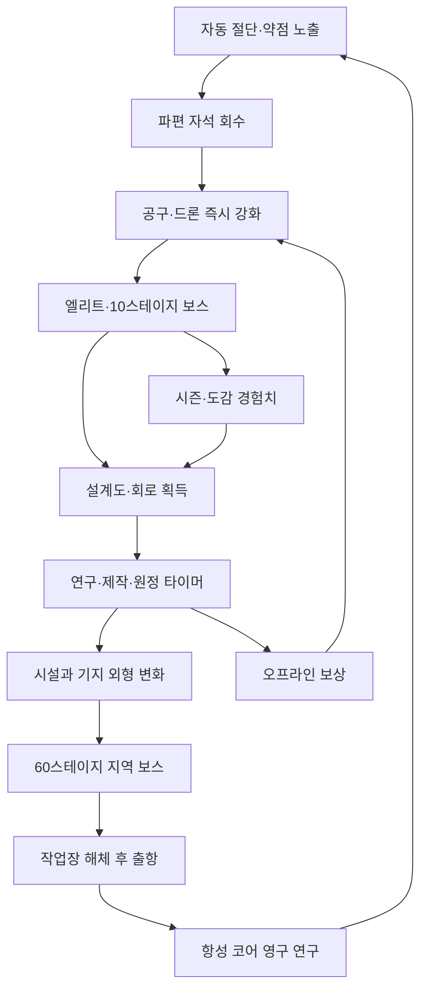
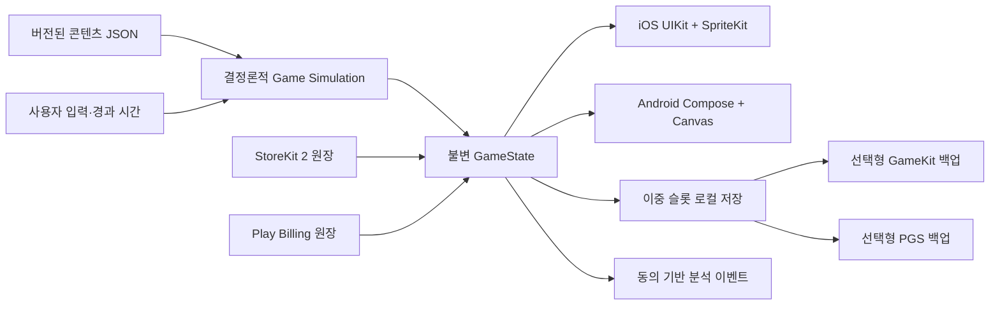

# 별을 줍는 고물상 / StarJunkyard 마스터 게임 기획서

> 문서 상태: **1.0 제작 기준 동결안**  
> 조사 기준일: **2026-07-29 (KST)**  
> 문서 용도: 제품 승인, 버티컬 슬라이스, 소프트런치, iOS·Android 네이티브 개발, 아트·오디오 외주 발주  
> 수치 표기: `[사실]`은 외부 출처로 검증한 사실, `[관찰]`은 공개 스토어·광고 표본의 정성 분석, `[가정]`은 이 제품의 밸런스/사업 가정, `[결정]`은 본 문서에서 동결한 사양이다.

이 문서는 법률 자문이나 매출 예측서가 아니다. 시장 수치는 공개 범위가 제한된 제3자 추정치를 포함하며, 실제 출시 전 KIPRIS·WIPO·USPTO 및 대상국 변리사를 통한 상표 클리어런스가 별도로 필요하다.

---

## 1. 총괄 결론

### 1.1 Go / No-Go

**조건부 Go.** “고물상 타이쿤”으로 만들면 출시하지 않는다. 출시할 제품은 **보이는 자동 해체 전투, 기지의 구조적 변신, 지상 폐기물에서 행성 해체까지 이어지는 픽셀 스케일 판타지**를 한 화면에서 연결하는 세로형 방치 RPG다.

핵심 수정은 다음과 같다.

- 1.0을 10지역·600스테이지에서 **6지역·360스테이지**로 축소한다. 지역당 고유 적·보스·배경 파괴 단계의 품질을 보장한다.
- 캐릭터 가챠를 넣지 않는다. 드론 12종은 스토리·보스 설계도·선택 제작으로 확정 획득한다.
- “숫자만 오르는 타이쿤”을 버리고, 적이 부품 단위로 분리되고 회수물이 뒤쪽 컨베이어와 기지 외형을 실제로 바꾸게 한다.
- 첫 출항은 첫날 누적 플레이 **100~140분, 스테이지 60**에서 경험한다. 결제하지 않아도 같은 날 도달한다.
- 강제 광고를 넣지 않고 보상형 광고를 **일 6회**로 제한한다. 광고 보상은 기본 보상을 빼앗지 않는 추가분이다.
- 1.0의 매출 중심을 프리미엄 캐시보다 **광고 즉시 수령권, 영구 편의 슬롯, 월간 정비 계약, 시즌 패스, 외형**에 둔다. 이는 무서버 소모성 장부 위험을 낮춘다.
- 세계관은 환경 교육물이 아니라 “쓸모없다고 버려진 것의 역전”에 집중한다. 따뜻한 작업장 유머와 거대한 우주 고철의 경외감을 함께 쓴다.

### 1.2 성공 조건과 중단 조건

버티컬 슬라이스에서 다음 네 조건을 모두 통과해야 제작을 계속한다.

1. 30명 블라인드 테스트 중 24명 이상이 10초 무음 영상만 보고 “해체/회수/자동화”를 설명한다.
2. 첫 보스 해체의 5점 만족도 평균이 4.0 이상이다.
3. 기지 1→3단계 전후 영상의 선호도가 정지 일러스트형 성장 영상보다 높다.
4. Android 중급기와 3년 전 iPhone에서 30분 전투 후 프레임 시간 p95가 각각 20ms 이하이며 메모리 증가가 5% 미만이다.

한 항목이라도 두 차례 개선 후 실패하면 “방치 RPG 전체 제작”을 중단하고, 해체 미니게임 중심의 소형 프리미엄 게임으로 재검토한다.

---

## 2. 최신 시장 조사

### 2.1 시장 크기와 구조

- `[사실·2026-02]` Sensor Tower는 2025년 모바일 게임 IAP 매출을 약 **820억 달러**, 전체 게임 다운로드를 모바일·PC·콘솔 합계 520억 건으로 집계했다. 모바일 매출 성장률은 1%로 성숙 시장에 가깝다. 이는 “장르가 크니 자연 유입된다”가 아니라 기존 라이브 타이틀과의 경쟁 비용이 높다는 뜻이다. [Sensor Tower State of Gaming 2026](https://sensortower.com/press/press-release-sensor-tower-state-of-gaming-gaming-drove-52-billion-downloads-82b-iap-revenue-on-mobile-and-12b-premium-revenue-on-steam)
- `[사실·2025-03]` 2024년 모바일 게임 IAP는 4%, 이용 시간은 7.9%, 세션은 12% 증가했다. 서구권 성장은 캐주얼이 주도했고, 하이브리드 캐주얼 IAP는 37% 증가했다. [Sensor Tower State of Mobile Gaming 2025](https://sensortower.com/press/press-release-sensor-tower-mobile-gaming-rebounds-in-2024-as-player-engagement-and-spending-reach-new-highs)
- `[사실·2025-03]` Adjust 표본에서 2024년 글로벌 게임 설치는 전년 대비 4% 증가했고, 게임 앱의 평균 세션 길이는 30.75분이었다. 이 값은 전체 게임 평균이지 본 프로젝트의 목표가 아니다. [Adjust Mobile App Trends 2025](https://www.adjust.com/resources/ebooks/mobile-app-trends-2025/)
- `[사실·2026-01]` 2025년 연말 표본에서 Idle RPG 세션은 평시 대비 크리스마스 전후 15~20% 높았지만 설치 증가는 날짜별 -4~20%로 변동했다. 방치 RPG는 휴일 “복귀”에는 강하지만 신규 획득만으로 성장한다고 볼 수 없다. [Adjust 2025 Holiday Trends](https://www.adjust.com/blog/2025-holiday-app-trends/)

**해석:** 방치 RPG 자체 수요는 남아 있으나, 신규 IP가 캐릭터 수집·PvP·길드 없이 높은 IAP를 내기는 어렵다. 따라서 이 게임의 1차 생존 지표는 고래 매출이 아니라 낮은 광고 피로, 영구 편의 구매, 시각적 공유성으로 만든 장기 잔존이다.

### 2.2 한국·일본·미국

| 국가 | 검증 사실 | 소비 성향 해석 | 제품 대응 |
|---|---|---|---|
| 한국 | `[사실·2025-11]` 2025년 1~3분기 모바일 게임 수익의 48%가 RPG였고, 2024-10~2025-09 RPG 매출 추정치는 약 14억 달러였다. 수치는 Sensor Tower 추정이며 스토어 외 매출은 포함하지 않는다. [한국 게임 시장 인사이트 2025](https://sensortower.com/ko/blog/state-of-gaming-in-korea-2025-report-KR) | 빠른 전투력 피드백과 촘촘한 성장 메뉴는 익숙하지만, 경쟁·가챠 기대치도 높다. | “비경쟁 수집”을 명확히 광고하고, 첫날 출항·큰 수 성장·한국어 숫자 단위를 강하게 제공한다. 핵심 소프트런치 시장. |
| 일본 | `[사실·2025]` 연간 모바일 다운로드는 6억 건 이상으로 정체됐지만 모바일 IAP는 약 110억 달러이며, 퍼즐이 다운로드를, RPG·전략·카드가 매출을 주도했다. [Sensor Tower Japan 2025](https://sensortower.com/state-of-gaming-in-japan-2025-report) | 신규 설치보다 장기 애착·수집 완성·선명한 캐릭터성이 중요하다. | 마스코트 드론의 표정·도감·기지 생활 애니메이션을 강화한다. 일본어는 1.1 후보이며 1.0은 번역 QA 역량 때문에 제외한다. |
| 미국 | `[사실·2026-02]` 2025년 미국 모바일 게임 소비는 267억 달러로 집계됐다. [ESA/Circana·Sensor Tower](https://www.theesa.com/2025-u-s-consumer-spending-on-video-games-nears-pandemic-level-peak-at-60-7-billion-second-highest-on-record/) `[사실·2025]` 서구권의 절대 성장에는 캐주얼이 가장 크게 기여했다. | 이해가 빠른 코어 액션, 실제 플레이와 같은 광고, 선택 광고·영구 광고 제거의 가치가 중요하다. | “Cut → Magnet → Factory grows”를 3초 안에 이해시키고, 전문용어보다 salvage/rebuild 어휘를 쓴다. 1차 글로벌 시장. |

국가별 “성향”은 공개 집계와 스토어 표본에서 도출한 **제품 가설**이며 국민 전체의 심리로 일반화하지 않는다. 한국·미국 동시 소프트런치에서 튜토리얼, 광고 사용, 첫 편의 구매를 별도 코호트로 검증한다.

### 2.3 픽셀 아트·자동전투·타이쿤 결합

- `[관찰·2026-07-29]` Idle Slayer의 Google Play 공개 페이지는 500만+ 다운로드, 4.6점을 표시하며 장기 플레이·공정한 진행·픽셀 스타일을 칭찬하는 리뷰와 후반 정체·광고 오류 불만이 함께 보인다. 픽셀은 차별화 장치지만, 진행 설계의 대체재는 아니다. [Idle Slayer 스토어](https://play.google.com/store/apps/details?id=com.pabloleban.IdleSlayer)
- `[관찰]` ExoMiner는 우주 채굴→제작 확장을 명확히 보여 주며 공개 리뷰에서 수년 플레이, 선택 광고의 균형을 칭찬받는 반면 후반 랭크 미션·정보 탐색 피로가 반복된다. [ExoMiner 스토어](https://play.google.com/store/apps/details?id=com.eldring.exominer)
- `[관찰]` Idle Miner Tycoon·Eatventure는 작업자가 움직이고 시설이 바뀌는 “보이는 생산”이 강하다. 반면 시작 시 다수 팝업, 화면을 가리는 상품 아이콘, 광고 오류가 최근 저평가 리뷰의 공통점이다. [Idle Miner Tycoon 스토어](https://play.google.com/store/apps/details?id=com.fluffyfairygames.idleminertycoon), [Eatventure 리뷰](https://apps.apple.com/us/app/eatventure/id1600871388?platform=iphone&see-all=reviews)
- `[관찰]` NecroMerger는 고유 테마·스프라이트·오브젝트 반응과 결제 없이 획득 가능한 재화를 칭찬받는다. 대기 구간에는 순환 이벤트가 완충재가 된다. [NecroMerger 스토어](https://play.google.com/store/apps/details?id=com.grumpyrhinogames.necromerger)
- `[제한]` “픽셀 모바일 게임 시장”만 분리한 신뢰도 높은 무료 1차 통계는 확인하지 못했다. 유료 조사 보고서의 성장률을 사실로 채택하지 않고, 성공작 스토어·리뷰와 아트 생산 위험만 근거로 사용한다.

### 2.4 가챠 없는 수익화와 광고

`[관찰]` Idle Slayer, ExoMiner, Melvor Idle, AdVenture Capitalist, Egg, Inc.는 서로 다른 비중으로 영구 광고 제거, 확장팩/완전판, 편의·부스트, 구독·시즌, 선택 광고를 사용한다. “가챠 없음” 자체가 매출 모델은 아니며, **오래 쓰는 편의의 가치를 먼저 체감**시켜야 한다.

`[사실·2020 연구]` 36,309개 광고 관련 리뷰 분석에서는 광고 빈도와 광고 다양성이 핵심 불만이었다. 오래된 연구이므로 현재 수치를 대변하지 않지만 빈도 제한 원칙에는 유효하다. [In-App Advertising Review Study](https://arxiv.org/abs/2008.12112)

`[관찰·2024~2026]` Gold & Goblins, Cat Snack Bar, Legend of Slime의 최근 공개 리뷰에는 다음 문제가 반복된다.

- “선택”이라고 시작한 광고가 후반에는 사실상 필수가 되거나 강제 광고로 변함.
- 광고 종료가 스토어로 이동하거나 보상이 지급되지 않음.
- 광고 소재와 실제 핵심 플레이가 다름.
- 광고 제거 구매 뒤에도 상품 팝업이나 다른 광고성 UI가 남음.
- 후반 시간이 길어졌지만 새 결정은 늘지 않음.

근거 표본: [Gold & Goblins 리뷰](https://play.google.com/store/apps/details?id=com.redcell.goldandgoblins), [Cat Snack Bar 리뷰](https://play.google.com/store/apps/details?id=com.tree.idle.catsnackbar), [Legend of Slime 리뷰](https://play.google.com/store/apps/details?id=com.loadcomplete.slimeidle).

**제품 결론:** 광고 2배를 표준 진행속도로 역산하지 않는다. 기본 보상은 온전히 주고, 광고는 +25% 보너스 또는 추가 희귀품 판정만 제공한다. 일 6회 이후 버튼을 숨기고 “오늘의 구조 신호를 모두 사용했습니다”라고 표시한다.

### 2.5 성공·실패 패턴

| 패턴 | 성공 신호 | 실패 신호 | StarJunkyard 규칙 |
|---|---|---|---|
| 초고속 성장 | 첫 세션에 새 기능과 외형이 계속 열린다. | 메뉴만 늘고 선택이 없으며 자동 퀘스트 클릭이 된다. | 10분 동안 4개 시스템만 열고, 해체 입력은 실제 보상 차이를 만든다. |
| 장기 방치 | 다음 목표와 완료 시간이 명확하다. | 주·월 단위 벽인데 새 시각·전략 변화가 없다. | 한 타이머 최대 8시간, 2회 접속마다 시각 변화 1개를 보장한다. |
| 수집 | 수집물이 전투·기지에서 보인다. | 수백 중복 카드가 전투력 숫자로만 바뀐다. | 드론 12종 확정 획득, 모듈 30종 도감 누적. |
| 라이브옵스 | 본편 대기 중 할 일이 생기고 놓친 임무가 누적된다. | 일일 숙제와 기간 한정 전투력이 불안을 만든다. | 8주 시즌, 주간 임무 이월, 유료 트랙은 외형·편의만. |
| 광고 | 플레이어가 시점과 대가를 고른다. | 광고가 실패 복구·기본 진행의 사실상 입장료가 된다. | 강제 광고 0, 일 6회, 실패 직후 광고 제안 금지. |

### 2.6 조사 한계

- 다운로드·매출은 회사 공시가 아닌 경우 Sensor Tower 등 제3자 추정이다.
- 스토어가 공개하는 리뷰는 국가·기기·유용성 정렬에 따라 달라진다. 결제자·장기 플레이어 여부를 인증할 수 없어 별점별 정량 비중을 만들지 않았다.
- 공개 광고 라이브러리에서 국가·기간별 전체 집행량을 확보하지 못했다. 광고 분석은 2026-07-29에 접근 가능한 스토어 영상·스크린샷·리뷰의 정성 표본이다.

---

## 3. 경쟁작 비교표

### 3.1 직접·인접 경쟁 18종

| 게임 / 플랫폼 / 출시 | 콘셉트·루프 / 아트 | 자동전투 / 기지 | 주요 수익 | 강점·반복 칭찬 | 약점·반복 불만 | 배울 점 / 금지할 점 |
|---|---|---|---|---|---|---|
| Legend of Slime / iOS·AOS / 2022 | 슬라임 자동전투·장비·동료 / 2D 카툰 | 예 / 약함 | 소환, 패스, 광고 제거, 패키지 | 빠른 성장, 귀여운 캐릭터 | 과다 광고, 유료 캐릭터, 시스템 누적 | 전투 피드백 / 유료 캐릭터 격차·광고 압박 금지 |
| [Legend of Mushroom](https://play.google.com/store/apps/details?id=com.mxdzzus.google) / iOS·AOS / 2024 | 램프 탭 장비 교체·방치 RPG / SD 카툰 | 예 / 정원 | 가챠, 패스, 경쟁 패키지 | 쉬운 온보딩, 강한 UA, 클래스 변신 | P2W·팝업·경쟁 압박 | 3초 장비 변화 / 램프·슬롯형 보상과 경쟁 과금 금지 |
| Soul Strike / iOS·AOS / 2024 | 대량 적 자동 핵앤슬래시 / 2D 픽셀풍 | 예 / 약함 | 소환, 패스, 광고 제거 | 전투력 상승 경로와 화면 밀도 | 반복, 충돌·광고 보상·결제 오류 | 적 다수 해체 쾌감 / 999개 부품·메뉴 과잉 금지 |
| Go Go Muffin / iOS·AOS / 2024 | 방치 MMO·파티 보스 / 동화풍 3D | 예 / 캠프 | 가챠, 패스, 외형 | 편안한 음악, 마스코트·여행 감성 | 파티 의존, 복귀 난도, 고가 외형 | 마스코트 동행 / 실시간 팀 의존 금지 |
| Super Snail / iOS·AOS / 2023 글로벌 | 기묘한 스토리·유물 수집 / 만화 | 부분 / 집 | IAP, 광고, 패키지 | 독창적 세계관, 방대한 도감 | 메인 루프 선택 부족, 매 실행 팝업 | 폐품 도감의 유머 / 슬롯 결과 버튼과 팝업 범람 금지 |
| Idle Slayer / 모바일·PC / 2020 | 횡스크롤 처치·환생·스킬 트리 / 픽셀 | 예 / 없음 | 광고 제거, 보석, 외형 | 장기 목표, 픽셀, 비교적 공정 | 후반 정체, 광고 오류 | 긴 성장 트리 / 목표 없는 수주 벽 금지 |
| NecroMerger / iOS·AOS / 2022 | 오브젝트 병합·기지 확장 / 픽셀 | 생산 자동 / 강함 | 광고 제거, 팩, 스킨 | 테마, 반응형 스프라이트, 자원 결정 | 간헐 대기, 광고 불능 | 기지 오브젝트 개성 / 광고 실패가 행동을 막게 하지 않기 |
| Eatventure / iOS·AOS / 2022 | 음식점 설비 강화·직원 자동화 / 미니멀 3D | 예 / 강함 | 광고, 장비 상자, 이벤트 IAP | 30초~장시간 모두 가능, 강제 광고 없음(과거 표본) | 업데이트 후 광고·장비 운 의존, 광고 소재 차이 | 짧은 세션·보이는 일꾼 / 상자 운·소재 불일치 금지 |
| Cat Snack Bar / iOS·AOS / 2023 | 고양이 식당 자동화 / 귀여운 2D | 예 / 강함 | 광고, 랜덤 아이템, 팩 | 캐릭터 애착, 편안함 | 2024~26 강제 광고·화면 1/3 상품 아이콘 | 캐릭터 생활감 / 후반 광고 전환·UI 오염 금지 |
| Idle Miner Tycoon / iOS·AOS / 2016 | 광산 운송 병목 최적화 / 2D 카툰 | 예 / 강함 | 광고, 매니저 랜덤, 패스, 구독 | 생산선 이해, 거대한 콘텐츠 | 시작 팝업, 광고 오류, 반복 광산 | 병목이 보이는 라인 / 접속 팝업 연타 금지 |
| Gold & Goblins / iOS·AOS / 2020 | 고블린 병합·암석 파괴 / 3D | 예 / 광산 | 광고 제거, 팩, 이벤트 | 부수는 손맛, 광고 제거 가치 | 반복, 후반 지연, 가짜 플레이 광고 지적 | 물체 파괴 단계 / 실제 없는 crusher 광고 금지 |
| ExoMiner / iOS·AOS / 2021 | 행성 채굴·제작·랭크 / 플랫 SF | 예 / 생산망 | 광고, 팩, 광고 제거 | 우주 확장, 수년 플레이, 선택 광고 | 랭크 벽, 통계 부족, 너프 인식 | 지상→우주 성장 / 제작 재료 찾기 피로 금지 |
| [Cell to Singularity](https://celltosingularity.com/press/) / iOS·AOS·PC / 2018 | 진화 트리·이벤트 / 3D+UI | 예 / 트리 | 광고, 다윈 큐브, 패스 | 교육적 발견, 스케일 확대, 음악 | 반복, 긴 갱신, 광고 소재 불일치 | 스케일 경외감 / 탭만 남는 후반 금지 |
| [Melvor Idle](https://www.jagex.com/news/melvor-idle-version-1-0-launches-on-pc-and-mobile) / 모바일·PC / 2021 | 스킬 기반 방치 RPG / 아이콘·텍스트 | 예 / 없음 | 완전판·확장팩 | 깊이, 가챠 없는 명료한 가치 | 계정·온라인 문제, 시각적 보상 약함 | 명시적 완전판 가치 / 세계가 보이지 않는 표 계산 금지 |
| [AdVenture Capitalist](https://www.kongregate.com/en/pages/adventure-capitalist) / 모바일·PC / 2014 | 사업 매니저·환생 / 2D | 예 / 강함 | 광고, 골드, 이벤트 | 즉시 이해, 큰 수 | 반복, 상품 가치 논란 | 단순한 초기 루프 / 테마 없는 숫자 복제 금지 |
| Idle Junkyard Tycoon: Recycling / iOS·AOS / 2025 | 폐기장 정리·트럭·매니저 / 3D 카툰 | 예 / 강함 | 광고 제거, 영구 부스트, 박스 | 트럭의 움직임, 고물 처리 테마 | 특정 스테이지 하드월, 구매 후 정체·버그 | 테마 수요 검증 / 트럭 박스·2주 벽 금지 |
| Junkyard Keeper / iOS·AOS / 2022 | 차량으로 폐품 흡입·시설 확장 / 3D 하이퍼캐주얼 | 부분 / 강함 | 강제·보상 광고, IAP | 폐품이 빨려드는 즉시 만족 | 플레이 중 광고, 얕은 반복 | 자석 회수 장면 / 강제 광고 금지 |
| [Hardspace: Shipbreaker](https://www.focus-entmt.com/games/hardspace-shipbreaker) / PC·콘솔 / 2022 | 우주선 절단·분류 / 사실적 3D | 아니오 / 작업장 | 프리미엄 | 물리 해체의 독창성, 직업 세계관 | 모바일·짧은 세션에 부적합 | 약점→절단→분류 문법 / 외형·명칭·기업 풍자 모방 금지 |

출시 시기와 현재 상품은 각 스토어·공식 공개 페이지 기준이며 국가별로 다를 수 있다. 주요 검증 링크: [Idle Junkyard Tycoon 리뷰](https://apps.apple.com/us/app/idle-junkyard-tycoon-recycling/id6741473028?platform=iphone&see-all=reviews), [Junkyard Keeper 리뷰](https://apps.apple.com/us/app/junkyard-keeper/id1592275423?platform=iphone&see-all=reviews), [Soul Strike 스토어](https://play.google.com/store/apps/details?id=com.com2usholdings.soulstrike.android.google.global.normal), [Go Go Muffin 스토어](https://play.google.com/store/apps/details?id=com.xd.muffin.gp.global), [Super Snail 스토어](https://play.google.com/store/apps/details?id=com.qcplay.snail.android.na).

### 3.2 리뷰 층위 분석

공개 스토어만으로 결제자·장기 이용자를 인증할 수 없으므로 표본 문구가 스스로 밝힌 경우만 분류했다.

| 리뷰 층 | 반복 칭찬 | 반복 불만 | 제품 반영 |
|---|---|---|---|
| 5점 | 귀여움/픽셀, 짧게 켜도 됨, 눈에 보이는 자동화, 선택 광고 | “한 가지 더 있었으면”이라는 콘텐츠 요구 | 2회 접속마다 새 실루엣·기지 변화, 도감 대사 제공 |
| 3점 | 기본 루프는 만족 | 후반 반복, 느린 벽, 화면 팝업, 광고 오류 | 막힘 감지 후 무료 목표 3개 제시; 접속 상품 팝업 0개 |
| 1점 | 초반은 재미있었다는 회고 | 강제 광고 전환, 구매 복원 실패, 너프, 결제해도 막힘 | 광고 규칙 영구 고정; 영구 상품 스토어 재검증; 밸런스 하향 시 보상 |
| 장기 플레이어 자가표기 | 수개월 목표, 업데이트, 수집 완성 | 후반 숫자만 확대, 옛 빌드 가치 훼손 | 영구 연구는 삭제·하향하지 않고 새 축은 수평 확장 |
| 결제자 자가표기 | 광고 제거·영구 편의의 체감 | 새 저장에서 미복원, 광고 제거 후 다른 방해 | 계정/저장과 무관하게 스토어 entitlement로 복구 |
| 광고 관련 | 강제 없음, 원하는 때 추가 보상 | 긴 광고, 외부 이동, 무보상, 사실상 필수 | 보상 영수증 상태머신, 실패 시 즉시 무료 지급, 일 6회 |
| 콘텐츠 고갈 | 이벤트가 본편 대기 완충 | 같은 이벤트·적 재활용 | 시즌은 외형 변주+미니 보스 1종, 본편 밸런스와 분리 |

### 3.3 광고 소재 표본 분석

| 문법 | 공개 소재에서 보이는 장점 | 위험 | 본 게임의 0~12초 실제 캡처 규격 |
|---|---|---|---|
| 첫 3초 파괴 | 큰 암석·쓰레기를 부수거나 흡입해 이해가 빠름 | 실제 게임에 없는 조작을 광고 | 0.0초 녹슨 세탁기 괴수, 0.5초 절단선, 1.4초 양분, 2.2초 자석 회수 |
| 성장 전후 | 작은 매장→다수 작업자 대비 | UI 숫자만 커짐 | 3~6초 손수레가 컨테이너 공장으로 한 번에 변형 |
| 실패 후 성장 | 보스 실패로 업그레이드 이유 제시 | 의도적 패배·구매 버튼 유도 | 자연 보스 실패→무료 드론 약점 교체→재도전 성공; 상점 미노출 |
| 수집/애착 | 귀여운 동료와 외형 변주 | 캐릭터가 실제 전투에 안 보임 | 리벳이 렌즈를 찡그리고 자석 꼬리로 나사를 놓치는 0.7초 컷 |
| 숫자 폭증 | 장르 기대를 즉시 전달 | 읽을 수 없는 UI, 허위 배율 | 6~9초 DPS 240→18.2K와 파편 12→96을 실제 빌드로 캡처 |
| 우주 스케일 | 강한 USP | 초반 플레이와 괴리 | 9~12초 같은 절단 동작을 세탁기→위성→달 표면에 매치컷; “오늘은 고철, 내일은 행성” |

---

## 4. 시장 공백과 최종 포지셔닝

### 4.1 시장 공백 한 문장

**“가챠 캐릭터나 광고 강요 없이, 폐품 생명체가 실제로 분해되고 그 재료가 픽셀 공장과 우주 규모를 눈앞에서 바꾸는 세로형 방치 RPG”가 비어 있다.**

### 4.2 최종 포지셔닝

- 장르 한 문장: **보이는 해체 전투와 생산 자동화를 결합한 세로형 픽셀 방치 RPG.**
- 핵심 국가: 한국·미국 동시 소프트런치, 정식 1.0 한국·미국·영어권. 일본은 1.1 현지화 후보.
- 핵심 타깃: 20~39세, 방치 RPG/증분 게임 경험자, 하루 3~8분씩 여러 번 확인하며 시스템 최적화를 좋아하는 이용자.
- 보조 타깃: 픽셀 인디·공장 자동화·정리/청소 만족감을 좋아하지만 경쟁과 가챠를 싫어하는 이용자.
- 설치 이유: 세탁기 괴수가 절단되고 부품이 자석으로 빨려 공장이 커지는 3초 영상.
- 7일 이유: 첫날 출항 이후 매일 기지 실루엣·드론 조합·새 지역이 바뀐다.
- 첫 결제 이유: 이미 자발적으로 사용한 보상형 광고를 영구 즉시 수령으로 바꾸거나 작업 대기열 하나를 영구 추가한다.
- 월 결제 이유: 정비 계약의 편의와 8주 시즌의 완결된 외형 세트를 원한다.
- 다른 방치형이 아닌 이유: 전투 드롭이 숫자 카드가 아니라 화면 뒤 생산선으로 이동하고, 모든 적·시설·UI 장식이 일관된 픽셀 세계다.
- 광고 3초: 세탁기 괴수의 빨간 약점을 절단→두 동강→리벳의 자석 회수→손수레에 컨베이어가 펼쳐짐.
- 첫 스크린샷 문장: **“오늘은 고철, 내일은 행성.”**

### 4.3 USP 3개

1. **부품 단위 해체:** 적 체력 70/30%에서 장갑·공격부가 떨어지고 전투 정보와 실루엣이 변한다.
2. **전투와 기지의 한 화면 인과:** 회수 파편이 뒤쪽 컨베이어를 타고 시설에 들어가며 업그레이드 전후가 즉시 보인다.
3. **수직 스케일 판타지:** 손수레→골목 공장→분해선→궤도 정거장으로 같은 픽셀 규칙 안에서 규모가 변한다.

---

## 5. 저작권·상표 위험

### 5.1 일반 아이디어와 보호 가능한 표현

자동전투, 오프라인 보상, 환생, 장비 강화, 약점 공격, 컨베이어는 일반적인 규칙·아이디어다. 반면 다음은 타사의 구체적 표현이므로 복제하지 않는다.

- Legend of Mushroom의 램프 연타→무작위 장비 교체 화면 구성과 버섯 실루엣.
- Gold & Goblins의 광산 격자, 고블린 병합, 암석 숫자 배치.
- Idle Miner Tycoon의 수직 광산 3단 운송 UI와 매니저 카드 구성.
- Hardspace: Shipbreaker의 노란 작업복·산업용 헬멧 조합, 특정 절단선 색/표식, 기업 로고·부채 풍자.
- WALL-E의 쌍안경 눈·상자 몸통·궤도형 다리, R2-D2의 돔 머리·원통 몸체·청백 배색, 특정 로봇청소기의 원반 실루엣.
- Vampire Survivors류의 동일한 캐릭터 중앙 배치·적 군집·아이콘 프레임과 유명 몬스터 실루엣.

주인공은 비대칭 어깨 절단기와 삼각 앞치마, 드론 리벳은 **병뚜껑 로터+단안 렌즈+U자 자석 꼬리**로 식별한다. 청백·적백 로봇 배색은 사용하지 않는다.

### 5.2 이름 예비 검색

`[관찰·2026-07-29]` “별을 줍는 고물상”의 정확 일치 게임은 일반 웹·주요 스토어 표면 검색에서 확인되지 않았다. 이는 상표 등록 가능성을 뜻하지 않는다. “우주 고물상”은 일반 서술·소설 제목에 사용되어 식별력이 낮다.

| 영문 후보 | 기억/검색/발음 | 내용 연상 | 혼동 위험 | 확장성 | 판정 |
|---|---:|---:|---|---:|---|
| **Junkwright: Idle Galaxy** | 5/5/4 | 5 | 낮음: 정확 게임명 표면 검색 결과 없음 | 5 | **1순위** |
| Orbit Junkwright | 4/5/3 | 5 | 낮음 | 5 | 2순위 |
| Cosmic Scrapworks | 4/4/4 | 5 | 낮음, 다만 설명적 | 4 | 후보 |
| Star Scrapwright | 4/5/3 | 5 | 낮음 | 5 | 후보 |
| Rust to Cosmos | 4/5/5 | 4 | 낮음, 슬로건처럼 보임 | 4 | 후보 |
| Galactic Salvage Works | 3/4/4 | 5 | 설명적·긴 이름 | 4 | 후보 |
| Tin to Titan | 5/5/5 | 4 | 일반 문구 가능성 | 4 | 마케팅 문구 후보 |
| Junkyard Beyond | 4/4/5 | 4 | “Junkyard” 동명 다수 | 4 | 보류 |
| Rustbound Cosmos | 4/5/4 | 4 | “-bound” 게임명 다수 | 5 | 보류 |
| Starwaste Salvager | 3/5/3 | 5 | 낮으나 발음 어려움 | 4 | 보류 |
| Scraplight | 5/5/5 | 5 | **높음:** 동명 게임과 미국 등록 상표 존재 | 4 | 폐기 |
| Scrapbound | 5/4/5 | 5 | **높음:** itch.io 게임·Steam 플레이테스트·도서 존재 | 5 | 폐기 |

Scraplight의 미국 등록 기록은 조명류지만 동명 게임도 존재한다. [SCRAPLIGHT 상표 기록](https://trademarks.justia.com/860/87/scraplight-86087538.html), [scraplight 게임](https://rainascallion.itch.io/scraplight). Scrapbound는 직접적인 우주 폐품 게임과 Steam 플레이테스트가 확인되어 사용하지 않는다. [Scrapbound 게임](https://itszephy.itch.io/scrapbound), [SteamDB ScrapBound](https://steamdb.info/app/4577570/info/).

**출시명 결정:** 마케팅 검증용 영문명은 **Junkwright: Idle Galaxy**. `Junkwright`를 “버려진 것을 새 용도로 만드는 장인”이라는 세계관 직업명으로 정의한다. 정식 확정 전 Nice 9·41·42류에 대해 KIPRIS, WIPO Global Brand Database, USPTO TESS, EUIPO eSearch, 일본 J-PlatPat의 문자·유사 호칭 검색과 변리사 의견을 받는다.

### 5.3 트레이드 드레스 안전 규칙

- HUD는 위쪽 재화 바+아래 4탭이라는 일반 구조만 공유하고, 패널 모서리는 리벳 플레이트 2px, 경고 줄무늬는 청록/호박색으로 자체 규격화한다.
- 보스 약점은 붉은 원/십자 대신 **깜빡이는 육각 볼트+점선 절단 경로**로 표현한다.
- 아이콘은 모두 24×24 원본에 좌상단 1px 흰 반사, 우하단 2px 짙은 그림자 규칙을 쓴다. 타 게임 아이콘을 트레이싱하지 않는다.
- 생성형 AI 산출물을 최종 스프라이트로 사용하지 않는다. 레퍼런스 탐색에 썼다면 출처 목록과 프롬프트를 기록하고 아티스트가 빈 캔버스에서 재설계한다.

---

## 6. 최종 콘셉트

### 6.1 제품 문장과 세계관

**“폐기 판정을 받은 정비사 ‘모’와 불량 분류 드론 ‘리벳’이 살아 움직이는 폐품을 해체·분류해 작업장을 우주 문명의 순환 기지로 바꾸는 픽셀 방치 RPG.”**

재난 뒤의 폐기물에는 버려질 때 남은 “잔류 명령”이 붙어 생명체처럼 움직인다. 주인공은 이들을 죽이지 않고 안전하게 해체한다. 각 보스 잔해에서 발견되는 기억 조각은 문명이 무엇을 버렸는지 보여 준다. 최종 적은 악당 개인이 아니라 모든 것을 일회용으로 분류하는 자동 시스템 **최종 처리 규약**이다.

### 6.2 톤

- 70% 따뜻한 작업장 코미디, 20% 우주 경외, 10% 조용한 환경 메시지.
- “세상을 구하라”보다 “이 나사 아직 쓸 만해”가 주인공의 태도다.
- 사망·피·시체 표현이 없다. 적은 볼트, 판금, 회로, 빛 입자로 분리되고 잔류 명령이 꺼진다.

### 6.3 핵심 판타지 단계

1. 손수레에서 빈 캔을 분류한다.
2. 리벳과 드론 팀이 자동으로 약점을 찾는다.
3. 컨베이어·용해로가 전투 파편을 실시간 처리한다.
4. 이동식 분해선이 도시와 바다의 거대 잔해를 수거한다.
5. 궤도 정거장에서 위성·달 도시를 해체한다.
6. 버려진 문명의 규약을 재작성해 항성급 순환 기지가 된다.

---

## 7. 타깃 이용자

| 페르소나 | 상황 | 원하는 것 | 싫어하는 것 | 핵심 기능 |
|---|---|---|---|---|
| 출퇴근 최적화형 | 하루 4~6회, 1~5분 | 완료 회수, 다음 목표, 빌드 추천 | 접속 팝업, 긴 수동전 | 복귀 요약, 자동 추천, 예약 알림 |
| 증분 시스템형 | 밤에 20분 최적화 | 공식·병목·프레스티지 | 숨은 확률, 무의미한 선택 | 상세 DPS, 생산 통계, 출항 미리보기 |
| 픽셀 수집형 | 스크린샷·도감 선호 | 독창적 드론, 기지 생활감 | 필터 도트, 팔레트 불일치 | 12 드론, 박물관, 스킨 미리보기 |
| 광고 피로 이탈자 | 여러 타이쿤 삭제 경험 | 강제 광고 없음, 공정한 구매 | 가짜 할인, 광고 보상 실패 | 일 6회, 실패 무료 지급, 영구 즉시권 |

연령·성별은 타기팅 제한으로 사용하지 않는다. 주인공은 이름·체형·음성을 중성적으로 설계하고 작업복 외형으로 자기표현하게 한다.

---

## 8. 핵심 제품 원칙

1. **모든 성장에는 보이는 변화가 있다.** DPS만 오르는 업그레이드는 연속 3회 배치하지 않는다.
2. **광고·결제는 기다림을 줄이지, 목표를 독점하지 않는다.** 무과금도 모든 드론·지역·보스를 획득한다.
3. **해체는 폭력이 아니라 변환이다.** 적은 부품으로 분리되고 기지에서 새 용도를 얻는다.
4. **픽셀 규칙을 예외 없이 지킨다.** 게임 세계·HUD 장식·광고 실제 화면은 동일 원본을 쓴다.
5. **30초 접속도 끝이 난다.** 회수→한 번의 결정→다음 완료 시각 확인 뒤 자연스럽게 종료할 수 있다.

추가 운영 원칙: 접속 직후 자동 상품 팝업 0개, 결제 일일임무 0개, 구매 직후 난도 변경 0개, 유료 재화 만료 0개, 시즌 유료 전투력 0개.

---

## 9. 전체 게임 루프

### 9.1 네 계층

| 계층 | 시간 | 행동 | 산출 | 다음 계층 연결 |
|---|---|---|---|---|
| 순간 | 5~30초 | 자동 절단→파괴 단계→자석 회수→오버클럭 1회 | 크레딧·부품, 약점 정보 | 강화 1회 또는 다음 스테이지 |
| 짧은 | 1~10분 | 8적 스테이지, 엘리트, 10스테이지 보스, 모듈 선택 | 설계도·회로·기지 시각 변화 | 연구/제작/보스 분석 시작 |
| 중간 | 30분~12시간 | 연구, 제작, 원정, 시설 건설, 오프라인 회수 | 드론·합금·자동화·도감 | 지역 보스와 출항 준비 |
| 장기 | 2일~8주 | 출항, 지역 완주, 영구 연구, 시즌, 도감 세트 | 항성 코어·새 시작점·외형 | 더 빠른 루프와 다음 지역 |



### 9.2 종료·복귀·결제의 자연스러운 지점

- 자연 종료: 강화로 새 보스를 넘긴 직후, 연구/제작/원정을 시작하고 “다음 완료 2시간 10분” 카드를 확인한 때.
- 복귀 이유: 완료 알림, 오프라인 파편 애니메이션, 막혔던 보스에 필요한 드론 연구 완료.
- 다음 무료 목표: 전투 화면의 목표 카드는 항상 `3분 내`, `오늘`, `이번 출항` 목표를 한 줄씩 표시한다.
- 단축 구매 욕구: 보스 설계도를 얻었고 조립 완료 뒤 바로 새 약점 조합을 시험하고 싶을 때. 실패 화면에서는 상점을 열지 않는다.
- 비결제 상태: 막히지 않고 느려진다. 8시간 안에 최소 하나의 무료 성장 축이 완료된다.
- 속도 차이 `[가정]`: 월 20달러 이하 결제자는 30일 누적 유효 성장 시간이 무과금의 1.35~1.55배, 시간 단축 집중 결제자는 최대 1.8배. 2배를 넘기지 않는다.
- 켜놓기: 스테이지 전진, 보스·희귀 설계도, 오버클럭·해체 보너스 가능. 오프라인: 마지막 클리어 파밍 지점에서 크레딧·부품만 70% 효율로 생산하며 새 스테이지를 깨지 않는다.

---

## 10. 첫 10분

첫 세션에는 로그인, 알림, 리뷰, ATT, 광고, 결제, 연속 패키지를 노출하지 않는다. 알림은 첫 30분 이후 플레이어가 10분 이상 타이머를 직접 시작했을 때 맥락형으로 요청한다. 분석 SDK 동의가 필요한 지역에서는 기능을 막지 않는 개인정보 선택 화면만 시작 전에 제공한다.

| 시간 | 화면·행동 | 시스템 반응·보상 | 감정 목표 / 이탈 위험 | 도트·사운드·햅틱 | 분석 이벤트 |
|---|---|---|---|---|---|
| 0:00~0:15 | 검은 화면의 금속 소리 뒤, 손수레와 천막. `화면을 눌러 쓸 만한 것을 찾기` | 로컬 저장 생성, 게스트 즉시 시작 | 호기심 / 긴 로고 | 비 내리는 골목 3층 배경, 천막 4f; 빗방울·무햅틱 | `first_launch`, `save_created` |
| 0:15~0:35 | 모: “버려졌다고 끝난 건 아니지.” 찌그러진 캔벌레 등장 | 절단기가 자동으로 1.2초마다 공격 | 주제 즉시 이해 / 대사 과다 | 주인공 idle 4f·attack 6f, 캔벌레 4f; 금속 틱 | `tutorial_step:first_enemy` |
| 0:35~0:55 | 첫 적이 몸통·뚜껑·나사 3종 파편으로 분리 | 12크레딧, 3부품이 주인공 쪽으로 빨림 | 수집 만족 / 드롭이 작음 | 파편 6개, 자석 곡선 8f; 짧은 light 햅틱 | `first_kill`, `first_currency` |
| 0:55~1:20 | 공구 버튼만 맥동. 10크레딧으로 Lv2 | DPS 8→9, 절단 불꽃 색 1단 상승 | 즉시 성장 / 여러 메뉴 | 24px 공구 아이콘, 숫자 팝 4f; 클릭음·selection | `first_upgrade` |
| 1:20~1:55 | 자동으로 3마리 해체. 쓰레기 더미에서 단안 렌즈 점멸 | 더미를 탭하면 리벳이 튀어나옴 | 마스코트 애착 / 강제 탭 불명확 | 리벳 등장 12f, 먼지 8f; 3음 모티프·success | `mascot_found` |
| 1:55~2:25 | 리벳 카드 한 장: “자석 꼬리 / 회수 반경 +20%” 확인 | 전투 슬롯 1에 자동 편성, 드론 공격 시작 | 동료의 효용 / 카드 설명 | portrait 32×32, hover 4f, shot 5f | `first_drone`, `formation_auto` |
| 2:25~2:55 | 큰 냉장고짐승. 오버클럭 버튼을 2초 길게 누름 | 8초간 공속 +60%, 파편이 버튼 게이지로 환류 | 능동 개입 / 길게 누르기 어려움 | 버튼 6f, 열기 왜곡은 픽셀 디더; medium 햅틱 시작/끝 | `overclock_first_use` |
| 2:55~3:20 | 접근성 대체 안내: 설정에서 한 번 탭 토글 가능 | 냉장고짐승 해체, 낡은 모터 획득 | 통제감 / 안내 방해 | 모터 24px, rare 6음; success 햅틱 | `accessibility_hint_seen` |
| 3:20~3:55 | 기지 버튼에 화살표. 고장난 자동 정렬기에 모터 장착 | 뒤 배경에서 벨트가 실제로 움직이고 자동 회수 +10% | 세계가 변함 / 메뉴 전환 | 정렬기 off/on 각 6f, 벨트 8f; 모터 기동음 | `facility_repaired:first_sorter` |
| 3:55~4:30 | 스테이지 5 엘리트 ‘우산게’. 장갑 아이콘을 탭해 설명 | 리벳이 약점 볼트에 우선 사격, 회로 2개 | 첫 전략 / 툴팁 과다 | 우산 펼침 6f·파괴 6f; shield crack | `elite_first`, `weakness_seen` |
| 4:30~5:10 | 공구/리벳 중 하나를 무료 3레벨까지 올림 | 선택한 축에 따라 DPS 동일, 연출만 달라짐 | 선택 소유감 / 거짓 선택 | 공구 칼날 또는 리벳 코일 1단 외형 | `tutorial_build_choice` |
| 5:10~5:40 | 스테이지 8, 천막 옆 압축기에 부품 투입 | 기지 등급 1→2: 손수레에 지붕·램프 추가 | 시각적 성장 / 보상 미미 | 기지 변형 14f, 전구 점등; heavy 햅틱 1회 | `base_visual_upgrade:2` |
| 5:40~6:20 | 30초 ‘날 세우기’ 작업 시작 | 남은 30초, 다른 전투는 계속 가능 | 짧은 기대 / 기다림 강요 | 숫자 플립 4f, 숫돌 8f | `timer_start:tutorial_sharpen` |
| 6:20~6:45 | 5분 단축권 1장을 지급하고 사용 안내 | 30초 즉시 완료, 4분30초 잔여 가치는 소모되지 않고 4분30초권으로 분할 반환 | 공정성 / 티켓 낭비 우려 | 티켓 찢김 대신 시간 픽셀이 게이지로 이동 | `speedup_free_used` |
| 6:45~7:25 | 스테이지 10 보스 ‘압착왕 캔크랩’ | 35초 제한, 70%에서 집게 분리, 30%에서 코어 노출 | 첫 절정 / 실패 | 보스 96×80, 3단 파괴, 보스 루프 30초 | `boss_start:first` |
| 7:25~7:55 | 보스 해체: 점선 2개 중 빛나는 절단선을 탭 | 기본 보상은 이미 확보; 성공 시 부품 +15% | 손맛 / 타이밍 부담 | 절단선 6f, 10파편, rigid 햅틱 | `dismantle_start`, `dismantle_result` |
| 7:55~8:25 | 보스 잔해 카드와 ‘절단 코일’ 설계도 | 모듈 슬롯 1 해금, 확정 장착 | 수집 기대 / 장비 복잡도 | 카드 뒤집기 8f, 48px 잔해 | `blueprint_first`, `module_equipped` |
| 8:25~9:00 | 작업장 전경 복귀 | 압착왕 집게가 크레인으로 재사용되어 기지에 매달림 | 해체의 의미 / 변화 놓침 | before/after 0.8초 카메라 팬 | `base_trophy_seen` |
| 9:00~9:30 | 다음 목표 카드: `스테이지 20: 폐가전 골목`, `스테이지 60: 첫 출항` | 무료 5분권 2장, 출항 미리보기 | 장기 목표 / 목표가 멂 | 미니 행성 실루엣 3종 | `next_region_preview` |
| 9:30~10:00 | 하단 4탭(전투·기지·창고·원정) 중 전투·기지만 활성, 자유 조작 | 가이드 잠금 해제. 잘못 눌러도 진행 손실 없음 | 자유 / 기능 과잉 | 탭 해금 6f; 작은 chime | `tutorial_complete`, `freeplay_begin` |

튜토리얼 보스 실패 시 체력이 70% 남은 상태로 전투가 일시 정지하고 “공구 Lv3 무료 강화”를 준 뒤 재도전한다. 광고·결제·난도 하향 팝업은 없다. 세 번째 실패에는 자동 해체 모드를 켜고 무조건 승리시킨다.

---

## 11. 첫 7일과 30일

`[가정]` 아래 값은 하루 3~5회, 첫날 100~140분·이후 하루 25~45분, 광고 0~2회, 무과금 중앙값을 목표로 한 내부 밸런스다.

| 시점 | 평균 스테이지 / 기지 | 드론 | 해금·진행 타이머 | 기대 플레이 | 보상·결제 노출 | 다음 목표 / 이탈과 방지 |
|---|---|---|---|---|---|---|
| 10분 | 12 / 손수레 2 | 리벳 | 모듈, 정렬기 | 10분 | 설계도, 노출 없음 | S20 / 자동이라 단조로움→오버클럭 |
| 30분 | 30 / 손수레 3 | 리벳·스파크 | 연구, 제작; 5분 연구 | 25~35분 | 드론 확정 제작, 노출 없음 | S60 / 메뉴 증가→목표 카드 3개 제한 |
| 첫날 종료 | 75~85 / 컨테이너 1 | 3종 | 원정·박물관·첫 출항; 30분 2건 | 총 100~140분 | 출항 후 광고 즉시권·첫 구매팩을 상점 배지로만 노출 | R2 진입 / 초기화 불안→유지 목록 시각화 |
| 2일차 | 105~120 / 컨테이너 2 | 4종 | 분석실; 1~2시간 | 30~45분 | 영구 작업대 미리보기 | S120 / 회로 부족→선택 보스 보상 |
| 3일차 | 140~155 / 골목 공장 1 | 5종 | 시즌·자동 추천; 2시간 | 30~45분 | 월간 계약·시즌 패스, 각각 1회 맥락 시트 | R3 / 임무 피로→주간 누적 |
| 4일차 | 170~185 / 골목 공장 1 | 6종 | 대형 잔해 분석; 2~3시간 | 25~40분 | 분석 완료 시 단축권 묶음 상점 링크(자동 팝업 없음) | S180 보스 / 보스 벽→약점 추천 |
| 5일차 | 195~215 / 골목 공장 2 | 6종 | 두 번째 원정 슬롯; 3~4시간 | 25~40분 | 원정 슬롯 비소모성 | R4 / 반복→침수·부식 기믹 |
| 7일차 | 235~250 / 이동 분해선 1 | 8종 | 영구 연구 2단; 4시간 | 35~55분 | D7 기념 무료 스킨, 시즌 패스 재노출 | S300 / 콘텐츠 속도→보스 도감 세트 |
| 14일차 | 300~315 / 이동 분해선 2 | 10종 | 3번째 원정 목적지군; 6시간 | 25~45분 | 기지 테마·드론 스킨 | 궤도 잔해권 / 긴 제작→병렬 목표 |
| 30일차 | 360 / 궤도 정거장 1 | 12종 | 1.0 최종 보스·종결 연구; 최대 8시간 | 25~45분 | 완주 외형, 연간 계약은 월간 이용자에게만 | 도감·시즌 / 콘텐츠 고갈→8주 시즌·도전 계약 |

### 11.1 첫 출항 확정

- 가능 조건: 스테이지 60 지역 보스 격파, 자동 정렬기 Lv5, 연구 `재사용 프로토콜 I` 완료.
- 목표 시점: 설치 후 **첫날, 누적 능동 100~140분 또는 경과 4~8시간**.
- 근거: 10분 안에는 초기 작업장에 대한 애착이 없고, 이틀 뒤에는 프레스티지 차별점이 늦다. 첫날 종료 직전은 “내일 더 빠르게 돌아온다”는 복귀 약속을 만든다.
- 첫 출항을 24시간 안에 못 한 이용자에게는 2일차 첫 접속에 30분 단축권 1장과 스테이지 60까지의 무료 추천 강화를 제공한다. 자동 클리어는 하지 않는다.

---

## 12. 자동전투

### 12.1 전투 규칙

| 항목 | 동결값 |
|---|---|
| 스테이지 구성 | 일반 스테이지 8체. 5의 배수는 일반 6+엘리트 1. 10의 배수는 보스 1(지역 최종인 60의 배수는 지역 보스). |
| 평균 시간 | 적합 전투력에서 일반 22~30초, 엘리트 28~38초, 보스 30~45초. |
| 보스 제한 | 중간 보스 45초, 지역 보스 60초. |
| 실패 | 사망 없음. 보스가 “재조립”해 전투 시작점으로 돌아감. 획득한 일반 파편 유지. |
| 재도전 | 3회 자동 재도전 기본. 이후 마지막 성공 스테이지 자동 파밍. 설정에서 무제한 재도전 가능. |
| 공격 | 주인공 1.2초 기본 절단; 드론별 0.6~2.4초; 액티브 스킬은 자동 발동하되 보스 약점 우선. |
| 치명타 | 초기 5%, 기본 피해 170%; PPM 정수. 크리티컬은 밝은 톱니 아이콘·높은 음·medium 햅틱. |
| 다중/범위 | 다중 타격은 각 타격 독립 방어 계산, 치명타 RNG는 타격별. 범위는 중앙 대상 100%, 인접 65%. |
| 약점 | 절단·충격·열·전기·냉각 5종. 맞는 속성은 피해 150%, 장갑 파괴 게이지 200%. |
| 오버클럭 | 파편 회수로 100 충전. 8초간 주인공 공속 +60%, 드론 스킬 재사용 +30%. 20초 내부 쿨다운. |
| 배속 | 1× 기본, 2×는 S30 무료 해금, 3×는 첫 출항 영구 연구로 무료 해금. 광고/결제 전용 아님. |
| 파괴 연출 | HP 70% 외장 1개, 30% 공격부 1개 분리; 최종 6~12파편. 보스 18~30파편이나 동시 화면 20개 제한. |
| 카메라·햅틱 | 일반 흔들림 0, 엘리트 1px/80ms, 보스 약점 2px/120ms, 최종 3px/160ms. 감소 모드는 모두 0. |
| 저전력 | 렌더 30FPS, 애니 8FPS, 파편 절반, 그림자 정적. 시뮬레이션 틱과 보상은 동일. |
| 스테이지 전환 | 0.35초 컨베이어 와이프; 10스테이지마다 1.2초 배경 랜드마크 이동. 로딩 화면 없음. |

### 12.2 렌더링과 시뮬레이션 규격

**결정적 공통 규격이 필요하다.** 두 네이티브 런타임과 오프라인 재현, 저장 충돌 검증에 이점이 크다. 다만 화면 파티클까지 결정적으로 만들 필요는 없다.

- 시뮬레이션 틱: **50ms 고정(초당 20틱)**. 프레임이 늦으면 최대 5틱 따라잡고, 그 이상은 경과 시간을 배치 계산한다.
- 시간: `Int64` 밀리초. 벽시계는 타이머 표시·오프라인 경과에만, 전투는 단조 시계를 쓴다.
- 확률·배율: `Int64` PPM(1,000,000=100%). 곱셈은 128비트 중간값 또는 BigValue mantissa를 쓰고 마지막에 내림한다.
- 큰 수: 부호 없는 **BigValue = Int64 mantissa(15자리) + Int32 exponent10**. 매 연산 뒤 mantissa를 `[10^14,10^15)`로 정규화. 저장은 십진 문자열 `mantissaEexponent`, UI 표기와 분리.
- RNG: **PCG-XSH-RR 64/32**, multiplier `6364136223846793005`, increment=`(stream<<1)|1`, 상태 `state UInt64`, `stream UInt64`; 콘텐츠 seed=`lineageHash xor stage xor attempt`. bounded 정수는 modulo bias를 피하는 rejection sampling을 쓰고 Golden fixture에 최초 100개 출력을 고정한다. 전투 판정만 공유하고 파티클은 플랫폼 RNG.
- 처리 순서: tick 증가→예약 스킬→주인공→드론 슬롯 1~3→DoT→적 행동→파괴 임계→드롭→종료 판정. 동시 처치는 슬롯 인덱스 순.
- Golden Test: 공통 JSON 입력과 10,000틱 결과의 HP·재화·RNG state·이벤트 해시를 Swift/Kotlin에서 exact match. IEEE 부동소수점은 시뮬레이션 금지.

### 12.3 공식

`s`=스테이지, `r=floor((s-1)/60)`, `L`=레벨. `round(x)`는 양수에 대해 `floor(x+0.5)`이며, 그 밖의 반올림은 별도 표기가 없으면 내림이다.

```text
일반 적 HP H(s) = round[50 × 1.105^(s-1) × 1.30^r]
엘리트 HP       = 6 × H(s)
10단위 보스 HP  = 30 × H(s)
60단위 지역보스 = 60 × H(s)
일반 크레딧     = round[10 × 1.095^(s-1) × 1.18^r]
보스 크레딧     = 일반 크레딧 × (40 + 5r), 최초 격파는 설계도 확정

공구 1타 피해   = 8 × 1.115^(공구레벨-1) × 공구등급배율
주인공 DPS      = 1타 피해 × attacksPerSecondPPM / 1,000,000
                   × 속성배율 × 모듈배율 × 치명타기대값
드론 i DPS      = baseDamage_i × 1.10^(드론레벨-1) × attackRate_i
                   × 링크배율 × 속성배율
치명타기대값    = 1 + critChancePPM × (critDamagePPM-1,000,000) / 10^12
총 DPS          = 주인공 DPS + Σ(편성 드론 DPS) + DoT의 틱 평균

공구 강화 비용 Ctool(L)  = round[25 × 1.12^(L-1)] 크레딧
드론 강화 비용 Cdrone(L) = round[18 × 1.13^(L-1)] 크레딧 + floor(L/10) 회로
지역 성장 계수           = HP 1.30^r, 보상 1.18^r, 신규 재료는 확률이 아니라 확정 노드
```

| 스테이지 | 지역 | 일반 HP | 엘리트 HP | 해당 지점 보스 HP* | 일반 크레딧 | 권장 최소 DPS(HP/2.5초) |
|---:|---:|---:|---:|---:|---:|---:|
| 1 | 1 | 50 | 300 | 1,500 | 10 | 20 |
| 10 | 1 | 123 | 738 | 3,690 | 23 | 49 |
| 50 | 1 | 6,664 | 39,984 | 199,920 | 854 | 2,666 |
| 100 | 2 | 1,275,789 | 7,654,734 | 38,273,670 | 94,163 | 510,316 |
| 300 | 5 | 1.318e15 | 7.911e15 | 7.911e16 | 1.181e13 | 5.274e14 |
| 600 | 10(확장 검증) | 4.994e28 | 2.997e29 | 2.997e30 | 1.803e25 | 1.998e28 |

\* 10/50/100/300은 30배 가상 보스, 600은 60배 지역 보스로 계산했다. 1.0 콘텐츠 끝은 360이며 600 값은 BigValue·공식 장기 안정성 시험용이다.

### 12.4 막힘 감지

다음 중 2개를 만족하면 `stalled=true`다: 같은 보스 5회 실패, 최고 스테이지가 능동 20분 동안 증가하지 않음, 권장 DPS의 70% 미만, 8시간 내 완료될 성장 작업이 없음. 이때 상점이 아니라 무료 카드 3개를 표시한다: `약점 드론 자동 편성`, `마지막 성공 지점 30분 예상 수익`, `2시간 이내 연구`. 결제 링크는 사용자가 “더 빠르게”를 펼친 뒤에만 보인다.

---

## 13. 장비·모듈

### 13.1 구조 결정

인벤토리 장비 드롭을 폐기하고 **도감형 모듈 5슬롯×6종=30종**을 쓴다. 최초 설계도는 해당 보스/도감에서 확정, 중복 설계도는 그 모듈 XP로 즉시 흡수된다. 희귀도 추첨은 없고 등급 승급은 누적 XP와 재료로 확정된다.

- 슬롯: 절단 공구, 반응로, 자석, 드론 링크, 스캐너.
- 등급: 고철→정비→궤도→항성 4단. 최대 레벨 60(각 등급 15레벨).
- 승급: Lv15/30/45 + 같은 모듈 설계도 XP 100/300/900 + 합금 5/20/60.
- 선택형 설계도: 지역 보스 두 번째·네 번째 격파 때 미보유 2종 중 선택.
- 천장: 한 지역 보스 5회 격파 안에 그 지역 모듈 전부 확보. 중복 때문에 미보유가 늦어지지 않는다.
- 외형: 장착 절단 공구는 주인공 손에, 반응로는 등짐 빛, 자석은 회수 빔 색, 링크는 드론 궤도, 스캐너는 약점 표식에 반영된다.

### 13.2 출시 모듈 30종 전체 목록

| 슬롯 | 코드·이름 | 주/부 능력 | 획득 | 초·중·후반 외형 |
|---|---|---|---|---|
| 절단 | T01 깡통가위 | 공격/일반적 +10% | 튜토리얼 | 녹슨 두 날→볼트 가위→빛 칼날 |
| 절단 | T02 진동톱 | 공속/파괴게이지 | R1 보스 | 짧은 톱니→이중 톱→청록 진동선 |
| 절단 | T03 유도플라즈마 | 약점 피해/보스 | R2 | 토치→코일 토치→백색 플라즈마 |
| 절단 | T04 파도절단기 | 범위/침수 적 | R3 | 후크→압력 노즐→파란 아크 |
| 절단 | T05 궤도전단기 | 다중타격/치명 | R5 | 원형 날→위성 링→3중 링 |
| 절단 | T06 규약분해자 | 모든 속성/지역보스 | R6 최종 | 검은 렌치→문자 칼날→별자리 절단선 |
| 반응로 | R01 자전거 발전기 | 기본 DPS/오버클럭 충전 | 기지 Lv2 | 페달→구리 코일→황동 플라이휠 |
| 반응로 | R02 축전지 묶음 | 스킬 피해/회수 | R1 | 테이프 전지→랙→펄스 셀 |
| 반응로 | R03 열회수 코어 | 열 피해/시설 속도 | R2 | 라디에이터→적열관→백열 코어 |
| 반응로 | R04 조류 터빈 | 냉각/오프라인 효율 | R3 | 프로펠러→터빈→물방울 링 |
| 반응로 | R05 진공로 | 보스 DPS/연구 속도 | R5 | 구체 탱크→자기장→청자색 진공 |
| 반응로 | R06 소형 항성로 | 총 DPS/출항 코어 | R6 | 별 불씨→팔각로→미니 태양 |
| 자석 | M01 편자 자석 | 반경/회수속도 | 튜토리얼 | U자 철→적청 도색→황금 리벳 |
| 자석 | M02 벨트 픽업 | 부품량/정렬기 | R1 | 롤러→벨트 팔→다중 흡입구 |
| 자석 | M03 회로 낚싯줄 | 회로/희귀 판정 | R2 | 코일줄→갈고리→번개 낚싯줄 |
| 자석 | M04 심해 인양기 | 원정/침수 보상 | R3 | 닻→윈치→발광 케이블 |
| 자석 | M05 중력 갈퀴 | 화면 전체/엘리트 | R5 | 갈퀴→접이 암→중력 격자 |
| 자석 | M06 사건지평 주머니 | 오프라인 상한/보스 파편 | R6 | 검은 주머니→별 점→소형 소용돌이 |
| 링크 | L01 구리 안테나 | 드론 DPS/1번 슬롯 | 리벳 합류 | 철사→Y안테나→파형 깃발 |
| 링크 | L02 릴레이 캔 | 재사용/2번 슬롯 | R1 | 깡통→쌍캔→신호 펄스 |
| 링크 | L03 전술 분배기 | 속성 일치/자동추천 | R2 | 스위치판→색 케이블→홀로 격자 |
| 링크 | L04 원정 비콘 | 원정 속도/전투 복귀 | R3 | 부표→안테나 부표→푸른 등대 |
| 링크 | L05 군집 지휘환 | 3드론 시너지/범위 | R5 | 링→3노드 링→궤도 고리 |
| 링크 | L06 문명 중계기 | 모든 드론/스킬 연쇄 | R6 | 석판 안테나→문자판→별 지도 |
| 스캐너 | S01 돋보기 | 약점 표시/명중 | 튜토리얼 | 금 간 렌즈→황동 렌즈→쌍초점 |
| 스캐너 | S02 잔열계 | 치명률/열 약점 | R1 | 온도계→게이지→열 지도 |
| 스캐너 | S03 회로 청진기 | 전기 피해/회로 | R2 | 청진기→파형계→번개 파형 |
| 스캐너 | S04 부식 분광기 | DoT/침수 약점 | R3 | 프리즘→3렌즈→무지개 픽셀 |
| 스캐너 | S05 궤도 라이다 | 첫 타격/엘리트 | R5 | 접시→회전 접시→스캔 원호 |
| 스캐너 | S06 기억 판독기 | 도감/최종 보스 | R6 | 카세트→유리판→기억 별자리 |

모듈 강화는 슬롯별 `크레딧+회로`, 승급은 합금을 사용한다. 모듈을 분해하거나 판매하는 기능은 없다. 추천은 “최고 DPS”와 “해당 보스 약점” 두 프리셋을 보여 주고 자동 장착 전 변경점을 비교한다.

---

## 14. 드론

### 14.1 공통 규칙

- 전투 편성 1슬롯으로 시작, 스테이지 90과 첫 출항 연구에서 2·3슬롯 해금. 최대 3.
- 획득은 스토리 2, 보스 설계도 6, 박물관 세트 2, 원정 연속 임무 2. 모두 확정이며 유료 전용 드론은 없다.
- 레벨 60, 등급 4단. 중복 드론은 존재하지 않고 획득 이후 같은 설계도는 `드론 데이터` XP로 직접 누적된다.
- 전투 편성 드론도 원정에 보낼 수 있지만, 원정 중 전투 스탯은 80%의 “훈련 복제체”로 유지한다. 편성 충돌 스트레스를 없앤다.
- 자동 추천 점수=`예상 60초 피해 60% + 약점 파괴 25% + 생존/보상 15%`. 추천 이유를 한 문장으로 표시한다.
- 스킨은 실루엣·히트박스·투사체 판정·속성을 바꾸지 않는다. 스탯 0.

### 14.2 출시 드론 12종

| 이름(코드) | 실루엣·크기·색 | 역할 / 기본 공격 | 고유 스킬·패시브 | 해금·성장 / 원정 특성 | 애니메이션 / 유료 스킨 예 |
|---|---|---|---|---|---|
| **리벳 RIV-0** | 병뚜껑 로터, 단안, U자 꼬리; 32×32/18×20; 청록·호박 | 회수 지원 / 1.0초 나사탄 | `몽땅자석` 8초마다 파편 흡입+3연타; 회수 반경 +20% | 2분 스토리; 회로/범용 데이터 / 폐품 탐색 +20% | idle 6, move 6, attack 5, skill 10, emote 4 / 딸기잼 뚜껑 |
| 스파크 SPK-2 | 콘센트 뿔·번개 꼬리; 32×32; 노랑·남색 | 연쇄 전기 / 0.8초 전극 | `합선` 4대 연쇄; 전기 약점 +15% | S25 보스 / 발전소 성공등급 +1 | 4/6/6/8/3 / 네온 간판 |
| 톱니 SAW-3 | 반달 톱날 날개; 40×32; 주황·철 | 단일 보스 / 1.4초 회전날 | `정밀절개` 약점 게이지 300%; 보스 +12% | R1 지역보스 / 대형 잔해 시간 -10% | 4/6/7/12/3 / 종이 공예 톱니 |
| 체 CHIP-4 | 집게 다리·작은 분류함; 32×32; 연두·갈색 | 부품 획득 / 1.2초 집게탄 | `좋은 것만` 10초간 부품 +25%; 엘리트 드롭 +10% | 박물관 R1 세트 / 분류 보상 +20% | 6/8/5/9/5 / 소풍 바구니 |
| 서리 FRZ-5 | 냉각팬 눈꽃; 32×32; 하늘·흰색 | 제어/냉각 / 1.0초 서리못 | `급랭` 적 행동 2초 정지; 열 적 +20% | R2 보스 / 고온 목적지 성공 +15% | 6/6/5/10/4 / 빙수기 |
| 램 RAM-6 | 자동차 범퍼·스프링; 40×32; 빨강·회색 | 장갑 파괴 / 1.8초 돌진 | `폐차압축` 방어 -25% 6초; 첫 장갑 +30% | R2 지역보스 / 운송량 +15% | 4/8/8/10/3 / 장난감 소방차 |
| 엠버 EMB-7 | 용광로 몸통·굴뚝; 32×40; 주홍·검정 | 열 DoT / 1.4초 불티 | `재점화` 5틱 화상, 중첩 폭발; 부식 적 +15% | R3 보스 / 제련 보상 +20% | 6/6/6/12/4 / 캠핑 주전자 |
| 부표 BUO-8 | 구명환·프로펠러; 40×32; 산호·남색 | 보호/침수 / 1.2초 물대포 | `인양선` 보스 제한 +5초 1회; 침수 피해 +25% | R3 지역보스 / 해양 원정 +25% | 6/8/6/10/5 / 고무오리 |
| 펄스 PLS-9 | 메트로놈·안테나; 32×40; 자홍·청록 | 치명 버프 / 0.7초 음파 | `박자맞춤` 8초 치명 +15%; 5번째 타격 확정 치명 | 박물관 R3 세트 / 문화 잔해 +20% | 8/6/5/12/6 / 카세트 플레이어 |
| 비콘 BCN-10 | 위성접시·삼각 다리; 40×40; 백색·보라 | 약점 표식 / 2.0초 광선 | `재분류` 6초 모든 피해를 약점 취급; 첫 타 +20% | R5 보스 / 궤도 원정 시간 -15% | 4/8/8/14/3 / 천문대 황동경 |
| 짐꾼 HUL-11 | 접이 상자·4개 작은 로터; 48×32; 황토·청록 | 범위/오프라인 / 2.4초 낙하 | `한꺼번에` 전 화면 180%; 오프라인 +10% | 원정 연속 6 / 적재량 +30% | 6/8/8/12/4 / 이삿짐 상자 |
| 메아리 ECH-12 | 끊어진 안테나 두 겹; 32×40; 보라·은색 | 스킬 복제 / 1.6초 파동 | `잔향` 직전 드론 스킬 60%로 복제; 쿨다운 +10% | R6 보스 / 시간 잔해 희귀 +15% | 8/8/6/14/6 / 유령 라디오 |

### 14.3 마스코트 리벳 비주얼 안전성

리벳은 정면에서 원형 병뚜껑 14px, 중앙 단안 5×4px, 아래로 꺾인 U자 자석 꼬리가 실루엣의 40%를 차지한다. 몸통 없는 부유형이라 상자형 로봇·돔형 우주 로봇·원반 청소기와 구분된다. 감정은 눈썹 대신 렌즈 셔터(수평 폭 2~5px)와 꼬리 각도로 표현한다. 앱 아이콘은 얼굴 확대가 아니라 **자석 꼬리로 작은 별 모양 나사를 낚는 45도 전신**을 쓴다.

---

## 15. 기지·시설

### 15.1 기지의 여섯 단계

| 단계 / 해금 | 실루엣·배경 | 움직임·NPC·드론 | 컨베이어·조명·음악 | 전후/광고 장면 |
|---|---|---|---|---|
| 1 손수레와 천막 / 시작 | 왼쪽 천막, 중앙 손수레, 오른쪽 고철 탑; 비 오는 골목 | 모 1, 길고양이 1, 드론 0→2 | 손운반→짧은 벨트; 전구 1; 망치·베이스 2레이어 | 캔 1개가 벨트를 처음 움직임 |
| 2 컨테이너 작업장 / 첫 출항 | 컨테이너 2개가 ㄱ자, 지붕 크레인; 새벽 도시 | 정비 NPC `보라`, 드론 3~5 | 2갈래 분류; 형광등; 드럼 레이어 추가 | 천막이 접혀 컨테이너 벽이 펼쳐지는 1.5초 |
| 3 골목 재활용 공장 / R2 완주 | 굴뚝·2층 연구실·야드; 해 질 녘 공업가 | 기록사 `누리`, 행상 로봇, 드론 6~8 | 4갈래+용해로; 창문 점등; 신스 아르페지오 | 보스 집게가 크레인으로 재사용 |
| 4 이동식 대형 분해선 / R3 완주 | 선체 위 공장, 수면 아래 인양 암 | 선장 `마루`, 갈매기봇, 드론 8~10 | 수직 인양→선내 벨트; 탐조등; 파도 퍼커션 | 골목 공장이 접혀 바다로 출항 |
| 5 궤도 재활용 정거장 / R5 진입 | 고리형 정거장·도킹 암·지구 호 | 궤도 관제 AI `칠`, 드론 12~16 | 무중력 튜브; 항법등; 코러스 패드 | 작은 분해선이 고리 정거장에 결합 |
| 6 항성급 자원 순환 기지 / R6 완주 후 | 불완전 다이슨 고리와 도시 크기 프레스 | 기억 투영 NPC 4, 드론 24 | 빛 입자 컨베이어; 항성 림라이트; 전 레이어 합주 | 별빛을 끄는 게 아니라 폐기 열을 새 별씨로 압축 |

1.0 플레이 가능 기지는 1~5이며, 6단계는 최종 보스 뒤 30초 에필로그와 홈 화면 외형으로 완성된다. 기능 추가 없이 1.0 완주 보상으로 제공하므로 후속 지역을 약속만 하고 끝내지 않는다.

### 15.2 시설 8종

공통 최대 Lv20. 외형은 Lv1/5/10/15/20 다섯 단계. 비용은 `baseCredit × 1.55^(L-1)`과 지정 재료, 시간은 아래 구간 공식으로 계산한다.

```text
Lv1~4: 0, 1, 3, 5분
Lv5~9: 10 × 1.35^(L-5)분
Lv10~14: 45 × 1.32^(L-10)분
Lv15~20: 180 × 1.22^(L-15)분, 최대 480분(8시간)
```

| 시설 | 기본비용 | 레벨당 효과 / 주요 이정표 | 외형 단계 | 타이머·비고 |
|---|---:|---|---|---|
| 자동 정렬기 | 100C·20부품 | 부품 +3%/Lv; Lv5 회로 자동분리, Lv10 파편 애니 +1종, Lv20 +60% | 손체→벨트→광학문→3갈래→중력 분류 | 건설 큐, 튜토리얼 Lv1 즉시 |
| 용해로 | 500C·50부품 | 합금 제작 +4%/Lv; Lv5 2번째 제작 레시피, Lv15 부산물 +1 | 드럼통→벽돌로→유도로→진공로→항성로 | 제작 큐 사용 |
| 연구실 | 800C·20회로 | 연구 시간 -2%/Lv(합산 최대 35%); 연구 티어를 5레벨마다 해금 | 책상→컨테이너→2층실→궤도 랩→기억실 | 연구 큐 별도 |
| 드론 격납고 | 1.2KC·40회로 | 드론 DPS +2%/Lv; Lv5/12 원정 보너스, Lv20 정비 애니 | 충전판→선반→암 3개→도킹 링→군집 둥지 | 조립은 제작 큐 |
| 폐품 박물관 | 2KC·수집품 5 | 도감 세트 효과 +1%/Lv; 전시대 4개씩 증가 | 상자→진열장→골목관→선내관→무중력관 | 건설만, 전시 교체 즉시 |
| 출항 플랫폼 | 5KC·합금 3 | 시작 스테이지 +1/2Lv; 출항 미리보기 정확도, 자동화 복구 | 목재 경사→레일→크레인→발사갑판→궤도 도크 | 출항 중 20초 연출, 스킵 가능 |
| 잔해 분석실 | 8KC·회로 60 | 분석 시간 -2%/Lv; Lv10 보스 선택 보상 +1안 | 돋보기→절단대→CT링→기억 챔버→시간 프리즘 | 분석 큐 별도, 최대 1건 |
| 에너지 코어 | 12KC·합금 8 | 오버클럭 +1%/Lv, 시설 전체 생산 +1%/2Lv | 자동차 배터리→코일→플라즈마→진공구→별씨 | 건설 큐, R2 해금 |

시설은 슬롯이 고정된 기지 파노라마에서 성장한다. 자유 배치는 1.0에서 제외한다. 세로 360px 폭에서 정밀 배치 UX가 한 손 조작과 충돌하고, iOS/Android 저장·충돌·경로 탐색 QA를 키우며, 광고에 필요한 명확한 “정답 실루엣”을 약화하기 때문이다. 대신 각 시설 외형 분기 2개(산업형/생활형)를 외형 설정으로 제공하되 효과는 같다.

### 15.3 업그레이드 전후 표현 규칙

시설 완료 시 카메라가 0.6초 이동하고 이전 스프라이트를 0.3초 잔상으로 남긴 뒤 새 스프라이트가 4방향에서 조립된다. 변화한 부품 3곳을 1초간 호박색으로 점멸한다. 완료 화면을 닫은 뒤에도 기지 NPC가 5초 동안 새 시설을 바라보므로 변화를 놓치지 않는다.

---

## 16. 연구·타이머

### 16.1 타이머 원칙

- 적용: 시설 건설, 연구, 합금 제작, 드론 조립, 원정, 보스 잔해 분석.
- 미적용: 일반 전투, 지역 입장, 모듈/드론 레벨 강화, 편성, 도감 열람, 출항 자체.
- 동시에 화면 상단에 보이는 완료 카드는 최대 3개. 나머지는 해당 화면 안에서만 보인다.
- 마지막 3분은 무료 완료. 3분 이하 작업은 시작과 동시에 무료 완료할 수 있다.
- 프리즘 1개는 2분 단축. 비용=`ceil(max(0, 남은초-180)/120)`. 확인 시트에 단축 전·후 시각을 함께 표시한다.
- 단축권: 5분, 30분, 2시간. 남는 시간은 같은 종류의 `시간 잔액`으로 보존하며 버려지지 않는다.
- 묶음: 3장 5%가 아니라 5장 10%, 10장 15%의 **상시 명시 할인**. 카운트다운 없음.
- 기본 큐: 건설 1, 연구 1, 제작 1, 분석 1, 원정 2. 영구 작업대는 제작 큐만 +1; 영구 원정 슬롯은 +1.
- 자동 다음 작업은 꺼짐이 기본. 플레이어가 최대 3개를 무료 예약할 수 있으나 재료는 시작 시점에 차감되지 않고 부족하면 정지한다.

### 16.2 시간대

| 시기 | 연구/건설 | 제작 | 원정/분석 | 설계 의도 |
|---|---|---|---|---|
| 튜토리얼 | 20초~3분, 무료 완료 | 30초 | 없음 | 타이머·공정성 교육 |
| 첫날 | 3~20분 | 2~10분 | 15~30분 | 한 세션 안에 1회 완료 경험 |
| 2~3일 | 20~90분 | 10~30분 | 30~120분 | 다음 접속 약속 |
| 첫 주 | 1~4시간 | 20~90분 | 2~4시간 | 하루 여러 접속과 일치 |
| 중후반 | 3~8시간 | 1~4시간 | 4~8시간 | 수면을 넘지 않음 |
| 최대 | **8시간** | **4시간** | **8시간** | 24시간·수일 벽 금지 |

### 16.3 연구 36종 전체 목록

각 연구는 1회 노드이며 I→VI가 선형으로 이어진다. 비용은 크레딧·회로, IV부터 합금 1~8개를 추가한다.

| 티어 | 기본 시간 | 크레딧 | 회로 | 합금 | 첫 무료 완료 적용 |
|---|---:|---:|---:|---:|---|
| I | 3분 | 250 | 0 | 0 | 첫 계열 I만 즉시 |
| II | 15분 | 2,500 | 5 | 0 | 마지막 3분 |
| III | 45분 | 25,000 | 15 | 0 | 마지막 3분 |
| IV | 2시간 | 250,000 | 40 | 1 | 마지막 3분 |
| V | 4시간 | 2,500,000 | 100 | 3 | 마지막 3분 |
| VI | 8시간 | 25,000,000 | 240 | 8 | 마지막 3분 |

연구실의 시간 감소는 시작 시점에 스냅샷으로 고정하고, 완료 직전 연구실을 올려 이중 감소시키지 않는다. 비용은 출항으로 초기화되지 않고 노드당 한 번만 지불한다. 동시 연구는 기본 1개이며 예약 최대 3개는 동시 실행이 아니다.

| 계열(6노드) | I | II | III | IV | V | VI |
|---|---|---|---|---|---|---|
| 절단공학 CUT | 공구 +10% | 공속 +8% | 파괴 +15% | 치명피해 +20% | 약점 +15% | 보스 +20% |
| 드론망 DRN | 드론 +10% | 2슬롯 | 쿨다운 -8% | 3슬롯 | 스킬 +18% | 링크 시너지 +20% |
| 회수학 SAL | 부품 +10% | 회수반경 +20% | 회로 +12% | 오프라인 8→10h | 희귀판정 +1회/4h | 오프라인 12h |
| 자동화 AUT | 2× 배속 | 자동 재도전 | 자동 추천 | 3× 배속 | 시작 S+10 | 출항 시설 Lv5 복구 |
| 제작학 FAB | 합금 비용 -5% | 제작 -10% | 예약 2개 | 드론 XP +15% | 제작 -15% | 예약 3개 |
| 항해학 EXP | 원정 보상 +10% | 목적지 +1 | 실패 제거 | 원정 -10% | 희귀 선택 2안 | 원정 보상 +25% |

연구 완료는 능력치를 소급 적용한다. 연구를 하향하지 않으며, 불가피한 밸런스 조정으로 효과가 줄면 감소량보다 큰 항성 코어를 지급하고 패치 노트에서 숫자를 공개한다.

### 16.4 “일부러 느리게” 보이지 않게 하는 장치

1. 타이머와 별개로 전투·강화·도감·보스 재도전은 항상 가능하다.
2. 작업 시작 전에 무료 완료 예정 시각, 단축권 보유량, 다음 무료 행동을 한 화면에 보여 준다.
3. 첫 발견·첫 제작은 같은 등급의 반복 제작보다 50% 짧다.
4. 동일 종류 타이머를 연속 단축하면 두 번째부터 확인 시트에 “기다려도 손실 없음”을 표시하고 상점 추천을 중단한다.
5. 8시간 내 완료 성장 축이 없으면 무료 30분권을 일 1회 목표 보상으로 제공한다.

알림은 완료가 10분 이상인 작업을 직접 시작한 뒤 “완료 알림 받기”를 눌렀을 때만 권한을 요청한다. 시설·연구·원정 중 가장 이른 1건과 시즌 종료 24시간 전 1건만 예약한다.

---

## 17. 원정·오프라인

### 17.1 원정 규칙

- 기본 2슬롯, 영구 연구/비소모성 상품으로 최대 3슬롯. 둘을 모두 얻어도 3을 넘지 않는다.
- 15분·30분·1h·2h·4h·8h. 실패는 항해학 III 전에는 `기본/우수/대성공` 3등급이며 기본도 표기 보상의 70%를 받는다. 이후 실패 개념이 사라지고 100/120/150%가 된다.
- 목적지 6개를 매일 로컬 04:00에 갱신. 시간 조작 감지 시 마지막 신뢰 시각 기준 24시간 뒤 갱신한다.
- 권장 드론은 성공 보너스만 주고 입장을 막지 않는다. 전투 복제체가 남으므로 편성 충돌 없음.
- 즉시 귀환은 경과 비율만큼 기본 보상을 받고, 프리즘으로 남은 시간 즉시 완료 시 100%를 받는다. 포기 손실 팝업을 과장하지 않는다.

### 17.2 출시 원정 18개

| ID·목적지 | 해금 | 시간 | 권장 | 기본 보상 / 희귀 |
|---|---:|---:|---|---|
| E01 골목 배수구 | S30 | 15m | 리벳 | 부품 40 / 낡은 표지판 |
| E02 폐점포 창고 | S45 | 30m | 체 | 크레딧 2K·부품 60 / 장난감 태엽 |
| E03 옥상 안테나 | S60 | 1h | 스파크 | 회로 12 / 라디오 목소리 |
| E04 몰 지하주차장 | S75 | 30m | 램 | 부품 100 / 주차권 뭉치 |
| E05 푸드코트 냉동실 | S90 | 1h | 서리 | 회로 20 / 마지막 메뉴판 |
| E06 광고탑 꼭대기 | S115 | 2h | 비콘 | 5분권 2 / 네온 글자 |
| E07 폐역 분실물실 | S130 | 1h | 체 | 부품 180 / 한 짝 장갑 |
| E08 터널 환기구 | S150 | 2h | 스파크 | 회로 35 / 기관사 호루라기 |
| E09 종착 차량기지 | S175 | 4h | 짐꾼 | 합금 3 / 막차 시계 |
| E10 침수 화물칸 | S190 | 2h | 부표 | 부품 300 / 젖은 엽서 |
| E11 산호 안테나 | S210 | 4h | 펄스 | 회로 60 / 고래봇 음반 |
| E12 해저 기관실 | S235 | 8h | 엠버 | 합금 6 / 선장 나침반 |
| E13 정지궤도 패널 | S250 | 2h | 비콘 | 회로 90 / 태양전지 조각 |
| E14 통신위성 묘지 | S275 | 4h | 메아리 | 합금 8 / 미전송 음성 |
| E15 달 화물 사출기 | S295 | 8h | 짐꾼 | 합금 12 / 달 우표 |
| E16 기계행성 환풍공 | S310 | 4h | 서리 | 회로 160 / 톱니 꽃 |
| E17 역회전 기록층 | S335 | 8h | 메아리 | 합금 18 / 어제의 나사 |
| E18 최종 처리장 외곽 | S350 | 8h | 톱니 | 항성 코어 2·합금 20 / 폐기 취소 도장 |

희귀 수집품은 첫 대성공에서 확정, 이후 10%다. 확률을 정보 시트에 공개한다.

### 17.3 오프라인 보상

```text
elapsed = clamp(신뢰 경과초, 0, offlineCap)
base = 마지막 클리어 파밍 스테이지의 초당 평균보상 × elapsed
offline = base × 700,000 PPM × 연구배율 × 모듈배율
희귀 판정 횟수 = min(3, floor(elapsed / 4시간))
```

- 기본 상한 8시간, 연구로 12시간, `장기 보관함` 비소모성 상품으로 최대 16시간. 중첩해도 16시간.
- 온라인 대비 70%. 보스·설계도·스테이지 진전 없음. 부품과 크레딧은 100:35 비율로 지급.
- 복귀 화면: 닫힌 기지→해가 이동→컨베이어 상자 더미→리벳이 상자를 열어 총액 표시. 5초 뒤 자동 요약 가능, 즉시 건너뛰기 제공.
- 광고 2배는 **채택하지 않는다.** 광고 시 기본 보상 지급 뒤 +25%와 희귀 판정 1회를 추가한다. 광고 즉시권 보유자는 같은 버튼을 탭하면 영상 없이 받는다.
- 기기 시간: 마지막 서버 시간이 없으므로 `wallClock`, `monotonicUptime`, 스토어 서명 거래시각, 클라우드 modifiedAt을 신뢰 단서로 저장한다. 벽시계가 단조 예상보다 10분 이상 뒤로 가면 음수 보상 0, 앞으로 24시간 초과 점프하면 16시간 상한만 지급하고 `clockSuspect`를 기록한다.
- 비정상 경과 30일 이상은 보상 계산을 16시간으로 제한하고 “기기 시각이 크게 바뀌어 최대 보관량만 계산했습니다”라고 설명한다. 계정 정지나 재화 몰수는 없다.

---

## 18. 보스·해체

### 18.1 보스 12종

| 보스 / 크기·지역·설정 | 패턴·약점·추천 | 제한/실패 | 확정·반복 보상 | 15~20초 해체 / 잔해 / 프레임·광고 |
|---|---|---|---|---|
| 압착왕 캔크랩 / 96×80, R1 S10 / 압축 명령이 게가 됨 | 집게 방패→캔 투척; 충격, 리벳 | 45s, 재조립 | 절단 코일 / 부품 | 빛난 집게 볼트 2개 탭→자석 쓸기; `첫 집게`; 34f / 첫 3초 소재 |
| 골목 포식차 / 144×96, R1 S60 / 폐기물을 삼킨 수거차 | 돌진·흡입; 절단, 톱니 | 60s | 톱니 설계도·코어5 / 합금 | 타이어 고정→점선 절단→압축기 인양; `첫 노선표`; 46f / 천막→컨테이너 |
| 광고탑 하이드라 / 128×112, R2 S90 / 꺼지지 않는 간판 3면 | 눈부심·문구 교체; 전기, 스파크 | 45s | 회로 청진기 / 회로 | 올바른 전원선 3개 순서 탭; `마지막 세일`; 42f / 네온 폭발 |
| 몰의 빈 왕좌 / 160×144, R2 S120 최종 변형* | 마네킹 소환·회전문; 열/전기 | 60s | 램·코어16 / 합금 | 왕좌의 4 가격표 중 실제 회로 선택; `영업 종료`; 58f / 간판 암전 |
| 막차 기관수 / 176×104, R3 S150 | 선로 돌진·신호 변경; 냉각, 서리 | 45s | 부식 분광기 / 회로 | 신호 녹→황→적 타이밍 탭 후 차륜 인양; `막차표`; 48f / 스파크 궤적 |
| 개찰구 케르베로스 / 144×112, R3 S180 | 3게이트 물기·표 검사; 전기 | 60s | 부표·코어34 / 합금 | 올바른 표를 3게이트에 드래그, 자동 대체는 순차 탭; `돌아오는 표`; 54f |
| 침몰 컨테이너 고래 / 192×128, R4 S210 | 물살·상자 분출; 열/인양, 부표·엠버 | 45s | 원정 비콘 / 부품 | 부력 밸브 2개→자석으로 상자 모으기; `젖은 항해일지`; 52f / 고래 실루엣 |
| 무명 함선의 심장 / 176×160, R4 S240 | 압력 맥박·암전; 전기/냉각 | 60s | 펄스·코어58 / 합금 | 박자 4회 입력, 자동은 긴 버튼 1회; `무명 선원 명단`; 60f / 수면 위 분해선 |
| 태양돛 가오리 / 192×112, R5 S270 / 고장 난 궤도 청소 위성 | 반사 날개·태양광 빔; 냉각/라이다, 서리·비콘 | 45s | 궤도 라이다 / 회로 | 반사각이 다른 날개 선택→패널 접기; `태양을 가린 돛`; 56f / 지구 호를 가르는 실루엣 |
| 궤도 쓰레기 용 / 208×160, R5 S300 | 패널 날개·잔해 유성; 절단/라이다, 비콘·톱니 | 60s | 비콘·코어89 / 합금 | 날개 패널 3개 절단 순서 선택→중력 갈퀴; `미전송 별지도`; 68f / 위성 용 해체 |
| 역행 시계탑 / 192×192, R6 S330 / 버려진 시간을 되감는 기록 장치 | 5초 전 공격 복제·시곗바늘 쓸기; 충격/잔향, 램·메아리 | 60s | 기억 판독기 / 합금 | 정방향 톱니 3개 고정→과거 파편 회수; `어제의 나사`; 72f / 화면 역재생 후 정지 |
| 최종 처리 규약 / 화면 280×220, R6 S360 / 문명 폐기 판정 그 자체 | 3단계: 분류 삭제·시간 역전·백지화; 속성 순환, 메아리+모든 드론 | 75s, 단계 유지 없이 재시작하되 일일 무료 버프 | 규약분해자·코어128·기지6 / 주 1회 합금 | 3개 기억 잔해 중 “보존”을 선택→별 모양 나사를 중앙에 장착; `폐기 취소`; 96f / 달→항성 매치컷 |

\* R2의 에스컬레이터 지네는 S110 엘리트, S120은 빈 왕좌 단독이다. 표의 공식 예시와 콘텐츠 배치는 데이터의 `bossStage`를 우선한다.

### 18.2 미니게임 공통

- 보스 체력 0에서 기본 보상을 먼저 원장에 기록한다. 이후 미니게임을 건너뛰어도 손해가 없다.
- 15~20초: 약점 선택 3초→절단/타이밍 8초→자석 회수 5초→결과 2초.
- 성공 추가 보상: 부품 +15%, 해당 보스 잔해 XP +1. 완벽 성공은 외형 불꽃만 추가하고 전투력은 더 주지 않는다.
- `자동 해체`는 기본 보상만 즉시 받고, 접근성 모드의 `보조 해체`는 시간 제한을 없애며 성공 보너스를 그대로 준다.
- 긴 누르기는 단일 탭 토글로 바꿀 수 있고, 드래그는 큰 방향 버튼 2개로 대체한다.

---

## 19. 지역·적·콘텐츠

### 19.1 1.0 범위

**6지역, 360스테이지, 일반 적 24종, 엘리트 6종, 보스 12종.** 기존 7~10지역(버려진 달 도시 심층, 기계 행성 후반, 시간 폐기장, 문명 최종 처리장)은 R6에 압축해 결말까지 제공하고, 별도 지역 확장은 1.1 이후 성과 기반으로 판단한다.

적은 `몸체(body)+이동부(locomotion)+공격부(tool)` 조합으로 제작하되 실루엣이 같은 단순 색상 변형은 별도 종으로 세지 않는다. 한 종은 고유 몸체와 파괴 순서, 최소 1개 고유 공격을 가진다. 부품 모듈은 애니메이션 재사용을 위한 내부 방식이지 플레이어에게 절차 생성 적으로 광고하지 않는다.

### 19.2 지역 6종

| 지역 / 스테이지 | 배경·팔레트·음악 | 일반 4종 / 엘리트 | 보스 | 재료·신규 시스템 | 기지·스토리·광고 | 제작량 |
|---|---|---|---|---|---|---|
| R1 끝골목 폐기장 / 1~60 | 비 골목, 벽돌·녹·청록; 망치+로파이 | 캔벌레, 우산게, 선풍기박쥐, 냉장고멧돼지 / 자판기기사 | 캔크랩, 포식차 | 부품; 모듈·연구·첫 출항 | 천막→컨테이너, 리벳 구조 / 캔 해체 3초 | 배경 6, 적 5, 보스2, 소품28 |
| R2 폐쇄된 메가몰 / 61~120 | 네온 암전, 자홍·민트·베이지; 뮤작→신스 | 쇼핑카트사슴, 마네킹문어, 키오스크거북, 청소기달팽이 / 에스컬레이터지네 | 광고탑, 빈 왕좌 | 회로; 속성·드론 추천 | 컨테이너→골목공장, 소비 기억 / 간판 3면 분리 | 배경 6, 적5, 보스2, 소품32 |
| R3 막차 없는 지하철 / 121~180 | 터널·신호등, 남색·주황; 레일 퍼커션 | 표딱지쥐, 형광등뱀, 좌석갑옷, 환풍기해파리 / 개찰구견 | 기관수, 케르베로스 | 합금; 3×·원정 심화 | 공장 이동 레일, 돌아오지 못한 물건 / 열차 분절 | 배경7, 적5, 보스2, 소품26 |
| R4 침몰선 묘지 / 181~240 | 수면 단면·녹슨 선체, 군청·산호; 수중 베이스 | 앵커게, 구명환복어, 전구아귀, 컨테이너소라 / 크레인문어 | 컨테이너 고래, 함선 심장 | 인양품; 부식·보조 해체 | 이동 분해선 완성 / 이름 없는 선원 기록 | 배경7, 적5, 보스2, 소품34 |
| R5 궤도 잔해권 / 241~300 | 지구 호·별·위성, 흑청·백색·보라; 무중력 아르페지오 | 패널나비, 안테나사마귀, 캡슐거북, 로켓두더지 / 도킹골렘 | 궤도 쓰레기 용 + 중간 `태양돛 가오리` | 이질 잔해 아이템; 중력·라이다 | 궤도 정거장 결합 / 버려진 메시지 / 지상→우주 매치컷 | 배경8, 적5, 보스2, 소품30 |
| R6 버려진 달 도시와 기계 행성 / 301~360 | 달 골목→행성 내부→백지 처리장, 회색·금·자홍; 전곡 변주 | 월면버스풍뎅이, 산소통양, 톱니꽃, 기록관거인 / 시간압축기 | `역행 시계탑`, 최종 처리 규약 | 기억 파편 아이템; 규약 선택 | 항성 기지 에필로그 / 행성 절단처럼 보이는 규모 | 배경10, 적5, 보스2, 소품42 |

각 지역은 중간 보스 1종과 지역 보스 1종을 가진다. 중간 보스는 10단위 스테이지에서 강화형으로 재등장할 수 있으나 도감에서는 한 종으로 센다. 콘텐츠 JSON의 고유 보스 수는 정확히 12다.

### 19.3 전체 적 명단과 고유 동작

| 지역 | 일반 4종의 고유 동작 | 엘리트 1종 |
|---|---|---|
| R1 | 캔벌레(구름), 우산게(방패), 선풍기박쥐(밀침), 냉장고멧돼지(문 돌진) | 자판기기사: 상품 버튼 순서로 장갑 해제 |
| R2 | 카트사슴(가속), 마네킹문어(팔 교체), 키오스크거북(오류 방패), 청소기달팽이(파편 흡입) | 에스컬레이터지네: 몸 마디가 역순 파괴 |
| R3 | 표딱지쥐(군집), 형광등뱀(점멸), 좌석갑옷(접힘), 환풍기해파리(부유) | 개찰구견: 3개 머리의 신호 속성 순환 |
| R4 | 앵커게(고정), 구명환복어(팽창), 전구아귀(암전), 컨테이너소라(상자 방패) | 크레인문어: 4개 암 중 공격 암 선택 절단 |
| R5 | 패널나비(반사), 안테나사마귀(빔), 캡슐거북(재진입), 로켓두더지(잠복) | 도킹골렘: 좌우 도킹 암을 동시에 3초 내 파괴 |
| R6 | 월면버스풍뎅이(저중력 점프), 산소통양(압력 돌진), 톱니꽃(재조립), 기록관거인(공격 기록 복제) | 시간압축기: 공격 간격을 1×/2×로 교대 |

지역별 드롭은 화폐를 늘리지 않고 R1 부품, R2 회로, R3 이후 합금 레시피와 `수집품`으로 연결한다. 이질 물질·기억 파편은 재화가 아니라 도감에 귀속되는 키 아이템이다.

### 19.4 스테이지 재사용 규칙

- 60스테이지는 6개 10스테이지 세트. 세트마다 배경 랜드마크, 적 조합, 날씨, 보스가 바뀐다.
- 같은 일반 적 조합을 연속 3스테이지 쓰지 않는다. 같은 엘리트는 지역당 최대 6회.
- 스테이지 1~20은 25초, 21~50은 28초, 51~60은 32초 목표. 수치만 올려 60초를 넘기지 않는다.
- 지역 완주 뒤 `재처리 계약`은 과거 적 조합에 주간 변형 하나를 붙이되, 전용 영구 전투력 보상은 없다.

---

## 20. 출항

### 20.1 초기화와 유지

| 초기화 | 유지 |
|---|---|
| 현재 스테이지(영구 연구의 시작점으로 이동), 크레딧, 임시 오버클럭, 시설 Lv5 초과 레벨, 진행 중 건설/연구의 해당 회차 | 드론·모듈·등급·도감·수집품·프리즘·구매·시즌·항성 코어·영구 연구·기지 외형·원정 해금 |

진행 중 타이머는 출항 전에 자동 완료하거나 비례 환불 중 선택한다. 유료 단축에 쓴 프리즘은 되돌리지 않지만 완료 결과는 반드시 유지한다. 출항 확인 화면은 `초기화 5`, `유지 9`, `즉시 얻는 효과 3`을 아이콘으로 비교한다.

### 20.2 조건·공식·빈도

- 첫 가능: S60+R1 지역 보스+필수 연구. 권장: S75, 예상 코어가 다음 영구 노드 비용보다 20% 많을 때.
- 이후 가능: 마지막 출항 최고 스테이지 +30. 권장 카드는 다음 노드 구매 가능 시에만 호박색.
- 보상 공식:

```text
항성 코어 = floor[5 × (최고스테이지/60)^1.55
                  × (1 + 0.12 × floor(max(0, 최고스테이지-60)/60))]
최초 지역 완주 보너스 = 지역번호 × 3 (1회)
반복 출항 감쇠 = 마지막 출항 후 30스테이지 미만이면 0 (출항 불가)
```

| 최고 S | 기본 코어 | 구매 가능한 대표 영구 연구 |
|---:|---:|---|
| 60 | 5 | 공구 +10% |
| 90 | 9 | 자동 정렬 복구 |
| 120 | 16 | 시작 S10 |
| 180 | 34 | 3× 배속·드론 +15% |
| 240 | 58 | 시작 S30·시설 Lv3 복구 |
| 300 | 89 | 오프라인 +2h·약점 +20% |
| 360 | 128 | 시설 Lv5 복구·최종 외형 |
| 600(확장) | 369 | 장기 확장 검증값 |

- 목표 반복 속도: 첫 1회 100~140분 능동, 2~3회차 60~90분, 4회차 이후 하루 1회 이하. 30분보다 빠른 출항은 조건으로 차단한다.
- 너무 늦음: 24시간 출항 없음+막힘 감지 시 권장 빌드와 무료 30분권. 너무 잦음: 3회 연속 권장점 이전 출항 시 확인 카드가 “다음 노드 불가”를 명시한다.
- 출항 후 첫 10분: 시작 S10/30으로 점프, 시설 자동 복구 애니메이션 20초, 이전보다 빠른 캔크랩 격파, 새 영구 노드 1개 구매, 다음 지역 직행. 튜토리얼은 반복하지 않는다.

항성 코어는 직접 판매하지 않는다. 프레스티지의 의미와 무료 장기 목표를 보존하고, 무서버 저장 롤백으로 영구 전투력을 복제하는 경제 피해를 제한하기 위해서다.

---

## 21. 경제

### 21.1 출시 재화 6종

HUD에는 크레딧과 프리즘만 상시 표시한다. 부품·회로·합금은 필요한 화면의 재료 줄에, 항성 코어는 출항/영구 연구에만 보인다. 시즌 XP는 재화가 아닌 진행도다.

| 재화 | 획득 | 소비 | 초반/후반 가치 | D7 일일 획득·소비 `[가정]` | 위험·소진 | 유료 판매 |
|---|---|---|---|---:|---|---|
| 크레딧 C | 전투·오프라인·원정 | 공구·드론·시설 | 즉시 강화 / 반복 출항 후 빠른 복구 | 12M / 11.4M | 지수 인플레; 출항 초기화·시설 비용 | 직접 판매 안 함 |
| 부품 P | 일반 적·분류기 | 시설·모듈 초반 | 모든 제작 / 박물관 복원 | 1,200 / 1,100 | 후반 잉여; 주간 수집품 복원 싱크 | 프리즘 번들에 포함 안 함 |
| 회로 Q | 엘리트·원정·보스 | 드론·모듈·연구 | 병목 시작 / 고급 연구 지속 | 180 / 165 | 특정 보스 파밍; 선택 원정으로 보완 | 직접 판매 안 함 |
| 합금 A | 용해로 제작·보스 | 승급·고급 시설 | 첫날 소량 / 핵심 승급 | 15 / 14 | 제작 큐 과밀; 레시피 예약·확정 보스 지급 | 단축은 가능, 완제품 판매 안 함 |
| 항성 코어 K | 출항·최초 완주 | 영구 연구 | 첫 출항 목표 / 자동화·시작점 | 0~34 / 동일 | 영구 인플레; 노드 비용과 출항 조건 | **판매 안 함** |
| 프리즘 F | 업적·시즌 무료·일일 3·IAP | 시간 단축·외형 일부 | 무료 단축 교육 / 선택 편의 | 20 / 8~20 | 롤백·환불·충돌; 번들 상한·장부 | 3개 소형 번들만 |

수집품, 드론 데이터, 설계도 XP는 해당 객체에 귀속된 진척도이며 교환 가능한 재화가 아니다. 지역별 금속·음식·기름 화폐를 추가하지 않는다.

### 21.2 소스·싱크 비율

- 크레딧: 목표 스테이지에서 10분 파밍하면 권장 공구 레벨 3~5회를 올릴 수 있다. 5분 미만에는 큰 변화가 없고 30분이면 보스를 다시 시험할 정도다.
- 회로: 하루 기본 원정 2회+엘리트로 당일 핵심 연구 1개 또는 드론 5레벨을 선택한다.
- 합금: 첫날 3개, D3 8개/일, D7 15개/일, D30 35개/일. 모듈 승급과 시설을 동시에 모두 완료할 수 없도록 하되 48시간 이상 한쪽을 막지 않는다.
- 무료 프리즘: 일일 목표 3, 광고 선택 최대 6(2회×3), 주간 25, 시즌 무료 평균 일 4. 총 재생산 평균 **일 12~16**, 첫 7일 업적 포함 일 20~25. 8시간 전면 스킵 239F이므로 무료 재화는 짧은 마무리에 적합하다.

### 21.3 경제 시뮬레이션

아래는 매출 전망이 아니라 밸런스 검증용 가정이다. 광고는 선택 0~2회/일, `진행 배율`은 같은 플레이 시간의 무과금 대비 유효 성장량이다.

| 유형 | 지출/보유 | 시점 | 스테이지·출항 | 기지·드론·모듈 | 진행 배율 | 체감 차이 |
|---|---|---|---|---|---:|---|
| 무과금 첫날 | $0 | D1 | S80·1회 | 기지2-1, 3드론, 5모듈 | 1.00 | 첫 출항과 R2 입장 가능 |
| 무과금 7일 | $0 | D7 | S245·4회 | 기지4-1, 8드론, 18모듈 | 1.00 | 모든 필수 시스템 해금 |
| 무과금 30일 | $0 | D30 | S360·10회 | 기지5, 12드론, 30모듈 중 26+ | 1.00 | 본편 완주, 도감 70~80% |
| 가벼운 결제자 첫날 | 새내기 정비함 $2.99 | D1 | S88·1회 | 동일 드론, 무료 티켓 편의 | 1.10 | 막힘 제거가 아닌 첫 복구 단축 |
| 월간 계약 구매자 | $7.99 | D30 | S360·13회 | 동일 전체 수집, 도감 82% | 1.38 | 23일 전후 본편 완주, 예약 스트레스 감소 |
| 중간 결제자 | 광고 즉시권+작업대+시즌 약 $33 | D30 | S360·15회 | 도감 90%, 외형 2세트 | 1.55 | 18일 전후 완주, 광고 대기·제작 병목 감소 |
| 단축 집중 | 프리즘 포함 약 $60 | D30 | S360·16회 | 도감 92%, 연구 완성 빠름 | 1.75 | 14일 전후 완주; 이후 시즌·도감만 남아 추가 구매 효율 급감 |

과금자가 콘텐츠 끝에 너무 빨리 닿는 문제 때문에 대형 프리즘 번들을 $24.99로 제한하고, $50/$100 번들을 두지 않는다. 결제자 전용 스테이지·드론·영구 연구는 없다.

### 21.4 경제 안전 레일

- 보스 5회 천장, 미보유 설계도 우선, 유료 확률 상자 0.
- 가격·효과는 콘텐츠 JSON Golden Test에 포함하고 플랫폼별 값이 다르면 빌드를 실패시킨다.
- 프리즘 잔액이 음수가 될 수 없다. 차감 전 원자적 거래 레코드를 쓰고 성공 뒤 저장 revision을 올린다.
- 밸런스 패치에서 이미 구매·제작한 아이템 가치가 10% 이상 하락하면 차액 이상의 회로/합금을 지급한다.

---

## 22. 인앱결제·광고·구독

가격은 `[가정]`이며 실제 App Store/Play Console의 2026년 국가별 가격 단계·세금을 출시 직전에 적용한다. 한국 원화·일본 엔화는 자동 환산하지 않고 심리 가격대를 수동 검토한다.

### 22.1 상품 카탈로그 15종

| # 상품 / 가격대(USD·KRW) | 유형·내용 | 노출·구매 이유 / 무과금 영향 | iOS / Android·복원 | 무서버 처리 |
|---|---|---|---|---|
| 1 새내기 정비함 / $2.99·₩4,400 | 1회: 작업복 `첫 기름때`, 매일 5분권 1장×7일 | 첫 출항 후 상점 카드 / 속도 약 35분, 콘텐츠 동일 | non-consumable / one-time; 복원 | transaction ID로 7회 클레임 idempotent |
| 2 프리즘 120 / $1.99·₩3,300 | 소모성 | 사용자가 잔액 부족 시 상점에서 선택 | consumable / one-time consumable; 복원 불가 | 해시체인 원장, 클라우드 포함 |
| 3 프리즘 550 / $7.99·₩11,000 | 소모성(+15%) | 중기 단축 | 동일 | 원장·번들 상한 |
| 4 프리즘 1,900 / $24.99·₩33,000 | 소모성(+27%) | 최대 번들 | 동일 | 환불 실시간 불가 명시 |
| 5 구조 신호 해독기 / $14.99·₩22,000 | 영구 광고 즉시 수령, 일 6회 제한 유지 | 광고 3회 이상 자발 사용 뒤 / 무과금 보상량 동일 | non-consumable / one-time; 복원 | 매 실행 store entitlement 재확인 |
| 6 추가 작업대 / $7.99·₩11,000 | 제작 큐 +1 영구 | 두 제작을 직접 대기열에 넣었을 때 | non-consumable / one-time | entitlement 우선, 저장은 캐시 |
| 7 추가 원정 슬롯 / $7.99·₩11,000 | 원정 최대 3 | 두 슬롯 모두 사용 후 | non-consumable / one-time | 동일 |
| 8 장기 보관함 / $5.99·₩8,800 | 오프라인 상한 16h | 8h 상한을 3회 채운 뒤 | non-consumable / one-time | 동일, 연구와 중첩 상한 16h |
| 9 월간 정비 계약 / $7.99·₩11,000 | 타이머 -10%, 오프라인 +2h, 예약 프리셋 2개, 주 30분권 1 | D3 이후 설정/상점 / 독점 콘텐츠 없음 | auto-renew subscription / subscription base plan | 앱 실행 시 활성 조회, 24h 캐시 유예 |
| 10 연간 정비 계약 / $59.99·₩88,000 | 월간과 동일, 약 2.5개월 할인 | 월간 1회 갱신 뒤만 제안 | 같은 subscription group / annual plan | 스토어 상태가 단일 진실 |
| 11 시즌 패스 / $9.99·₩14,000 | 활성 8주 유료 트랙, 외형 세트·프리즘·단축권 | 시즌 화면을 3회 연 뒤 / 무료 40단계 유지 | 시즌별 non-consumable / one-time | 시즌 product ID와 earned tier 저장 |
| 12 작업복 세트 / $4.99·₩6,600 | 2색 작업복+승리 포즈 | 탈의실 | non-consumable / one-time | entitlement |
| 13 드론 스킨 세트 / $3.99·₩5,500 | 리벳·스파크 스킨 | 해당 드론 보유 후 | non-consumable / one-time | entitlement |
| 14 기지 테마 / $7.99·₩11,000 | `밤시장 정비소`, 효과 0 | 기지3 도달 | non-consumable / one-time | entitlement |
| 15 해체 이펙트 세트 / $3.99·₩5,500 | 종이별·나사꽃 파편 | 보스 10회 해체 | non-consumable / one-time | entitlement |

구독과 비소모성 매출 비중 목표는 결제 매출의 65% 이상이다. 소모성 프리즘은 35% 이하로 제한한다. 이 비율은 내부 안전 목표이지 시장 평균이 아니다.

### 22.2 무서버 상품 위험

| 위험 | 결과 | 완화 | 받아들이는 잔여 위험 |
|---|---|---|---|
| 소모성 장부 롤백 | 프리즘 재사용 | transaction ID, append-only ledger, save revision/hash, 클라우드 충돌 수동 | 루팅·탈옥·완전한 로컬 변조는 방지 불가 |
| 다중 기기 | 서로 다른 잔액 | 프리즘 자동 합산 금지, 분기 선택, 선택 전 양쪽 내보내기 | 한 분기의 합법 구매 소비가 다른 분기에 미반영 가능 |
| 환불 | 이미 쓴 프리즘 | 다음 실행 때 거래 이력에서 확인 가능한 범위만 조정; 잔액 부족이면 0까지, 진행 회수 안 함 | 앱 미실행 중 실시간 환불 감지 불가 |
| 복원 | 소모성 복원 불가 | 구매 전 명시, 클라우드 저장 권장, 대형 번들 제거 | 플랫폼 계정만으로 잔액 복구 불가 |
| 플랫폼 간 | 구매 공유 불가 | 상점·설정에 사전 고지 | iOS↔Android 자동 이전 없음 |

프리즘 잔액이 잃어버리기 쉬운 구조라는 점 때문에 전투력 직접 구매를 금지하고 소형 시간 단축에만 사용한다. 서버 없는 1.0은 사업상 수용 가능하나, 소모성 환불/복구 고객지원 비율이 결제 100건당 2건을 넘거나 월 소모성 매출이 전체의 40%를 넘으면 1.1에서 **소모성 판매 축소**를 먼저 시행한다. 곧바로 자체 서버를 추가하지 않는다.

### 22.3 보상형 광고

| 위치 | 기본 | 광고/즉시권 추가 | 일 제한 |
|---|---|---|---:|
| 오프라인 복귀 | 계산된 70% 보상 | +25%·희귀 판정 1 | 1 |
| 원정 귀환 | 기본/우수/대성공 보상 | 기본분 +20% | 2 |
| 무료 프리즘 | 없음 | 3F | 2 |
| 보스 해체 | 기본 보스+미니게임 보상 | 부품 +15% | 1 |
| 일일 무료 상자 | 부품·회로 기본 상자 | 5분권 1 | 1 |

전역 합계 **일 6회**가 우선이므로 위치별 합이 7이어도 여섯 번째 뒤 모두 비활성화된다. 광고를 재생하지 못하거나 종료 콜백이 10초 내 오지 않으면 보상을 무료 지급하고 그 시도는 일 제한에 포함하지 않는다. 광고 SDK는 전투 중 로드하지 않고 기지/결과 화면에서만 프리페치한다. 광고 개인화 동의 거부 시 비개인화 광고 또는 기능 없음으로 폴백하며 기본 보상은 유지한다.

---

## 23. 시즌

### 23.1 무서버 라이브옵스 결정

| 방식 | 장점 | 단점 | 판정 |
|---|---|---|---|
| 앱에 미리 포함 | 오프라인, 양 플랫폼 동일 Golden Test | 유출·시계 조작, 긴급 수정 어려움 | **채택: 현재+다음 시즌** |
| 앱 업데이트 | 스토어 검수·QA 명확 | 업데이트 지연 | **채택: 8주마다** |
| 스토어 관리 기능 | 상품·구독 상태 신뢰 | 게임 규칙 배포 도구 아님 | 상품에만 사용 |
| 선택 Remote Config | 수치 핫픽스 | 외부 의존·양 플랫폼 분기·서명 필요 | 1.0 제외 |
| 완전 오프라인 | 단순 | 시계 조작·콘텐츠 교체 불가 | 번들 데이터와 결합 |

1.0은 서명된 시즌 JSON 두 개를 앱에 포함하고, 8주 업데이트로 다음 두 개를 교체한다. 시즌 보상은 경쟁·영구 전투력과 연결하지 않으므로 시간 조작의 경제 피해를 제한한다. 시작/종료는 UTC, 표시만 현지 시각. `clockSuspect`에서는 시즌 XP를 쌓되 종료·새 시즌 전환은 스토어 서명 시각이나 클라우드 시각을 한 번 확인할 때까지 보류한다.

### 23.2 구조

- 기간 8주, 40단계, 단계당 1,000XP.
- 일일 임무: 6개 풀에서 3개, 각 100XP(강화 3회, 보스 1회, 원정 회수, 오프라인 회수, 해체, 시설 확인). 결제·광고 임무 없음.
- 주간 임무: 4개×800XP, 시즌 끝까지 이월. 예: 약점 50회, 보스 12회, 원정 8회, 부품 20K 회수.
- 플레이 XP: 적 1, 보스 50, 주 2,500 상한. 총 획득 가능 약 62,400XP, 필요 40,000XP로 36% 여유.
- 복귀 보정: 4주차 이후 기대 단계보다 8단계 낮으면 다음 2주간 플레이 XP +50%와 누락 일일 임무를 주간 2개로 압축. 유료 구매 요구 없음.
- 종료: 수령하지 않은 달성 보상은 로컬 우편함에 자동 수령. 유료 패스를 종료 뒤 구매할 수 없지만 이미 구매한 트랙은 달성분 자동 수령.
- 시즌 한정 외형은 12개월 후 `기억 복원 상점`에 동일 또는 더 높은 고정가로 재판매할 수 있음을 사전 고지한다. 영구 독점 FOMO 문구 금지.

### 23.3 시즌 1: 유령 가전제품

줄거리: 메가몰 폐점 밤에 버려진 가전의 마지막 사용 기억이 전파로 돌아온다. 전용 적은 본편 적의 단순 색 변경이 아니라 `브라운관 유령` 1종과 미니 보스 `새벽 3시 세탁기` 1종이다. 시즌 허브는 박물관 야간 전시이며 8주 뒤에도 도감 이야기는 남는다.

| 단계 | 무료 트랙 | 유료 트랙 |
|---:|---|---|
| 1 | 부품 100 | 프리즘 20 |
| 2 | 5분권 1 | 리벳 감정 `소름` |
| 3 | 회로 10 | 회로 20 |
| 4 | 크레딧 10분 | 30분권 1 |
| 5 | 시즌 스티커 `플러그` | 작업복 머리 `안테나` |
| 6 | 부품 200 | 프리즘 20 |
| 7 | 5분권 1 | 합금 2 |
| 8 | 회로 15 | 5분권 3 |
| 9 | 크레딧 15분 | 박물관 벽지 `정전` |
| 10 | 드론 데이터 30 | 리벳 스킨 `브라운관` |
| 11 | 부품 300 | 프리즘 25 |
| 12 | 합금 1 | 30분권 1 |
| 13 | 회로 20 | 드론 데이터 50 |
| 14 | 크레딧 20분 | 프로필 프레임 `노이즈` |
| 15 | 이펙트 조각 1/3 | 작업복 상의 `수리기사` |
| 16 | 5분권 2 | 프리즘 25 |
| 17 | 부품 400 | 합금 3 |
| 18 | 회로 25 | 30분권 1 |
| 19 | 드론 데이터 30 | 기지 소품 `유령 라디오` |
| 20 | 수집품 `마지막 리모컨` | 해체 이펙트 `주사선` |
| 21 | 부품 500 | 프리즘 30 |
| 22 | 합금 2 | 2시간권 1 |
| 23 | 회로 30 | 드론 데이터 70 |
| 24 | 크레딧 30분 | 작업복 하의 `절연 장화` |
| 25 | 이펙트 조각 2/3 | 드론 스킨 `스파크-네온` |
| 26 | 5분권 3 | 프리즘 30 |
| 27 | 부품 600 | 합금 4 |
| 28 | 회로 40 | 30분권 2 |
| 29 | 드론 데이터 50 | 기지 음악 `심야 수리점` |
| 30 | 수집품 `예약 녹화 테이프` | 기지 간판 `24H REPAIR` |
| 31 | 합금 3 | 프리즘 35 |
| 32 | 30분권 1 | 2시간권 1 |
| 33 | 회로 50 | 드론 데이터 90 |
| 34 | 크레딧 45분 | 포즈 `감전 점프` |
| 35 | 이펙트 조각 3/3→`전파 파편` | 작업복 장갑 `고무장갑` |
| 36 | 부품 800 | 프리즘 40 |
| 37 | 합금 5 | 2시간권 1 |
| 38 | 회로 60 | 드론 스킨 `메아리-카세트` |
| 39 | 수집품 `굿나잇 방송` | 타이틀 `새벽의 정비사` |
| 40 | 리벳 무료 색상 `달빛 철판` | 기지 테마 `유령 가전 야시장` |

유료 트랙의 합금·데이터는 시간 편의이며 유료 전용 영구 전투력은 없다. 시즌 미니 보스 기본 도감과 스토리는 무료다.

---

## 24. 픽셀 아트 바이블

### 24.1 화면·렌더링

| 항목 | 동결 규격 |
|---|---|
| 기준 그리드 | 핵심 안전 구도 **360×800 논리 픽셀**, 9:20 세로. 디자인 원본 1논리px=1아트px. |
| 동적 캔버스 | 물리 화면 짧은 변을 기준으로 정수 배율 `S=floor(shortPixels/360)`, 최소 2. 실제 논리 캔버스는 `floor(Wpx/S)×floor(Hpx/S)`로 확장하고 360×800을 중앙 배치. 남는 물리 0~S-1px은 바깥 배경색으로 채움. |
| 안전영역 | OS inset 안쪽에서 핵심 HUD 좌우 12px, 상단 8px, 하단 8px. 배경·전경은 inset 밖까지 연장. 노치/다이내믹 아일랜드 아래 정보 금지. |
| 전투 영역 | 안전 높이의 61%: 기준 y=72~560. HUD 72px, 목표/능동 버튼 92px, 하단 탭 76px, 나머지 여백. |
| 비정수 기기 | 최종 비트맵을 비정수 확대하지 않는다. 논리 캔버스 폭을 늘려 정수 배율을 유지하고, 전투 중앙 360px 옆에는 환경만 더 보인다. |
| 태블릿 | 짧은 변 기준 S, 중앙 전투 360px. 논리폭 480px 이상이면 좌측 목표 카드·우측 DPS 요약을 별도 레일에 배치; 적 크기는 키우지 않는다. |
| iOS | `SKCameraNode` 위치와 모든 `SKSpriteNode.position`을 정수 논리 좌표로 양자화. `SKTexture.filteringMode=.nearest`, mipmap off. Apple 공식 `nearest`는 가장 가까운 texel을 사용한다. [SKTextureFilteringMode](https://developer.apple.com/documentation/spritekit/sktexturefilteringmode) |
| Android | SurfaceView 고정 논리 버퍼, Canvas는 정수 scale/translate만. Bitmap density none, `Paint.isFilterBitmap=false`, antiAlias=false, subpixelText는 게임 숫자에서 false. API 27 이하의 하드웨어 필터 예외를 피하려 minSdk 28. |
| FPS | 정상 렌더 60FPS, 전투 틱 20Hz, 도트 애니메이션 12FPS. 저전력 렌더 30FPS·애니 8FPS, 시뮬레이션 동일. |

픽셀 스냅은 카메라·스프라이트·파티클·9-slice 경계에 적용한다. 일반 본문 글꼴과 OS 시트는 접근성을 위해 벡터 안티앨리어싱을 허용하지만, 전투 숫자·제목·버튼 라벨은 픽셀 폰트를 정수 배율로 래스터 캐시한다.

### 24.2 크기·애니메이션 규격

| 대상 | 원본 캔버스 / 실제 실루엣 | 방향·피벗 | 프레임(12FPS 기준) |
|---|---|---|---|
| 주인공 모 | 48×64 / 30×52 | 오른쪽 3/4 단방향, `(24,58)` 발바닥 | idle 4, move 6, attack 6, skill 10, victory 6, hurt 2 |
| 소형 드론 | 32×32 / 16~24 | 오른쪽, 중심 `(16,16)` | idle 4~8, move 6, attack 5~8, skill 8~14, emote 3~6 |
| 대형 드론 | 48×40 / 28~40 | 중심 | 동일, 회전은 직접 프레임으로 그림 |
| 소형 적 | 32×32 / 20~28 | `(16,28)` | idle 4, move 6, attack 6, break 4, dismantle 6 |
| 중형 적 | 48×48 / 32~44 | `(24,42)` | idle 4~6, move 6, attack 6~8, break 6, dismantle 8 |
| 대형 적/엘리트 | 64×64 / 48~60 | `(32,58)` | idle 6, move 8, attack 8~12, break 8, dismantle 10 |
| 보스 | 128×128 기본, 최대 288×224 / 80~260 | 바닥 중앙, 파츠별 피벗 별도 | idle 8, 공격당 10~16, 전환 12, 파괴 단계 각 8, 최종 18~30 |

- 공격 타이밍: 주인공 6프레임 중 1~2 준비, 3 예광, **4에 판정**, 5~6 회수. 공속이 빨라져도 판정 전 3프레임을 100ms 미만으로 줄이지 않고 대기 구간을 먼저 줄인다.
- 피격: 해당 파츠를 `#F2F0E9`로 50ms 팔레트 교체, 100ms 뒤 원복. 광과민 감소에서는 밝기 변화 대신 1px 톱니 표시.
- 파괴: 일반 적 6~12, 엘리트 12~18, 보스 18~30 파편. 화면 동시 파편 20개, 넘는 수는 2~3px 묶음으로 합친다.
- 자석 회수: 80ms 정지→3개 정수 좌표 키프레임의 포물선→마지막 4px에서 2프레임 나선. 잔상은 알파 그라데이션이 아니라 50% Bayer 디더 2단.
- 드론 겹침: 주인공 머리 중심 반경 28px 금지 원. 슬롯별 궤도는 `(−34,−24)`, `(36,−12)`, `(−30,20)`을 기본으로 하고 겹치면 x축 8px 밀기.

### 24.3 주인공 정책

- 이름: 한국어 `모`, 영어 `Mo`. 대명사를 쓰지 않는 문장으로 현지화하고 성별 선택을 요구하지 않는다.
- 실루엣: 왼쪽 어깨가 큰 비대칭 절단기 하네스, 삼각 앞치마, 오른쪽 무릎 패치, 뒤로 솟은 렌치 1개. 얼굴은 2px 눈 하나와 코 그림자만.
- 공구 단계: 가위(짧은 V)→진동톱(수평 톱니)→플라즈마(ㄱ자 토치)→궤도전단(원형 링)→규약분해(점선 문자 날).
- 작업복 스킨은 몸·머리·장갑 3레이어. 피부색 6개는 무료 설정이며 스탯과 무관. 체형은 하나지만 대사·초상에서 성별 고정 표현을 하지 않는다.
- 승리 포즈는 보스 잔해를 밟지 않고 쓸 만한 나사를 들어 리벳에게 건넨다.

### 24.4 적·보스 표현

- 일반/엘리트 외곽선 1px `#12141C`, 보스 외곽 2px 중 바깥 1px `#12141C`, 안쪽 1px 지역 암색. 내부 모든 선을 검게 칠하지 않는다.
- 바닥 그림자는 1색 타원+50% 디더, 불투명도 그라데이션 금지. 부유 적은 1px 흔들리는 점선 그림자.
- 약점은 색만 쓰지 않는다: 절단=가위 홈, 충격=망치 균열, 열=3물결, 전기=지그재그, 냉각=6각 눈 결정.
- 엘리트는 색 변경이 아니라 추가 부품 1개와 2px 높은 실루엣, 고유 파괴 순서를 가진다.
- 파괴 단계는 원본 파일의 `part_armor`, `part_tool`, `part_core` 레이어를 런타임 노드로 분리한다. 분리 후 구멍 내부도 완성된 스프라이트여야 한다.

### 24.5 배경

- 4층: `far` 하늘/도시 0.125×, `mid` 건물 0.25×, `play` 전투 바닥 1×, `front` 케이블/비 1.25×. 모두 정수 픽셀 단위로 이동한다.
- 스크롤이 1px 미만이면 누적 후 한 번에 1px 이동한다. 부드러운 서브픽셀 이동을 쓰지 않는다.
- 반복 타일: 32×32 바닥, 64×64 벽, 128×64 원경. 3타일마다 흠집 오버레이를 바꿔 반복을 숨긴다.
- 환경 파티클: 비 24, 먼지 12, 불티 10, 별 32개 상한. 플레이 판정과 무관.
- 메모리: 지역별 배경 atlas 2장(각 2048² 이하), 활성 지역+다음 지역만 메모리. 전경 파괴 소품은 1024² 별도.
- 기지는 별도 `base_stage_N` 레이어를 배경 중간층에 합성하여 전투 드롭이 실제로 들어가는 모습을 유지한다.

### 24.6 UI 도트 규칙

| 요소 | 규격 |
|---|---|
| 패널 | 9-slice 모서리 6px, 외곽 1px, 안쪽 리벳 점 2개. 반투명 블러·유리 효과 금지. |
| 버튼 | 높이 40/48/56px, 눌림 시 y+2px·아래 그림자 2→0px. 선택은 왼쪽 볼트+테두리, 색만 변경하지 않음. |
| 비활성 | 채도 -60% 팔레트 교체+대각 렌치 아이콘. opacity만 낮추지 않음. |
| 아이콘 | 24×24 기본, 상점 32×32, 품질 외곽 1px. 한 아이콘 최대 8색. |
| 숫자 | 최소 16px, DPS 20px, 보스 피해 18px. 4자리마다 단위 또는 구분; 흔들림 없음. |
| 진행 바 | 높이 8px, 1px 외곽, 4px마다 눈금. 100%에서 2프레임 볼트 잠김. |
| 레드닷 | 붉은 원 금지. 8×8 호박색 육각 너트+`!`; 한 화면 최대 3개. |
| 툴팁 | 최대 폭 280px, 제목 픽셀·본문 산세리프, 꼬리 6px. 3줄 초과는 상세 화면. |
| 시트·팝업 | OS 전환 동작을 따르되 내용 카드가 픽셀 9-slice. 배경은 단색 65% 검정, 블러 없음. |
| 상점·시즌 | 상품마다 실제 픽셀 에셋과 효과 수치; 큰 할인 리본·가짜 원가 없음. 시즌 트랙 행 높이 56px. |
| 접근성 | 본문 대비 4.5:1, 큰 텍스트 3:1 이상. 색상+아이콘+패턴 3중 부호. 200% 글꼴에서 카드 높이 확장. |

### 24.7 팔레트

**공통 16색**은 모든 지역에서 외곽·UI·주인공 일관성을 만든다.

| 역할 | HEX | 역할 | HEX |
|---|---|---|---|
| 잉크 | `#12141C` | 깊은 남색 | `#1C2333` |
| 진철 | `#38445A` | 중철 | `#67748C` |
| 밝은 철 | `#B8C3D1` | 작업 백색 | `#F2F0E9` |
| 짙은 녹 | `#5A2F2B` | 녹 | `#A64B3C` |
| 불꽃 주황 | `#E7853A` | 경고 호박 | `#F2C14E` |
| 짙은 청록 | `#1E5A5A` | 청록 | `#38A6A5` |
| 밝은 청록 | `#76D6C9` | 작업 파랑 | `#4667A8` |
| 기억 자홍 | `#A94B7C` | 회복 녹 | `#6EA65C` |

| 지역 | 확장색 4개 | 사용 |
|---|---|---|
| R1 골목 | `#2B303B #70453A #C06C45 #7D8F58` | 젖은 벽·녹·이끼 |
| R2 몰 | `#301E3A #D14D87 #57C7B6 #E8D7A3` | 네온·플라스틱·암전 |
| R3 지하철 | `#111D33 #E4572E #F3A712 #7B8794` | 터널·신호·레일 |
| R4 침몰선 | `#0D2B45 #176B87 #35A7A0 #F07167` | 심해·산호·경고 |
| R5 궤도 | `#090B1A #4A4E9B #8C6ED9 #D8F3FF` | 우주·이온·별빛 |
| R6 문명 | `#17121F #6B5B3E #D9B44A #E45A9D` | 달 먼지·고대 금속·기억 |

한 스프라이트는 공통+지역 합계 최대 12색, 보스만 18색. 새로운 색은 팔레트 파일 승인 없이 추가하지 않는다. 광원은 색을 선형 혼합하지 않고 밝기 단계 2개와 25/50/75% Bayer 디더로 표현한다.

### 24.8 제작 파이프라인

- 원본: Aseprite `.aseprite`, 팔레트 `.gpl`, 타일맵 `.tmx`, 애니 메타 `.json`. 내보내기 PNG RGBA 1×만; 2×/3× 원본 금지.
- 레이어: `ref`(export 제외), `shadow`, `body_back`, `body`, `part_armor`, `part_tool`, `part_core`, `fx_back`, `fx_front`, `guide_pivot`(제외).
- 태그: `idle`, `move`, `attack`, `skill`, `hurt`, `break_70`, `break_30`, `dismantle`.
- 이름: `spr_{class}_{id}_{action}_{variant}_{frame3}.png`; 예 `spr_drone_riv0_attack_base_003.png`. 배경 `bg_r03_mid_tunnel_a.png`, UI `ui_btn_primary_pressed.9.png`, 아이콘 `ico_currency_prism.png`.
- Atlas: `atlas_{region|common}_{actor|fx|ui}_{nn}.png`; 2048² 최대, UI는 1024², padding 4px, extrusion 2px, 회전 패킹 금지, trim 허용하되 pivot 메타 필수. 지역·시즌·상점 atlas 분리.
- 피벗: 정규화 좌표 금지, 원본 캔버스의 정수 `(x,y)`. 플랫폼 양쪽에서 JSON을 읽고 PNG SHA-256을 비교한다.
- export CI: 색이 팔레트 밖, 반투명 픽셀(허용 FX 레이어 제외), 잘못된 캔버스, 누락 태그, 비정수 피벗, 양 플랫폼 해시 차이면 실패.
- 라이선스: `asset_ledger.csv`에 assetId, creator, source, license, contract, AI-use, approval, hash 기록. 외주 계약에 원본·수정권·전세계 상업 이용·광고 이용을 명시한다.
- AI 보조: 아이디어 키워드·무드 분류만 허용. 생성 이미지를 트레이스/픽셀 필터/최종 레퍼런스로 쓰지 않는다. 유명 IP 이름을 프롬프트에 넣지 않는다.
- 리뷰: 100%/400%에서 외곽, 팔레트, 안티앨리어싱, 실루엣, 파괴 후 내부, 피벗, 프레임 타이밍, 색각 시뮬레이션, 실제 기기 정수 배율을 확인한다.

폰트는 버튼·숫자·짧은 제목에 **Galmuri11 Bold**를 11/22px 정수 배율로, 긴 한글·영문 본문에 **Pretendard** 15~24pt/sp를 쓴다. 두 글꼴의 OFL 1.1 라이선스 파일을 앱에 포함한다. [Galmuri 라이선스 안내](https://noonnu.cc/en/font_page/923), [Pretendard LICENSE](https://github.com/orioncactus/pretendard/blob/main/LICENSE). 영문 로고는 별도 픽셀 레터링을 제작하고 본문 폰트를 변형하지 않는다.

### 24.9 상세 비주얼 브리프

#### 주인공 모

48×64 캔버스. 머리 12×12, 몸 18×25, 부츠 포함 높이 52px. 왼쪽 어깨 절단기가 몸 폭의 30%를 차지하고 삼각 앞치마의 밝은 청록 한 줄이 이동 때 흔들린다. 기본 작업복은 진철/녹/호박, 피부 6팔레트. 얼굴은 과장하지 않고 보스 앞에서는 고글이 1px 내려온다. 절단기 케이블이 등짐 반응로까지 이어져 공격 프레임 3에서 호박→백색으로 바뀐다.

#### 마스코트 리벳

32×32 캔버스. 14px 병뚜껑 원, 테두리 톱니 8개, 렌즈 5×4, 자석 꼬리 5×12. 부유 높이 3px, 6프레임 동안 `0,-1,-2,-2,-1,0`. 렌즈는 기쁨 5px, 걱정 3px, 분노 2px 셔터. 자석 극 색은 적/청 대신 호박/청록. 감정표 12종을 광고·스티커에 공용한다.

#### 일반 적 10종

| 적 | 그리기 지시 | 파괴·동작 |
|---|---|---|
| 캔벌레 | 32×32, 납작 캔 몸 18×10, 병따개 턱, 철색+녹 | 4다리 교대 6f; 70% 라벨, 30% 턱, 최종 뚜껑이 회전 |
| 우산게 | 40×32, 찢어진 우산이 등딱지, 손잡이 집게 | 방패 때 우산 2px 확대; 살 3개가 순차 분리 |
| 선풍기박쥐 | 40×32, 팬 3엽이 얼굴, 전선 꼬리 | 직접 그린 4회전 프레임; 날개→팬축→플러그 |
| 냉장고멧돼지 | 48×48, 문짝 주둥이, 채소칸 다리 | 돌진 전 내부 불 2회; 문→선반→압축기 분리 |
| 카트사슴 | 48×48, 카트 바구니 몸, 손잡이 뿔 | 바퀴가 속도에 따라 4f; 앞바퀴가 빠지면 비틀거림 |
| 마네킹문어 | 48×48, 상반신 몸에 옷걸이 6팔 | 공격 팔의 소매 패턴으로 예고; 팔 2개씩 분리 |
| 키오스크거북 | 48×48, 영수증 두루마리 목, 화면 등 | 오류 얼굴 `!` 2프레임; 화면 균열→용지→받침 |
| 표딱지쥐 | 32×32, 개찰표 몸, 펀치 구멍 눈 | 3마리 군집 위치가 삼각; 표 귀가 펀칭되어 날림 |
| 형광등뱀 | 48×32, 두 관 몸, 안정기 머리 | 2단 점멸은 완전 흰색 금지; 관 파손 뒤 한 관으로 기어감 |
| 앵커게 | 48×48, 닻 몸, 체인 다리 | 고정 시 체인 3칸 지면; 닻 팔→체인→부표 코어 |

#### 보스 3종

1. **압착왕 캔크랩:** 128×96 캔버스, 실제 96×80. 좌우 집게의 질량이 60%, 중앙 몸은 작다. 왼쪽 집게는 납작 프레스, 오른쪽은 톱니 집게로 비대칭. 70%에서 오른쪽 집게가 전경으로 날아오고 그림자 3프레임, 30%에서 몸 라벨이 찢어져 호박 코어가 보인다. 빨강 경고 원을 쓰지 말고 볼트 주변 2px 점선으로 약점을 표시한다.
2. **침몰 컨테이너 고래:** 224×160 캔버스, 실제 192×128. 등은 컨테이너 5개가 겹친 곡선, 배는 선체, 눈은 작은 항해등 하나. 군청 60%, 녹 25%, 산호 10%, 백색 5%. 숨을 내쉴 때 물이 아니라 작은 포장 라벨과 공기 픽셀이 나온다. 파괴 시 컨테이너가 뜨고 내부의 작은 기억 전구가 남는다.
3. **최종 처리 규약:** 288×224. 생물 실루엣을 피하고 문서 파쇄기·행성 고리·도장 암 3개가 결합된 건축물형. 1단 회색 분류 격자, 2단 자홍 시간 테이프, 3단 백색 빈칸이 차례로 벗겨져 중앙의 손바닥만 한 별 나사가 드러난다. 전면 백색 플래시는 금지하고 배경 팔레트를 한 단계씩 빼서 “백지화”를 표현한다.

#### 기지 3단계

1. **손수레와 천막:** 180×120. 바퀴 하나가 작아 1px 기울고, 파란 방수포 3패치, 전구 1개. 업그레이드 슬롯은 빈 나무 받침으로 미리 보인다. 비가 고인 양동이와 길고양이가 생활감을 만든다.
2. **골목 재활용 공장:** 280×180. 컨테이너 3개가 계단형, 2층 연구실 창, 4갈래 벨트가 중심. 연기는 구름이 아니라 열회수 관으로 돌아간다. 보스 잔해 4개를 기능 소품으로 배치하되 트로피 벽처럼 보이지 않게 한다.
3. **궤도 재활용 정거장:** 360×220. 화면을 가르는 고리 2개, 중앙 분해선 도킹, 왼쪽 태양 패널·오른쪽 분류 포드로 비대칭. 지구 호는 far 레이어에 96px 반경으로 일부만 보이고, 별은 1~2px 3밝기. 고리 회전은 12프레임 직접 그린 하이라이트 이동으로 표현한다.

---

## 25. UI·UX

### 25.1 정보 구조

하단 탭은 **4개: 전투 / 기지 / 창고 / 원정**이다. 창고 안에 드론·모듈·도감을 세그먼트로 두고, 기지 안에 시설·연구·제작을 둔다. 임무·시즌·상점은 전역 우측 레일의 아이콘이 아니라 상단 목표 카드의 확장 메뉴에 넣어 화면 오염을 막는다.

- 상단 HUD: 왼쪽 현재 스테이지·지역, 중앙 목표 카드 축약, 오른쪽 크레딧·프리즘. 재화 `+`는 상점 직행이 아니라 획득처 시트.
- 전투 오른쪽: 보스 재도전 버튼 48×48. 보스가 없으면 다음 보스까지 숫자.
- 전투 아래: 오버클럭 72×48, 1/2/3× 40×40, 자동 재도전 상태 32×32.
- 다음 목표 카드: `3분`, `오늘`, `출항` 세 줄. 접힘 상태는 가장 가까운 한 줄만.

### 25.2 전투 화면 와이어프레임

```text
┌────────────────────────────────────┐
│ [R3 148] 막차 없는 지하철   C 12.4M│  ← safe top/HUD
│ [다음: S150 기관수 · 권장 냉각]  F82│
├────────────────────────────────────┤
│  기지/컨베이어(파편이 뒤로 이동)   │
│       ○ 리벳       ○ 서리          │
│                                    │
│             [폐품 생명체]           │
│       약점: ❄ + 육각 눈결정         │
│                                    │
│  모 [절단기]        [BOSS 2/3]     │
│  HP 대신 작업 안정도 / DPS 510K     │
├────────────────────────────────────┤
│ [자동재도전] [1× 2× 3×] [오버클럭] │
│ 목표: 공구 1회 강화  2m 예상  [>]  │
├────────────────────────────────────┤
│  ⚔ 전투   ▣ 기지   ◇ 창고   ⇄ 원정 │
└────────────────────────────────────┘
```

### 25.3 전체 화면 명세 A: 목적·행동

| 화면 | 목적·진입 | 핵심 정보 / 핵심 행동 | 보조·빈 상태 |
|---|---|---|---|
| 시작 | 앱 실행 | 로고, 로컬 저장 검사 / 이어하기 | 첫 실행은 탭 시작; 저장 없음 문구 없음 |
| 전투 | 전투 탭 | 적·DPS·약점·스테이지 / 자동전투·오버클럭·배속 | 보스 재도전, 목표 카드 |
| 기지 | 기지 탭 | 파노라마·완료 작업 / 시설 선택·회수 | NPC 대화, 외형 모드 |
| 시설 상세 | 기지 시설 탭 | 현재/다음 효과·비용·시간 / 업그레이드 | 최고 Lv면 외형 비교 |
| 드론 목록 | 창고>드론 | 12종·레벨·역할 / 정렬·상세 | 미해금은 실루엣+정확 획득처 |
| 드론 상세 | 드론 선택 | DPS·스킬·성장·스킨 / 강화·편성 | 원정 특성, 도감 대사 |
| 편성 | 전투/드론 상세 | 3슬롯·보스 예상 / 드래그 또는 선택 교체 | 자동추천 비교; 빈 슬롯은 해금 조건 |
| 모듈 | 창고>모듈 | 5슬롯·30도감·XP / 장착·강화·승급 | 미보유는 확정 보스·천장 표시 |
| 연구 | 기지>연구실 | 6계열×6·선행·시간 / 시작·예약 | 큐 비면 추천 2개 |
| 제작 | 기지>용해로 | 레시피·보유·큐 / 수량·시작 | 재료 부족 시 획득처, 현금 버튼 없음 |
| 원정 | 원정 탭 | 슬롯·목적지·권장·시간 / 편성·출발 | 갱신 시각, 목적지 없음은 다음 갱신 |
| 도감 | 창고>도감 | 적·잔해·수집품 세트 / 열람·전시 | 미발견은 지역/조건만, 스포일러 실루엣 |
| 임무 | 목표 카드>임무 | 오늘·주간·업적 / 수령 | 모두 완료 시 다음 갱신과 자유 목표 |
| 출석 | 임무>달력 | 7일 순환·놓친 칸 / 오늘 수령 | 결석 복구 구매 없음, 다음 접속 이어짐 |
| 출항 | 기지>플랫폼 | 초기화/유지·코어·권장 / 출항 | 미충족은 3조건 체크리스트 |
| 시즌 | 목표 카드>시즌 | 40단계·XP·기간 / 임무·수령·패스 보기 | 시즌 전은 시작 시각, 후는 자동수령 내역 |
| 상점 | 목표 카드>상점 | 15상품·정확 효과 / 상세·구매 | 네트워크 없음은 외형 미리보기와 재시도 |
| 구매 확인 | 상품 선택→OS | 현지 가격·복원/소모 여부 / OS 구매 | 취소는 조용히 복귀, 재시도 강요 없음 |
| 오프라인 보상 | 5분+ 복귀 | 경과·효율·상한·애니 / 기본 수령 | 추가 광고는 수령 뒤 별도; 30초 미만은 배너 |
| 저장 충돌 | 분기 감지 | 두 저장의 스테이지·시각·구매 상태 / 하나 선택 | 양쪽 내보내기, 자동 합치기 없음 |
| 클라우드 저장 | 설정>저장 | 로컬/클라우드 revision·마지막 성공 / 연결·업로드 | 미로그인은 로컬 안전 설명 |
| 설정 | 톱니 | 사운드·알림·계정·언어 / 변경 | 데이터·지원·크레딧 |
| 접근성 | 설정 | 글자·흔들림·플래시·햅틱·입력 / 즉시 미리보기 | `기본값 복원`, 기기 설정 연동 |
| 고객지원 | 설정>지원 | FAQ·진단 ID·영수증 안내 / 로그 내보내기·메일 | 오프라인은 복사 가능한 텍스트 |

### 25.4 전체 화면 명세 B: 상태·플랫폼·에셋·분석

모든 목록 로딩은 스켈레톤이 아니라 해당 픽셀 기계가 2프레임 정비 중인 표시를 쓴다. 300ms 미만 로딩에는 표시하지 않는다.

| 화면 | 로딩·오류·오프라인 | 접근성 | iOS / Android 표현 | 핵심 도트 에셋 / 이벤트 |
|---|---|---|---|---|
| 시작 | 저장 해시 검사, 복구 시 백업 선택 | VoiceOver/TalkBack “시작” | UIKit 화면 전환 / Activity launch·시스템 back 종료 확인 없음 | 로고 12f / `launch_result` |
| 전투 | 콘텐츠 누락 시 안전 파밍, 네트워크 불필요 | 전투 요약 라벨, 플래시/흔들림 감소 | SpriteKit scene / SurfaceView Canvas | 전투 atlas / `stage_start`, `stage_clear`, `stage_fail` |
| 기지 | 저장 중이면 작은 볼트 회전 | 시설을 좌→우 탐색 가능 | push VC / Compose route | 기지 5단 / `base_open` |
| 시설 상세 | 비용 계산 오류면 업그레이드 비활성+코드 | 전후 수치 문장 | detent sheet / Material bottom sheet | 시설 5외형 / `facility_view`, `facility_upgrade` |
| 드론 목록 | 데이터 없으면 12 기본 메타 복구 | 역할·등급을 텍스트로 | collection / LazyGrid | portrait 12 / `drone_list_filter` |
| 드론 상세 | 스킨 미다운로드 없음(전부 번들) | 애니 정지 미리보기 | push / route | 전신·표정 / `drone_view`, `drone_level` |
| 편성 | 예상 계산 중 200ms debounce | 드래그 대체 선택 버튼 | drag+context menu / drag+back | 슬롯 링 / `formation_change`, `formation_recommend` |
| 모듈 | 누락 설계도는 잠금 | 색 외 슬롯·속성 이름 | segmented / tabs | 아이콘30 / `module_equip`, `module_promote` |
| 연구 | 큐 오프라인 정상 | 트리 선을 선행 문장으로 읽음 | scroll+sheet / LazyColumn+sheet | 노드36 / `research_start`, `research_queue` |
| 제작 | 저장 실패 시 시작 롤백 | 수량 stepper 직접 입력 | stepper / +/- buttons | 용해 애니 / `craft_start`, `craft_complete` |
| 원정 | 갱신 실패 시 기존 목적지 유지 | 권장 이유 읽기 | sheet picker / bottom sheet | 목적지18 / `expedition_start`, `expedition_return` |
| 도감 | 이미지 지연 없음 | 이미지 설명 1문장 | search bar / SearchBar | 잔해48 / `collection_view`, `collection_set` |
| 임무 | 날짜 의심 시 갱신 보류 설명 | 진행 `3/5` 읽음 | grouped list / cards | 렌치 체크 / `mission_claim` |
| 출석 | 오프라인 정상 | 오늘 위치·다음 보상 | modal sheet / dialog sheet | 달력7 / `attendance_claim` |
| 출항 | 저장 실패 시 출항 중단 | 유지/초기화 전체 읽기 | full-screen cover / full-screen route | 분해선 20f / `prestige_preview`, `prestige_confirm` |
| 시즌 | 시즌 데이터 서명 실패 시 비활성+본편 지속 | 두 트랙 읽기 순서 분리 | collection / LazyColumn | 시즌 atlas / `season_open`, `season_claim` |
| 상점 | 가격 미수신은 구매 버튼 대신 재조회 | 상품 유형·복원 여부 | StoreKit 가격 / Billing ProductDetails | 상품 아이콘15 / `shop_impression` |
| 구매 확인 | OS가 로딩·오류 소유 | 구매 전 효과 읽기 | StoreKit sheet / Play Billing UI | 성공 볼트 / `purchase_start`, `purchase_result` |
| 오프라인 | 계산 실패 시 마지막 정상 스냅샷 | 애니 건너뛰기 | page sheet / full dialog | 상자 8f / `offline_reward` |
| 저장 충돌 | 양쪽 해시 실패면 백업 복구 | 날짜 대신 진행 비교 | alert→detail / dialog→detail | 분기 선 / `save_conflict_choice` |
| 클라우드 | 로그인/네트워크 오류에도 닫기 가능 | 상태 텍스트·시각 | Game Center VC / PGS system UI | 구름 볼트 / `cloud_sync_result` |
| 설정 | 항상 로컬 | 200% 텍스트 | grouped table / Compose settings | 토글 3상태 / `setting_change` |
| 접근성 | 즉시 저장 | 화면 자체 WCAG 기준 | Dynamic Type / fontScale | 비교 샘플 / `accessibility_change` |
| 고객지원 | 메일 앱 없으면 복사/공유 | 로그에서 개인정보 제거 | share sheet / Sharesheet | 정비 우편함 / `support_export` |

### 25.5 플랫폼 내비게이션

- iOS: UIKit `UINavigationController`의 edge swipe back 유지, 상세는 push, 짧은 선택은 medium/large detent sheet. 파괴적 선택은 action sheet. 홈 인디케이터 safe area 준수. 결제 복원 버튼을 상점·설정 모두 제공.
- Android: Compose Navigation, 시스템/예측 뒤로가기는 상세→부모→탭 루트→앱 배경 순. ModalBottomSheet와 Material AlertDialog 의미를 유지하되 콘텐츠 카드만 픽셀. edge-to-edge와 WindowInsets 적용.
- 목록 관성·overscroll은 각 OS 기본을 유지한다. 전투 화면만 양쪽 동일한 픽셀 캔버스다.
- 태블릿: iOS는 2열 split(목록/상세), Android는 adaptive two-pane. 전투 중앙은 확대하지 않고 측면 정보 레일을 쓴다.

### 25.6 알림 너트 규칙

호박색 육각 너트는 **지금 탭하면 확정 이득을 받거나 결정을 끝낼 수 있을 때만** 표시한다: 작업 완료, 무료 보상 수령, 새 도감, 시즌 달성, 저장 충돌. 단순 상점 신상품·구매 가능·프리즘 부족에는 표시하지 않는다. 부모 탭은 자식 개수를 `!`가 아닌 1~9 숫자로 합산하며, 한 번 해당 항목을 보면 제거한다. 설정에서 모두 끌 수 있다.

---

## 26. 사운드·햅틱

### 26.1 음악

| 범주 | 길이·루프 | 레이어 | 우선순위 |
|---|---|---|---:|
| 지역 BGM 6곡 | 각 90~140초, 무봉제 루프 | 베이스·퍼커션·멜로디 3 stem; 기지 단계로 stem 추가 | 30 |
| 기지 마스터 1곡+변주 5 | 60초 루프, 지역별 45~60초 stem 변주 | 작업 소음이 박자에 맞고 기지 단계로 레이어 추가 | 25 |
| 보스 3곡 | 각 60~90초, 단계 전환 stinger | 지상/해양/우주 3테마를 11보스에 변주 | 50 |
| 최종 보스 1곡 | 150초, 3단계 연속 | 기존 6지역 동기를 차례로 “폐기”한 뒤 복원 | 70 |
| 메뉴·도감 1곡 | 45초 루프 | 2 stem | 20 |
| 시즌 1곡 | 75초 루프 | 브라운관 노이즈·심야 전파, 본편보다 가벼움 | 25 |
| 출항 1곡 | 18초 비루프 | 기지 레이어를 하나씩 제거 후 새 베이스 합류 | 60 |

음악 납품은 지역 6+기지 1+보스 3+최종 보스 1+메뉴 1+시즌 1+출항 1로 **14곡**이다. 기지 변주 5개와 보스별 편곡은 각 마스터의 stem/arrangement 납품이며 별도 곡 수로 세지 않는다.

스타일은 8-bit 모사만 하지 않는다. 금속 타격·테이프 노이즈·신스 펄스를 12~16bit 질감으로 제한하고 저역은 현대 기기에서 안정적으로 들리게 한다. 보스 외에는 음악이 전투 효과를 덮지 않도록 -16 LUFS 통합 기준에서 시작해 실제 기기로 튜닝한다.

### 26.2 효과음

| 소리 | 길이/루프 | 동시 상한 | 우선순위·규칙 |
|---|---|---:|---|
| 일반 절단 | 80~140ms/아니오 | 4 | 40, 4개 초과는 가장 오래된 것 중단 |
| 크리티컬 | 180ms | 2 | 55, 기본 절단을 -6dB duck |
| 적 해체 | 350~700ms | 2 | 60, 크기별 3변형 |
| 금속 파편 | 60~180ms | 6 | 25, 피치 5단만 사용 |
| 자석 회수 | 250ms | 2 | 35, 수량은 끝 음정으로 표현 |
| 드론 공격 | 80~220ms | 드론당 1 | 35, 3드론 스펙트럼 분리 |
| 시설/연구 완료 | 700/900ms | 1 | 65, 앱 전경에서만 |
| 원정 귀환 | 1.1s | 1 | 65 |
| 희귀 획득 | 1.4s | 1 | 80, 보상 화면 전환보다 먼저 |
| 구매 완료 | 600ms | 1 | 75, 현금 소리·카지노 징글 금지 |
| 실패/재조립 | 650ms | 1 | 55, 낮은 2음이나 수치심 유도 금지 |
| 출항 | 3.5s | 1 | 90, 음악 stinger와 통합 |

오디오 보이스 총 24, 저전력 16. 같은 SFX는 50ms 이내 재생 요청을 합쳐 볼륨만 `+min(6dB, log수량)`로 조정한다. 백그라운드 음악 재생 설정은 기본 꺼짐이며, 다른 앱 오디오를 중단하지 않는다.

### 26.3 햅틱

| 사건 | iOS | Android | 제한 |
|---|---|---|---|
| 일반 강화 | selection feedback | `CLOCK_TICK` 계열 짧은 효과 | 초당 2회 합산 |
| 희귀 획득 | success notification | `CONFIRM` | 결과 카드당 1회 |
| 보스 약점 | light impact | 짧은 20ms 또는 primitive tick | 2초당 1회 |
| 보스 해체 | rigid→success | 두 펄스 30/50ms | 감소 모드 1회 |
| 출항 | soft 3회→heavy | 3단 상승 파형 | 전체 연출 1세트 |
| 결제 성공 | success | confirm | 스토어 성공 확정 후 |
| 오류 | warning | reject | 같은 오류 10초 1회 |
| 오버클럭 시작 | medium impact | 25ms 단일 펄스 | 종료 때는 햅틱 없음 |
| 시설·연구 완료 | success보다 약한 light 2회 | tick 2회 | 복귀 시 완료 여러 건을 1세트로 합침 |
| 드론 편성 교체 | selection feedback | 짧은 tick | 드래그 중이 아니라 놓은 뒤 1회 |
| 시즌 단계 달성 | light→medium | 20/35ms 두 펄스 | 보상 수령과 중복이면 시즌 햅틱 생략 |
| 보스 제한시간 경고 | rigid 1회 | 35ms 1회 | 10초에서만, 반복 진동 금지 |

플랫폼이 제공하는 표준 햅틱 의미를 우선하고 임의 진동 파형은 보스/출항에만 쓴다. 위 **12패턴** 외에는 추가하지 않는다. 설정에서 전체 끄기, 반복 햅틱 끄기, 시스템 설정 따르기를 제공한다.

---

## 27. 플랫폼별 네이티브 기술

### 27.1 공통 경계

Swift와 Kotlin 런타임 코드는 공유하지 않는다. 공유 저장소는 다음 산출물만 가진다.

```text
/content       콘텐츠 JSON, 상품·시즌·현지화 원문
/schemas       JSON Schema, save/content version manifest
/balance       공식 명세와 입력 CSV(실행 코드는 플랫폼별)
/golden        전투·경제 입력/예상 출력 fixtures
/art-source    Aseprite 원본, 팔레트, asset ledger
/art-export    1× PNG, atlas manifest
/audio-source  WAV 원본과 cue sheet
/localization  ko/en strings, glossary, character limits
/analytics     event schema JSON
/ios           Swift/UIKit/SpriteKit/Tuist
/android       Kotlin/Compose/SurfaceView/Gradle
```

콘텐츠 JSON은 빌드 시 각 플랫폼의 강타입 모델로 생성하고, 런타임 파서 결과를 Golden Test로 비교한다. 공통 C/C++ 라이브러리, Kotlin Multiplatform, WebView 게임 화면을 사용하지 않는다.

### 27.2 iOS

- `[결정]` iOS/iPadOS 17 이상, 세로 iPhone·iPad. Xcode 26.4 계열, iOS 26 SDK 이상으로 제출. 2026-04-28부터 iOS 앱은 iOS 26 SDK 이상 빌드가 요구된다. [Apple 제출 요건](https://developer.apple.com/app-store/submitting/)
- Swift 6 언어 모드, UIKit 앱 셸, SpriteKit 전투, Swift Concurrency, StoreKit, GameKit, UserNotifications, OSLog.
- Tuist 프로젝트: `App`, `DesignSystem`, `GameContent`, `GameMath`, `CombatSimulation`, `CombatSpriteKit`, `SaveCore`, `Store`, `GameServices`, `Feature*`, `GoldenTests` 모듈. 기능 모듈은 `GameMath`를 거치지 않고 서로 참조하지 않는다.
- 상태: `@MainActor` 화면 store와 actor 기반 SaveCoordinator/PurchaseCoordinator. SpriteKit update에서 async I/O 금지; 시뮬레이션 actor가 이벤트 배치를 내고 scene이 보간한다.
- 전투: SKView 60FPS, `ignoresSiblingOrder=true`, atlas preload, 노드 풀. 물리 엔진은 쓰지 않고 정수 좌표·AABB만 사용한다.
- UI: UINavigationController, UICollectionView/UITableView, UIContentSizeCategory. 전투 HUD의 접근성 요소는 SpriteKit 노드 위에 투명 UIKit accessibility proxy로 제공한다.
- 로컬 알림은 사용자가 선택한 완료 작업만 `UNNotificationRequest`로 예약한다. Apple은 로컬 알림 전달을 보장하지 않으므로 게임 진행은 알림에 의존하지 않는다. [UserNotifications](https://developer.apple.com/documentation/usernotifications)

### 27.3 Android

- `[결정]` minSdk 28, target/compile SDK 36, 세로 phone·tablet. 2026-08-31부터 새 앱·업데이트는 Android 16(API 36) 이상을 target해야 한다. [Google Play target API 요건](https://developer.android.com/google/play/requirements/target-sdk)
- Kotlin, Jetpack Compose 앱 셸, 전투는 `SurfaceView`+전용 렌더 스레드+Canvas, Coroutines·StateFlow, Room은 구매 원장 인덱스에만 사용하고 전체 저장은 원자 파일.
- Gradle 모듈: `:app`, `:core:model`, `:core:math`, `:core:content`, `:core:save`, `:core:design`, `:core:analytics`, `:service:billing`, `:service:playgames`, `:feature:combat`, `:feature:base`, `:feature:inventory`, `:feature:expedition`, `:feature:store`, `:test:golden`.
- 전투: Surface 생명주기와 시뮬레이션 생명주기 분리. 앱 pause 시 틱 중단·원자 저장, resume 시 오프라인 배치. Canvas `drawBitmap` 대상 Rect는 정수, filter off, Bitmap 재사용, 프레임당 할당 0 목표.
- Compose: `collectAsStateWithLifecycle`, adaptive navigation suite를 쓰되 폰에서는 4개 bottom navigation 유지. 시스템 predictive back과 edge-to-edge 적용.
- 로컬 알림: WorkManager가 아니라 정확한 완료 시각의 AlarmManager/Notification 조합을 검토하되 exact alarm 특수 권한은 요청하지 않는다. 일반 비정확 알림으로 충분하며 완료 계산은 복귀 시 수행한다.

### 27.4 성능 예산

| 예산 | iOS | Android |
|---|---:|---:|
| 전투 프레임 p95 | 16.7ms 이하 | 20ms 이하(60FPS 목표, 안정 시 30 허용) |
| 시뮬레이션 1틱 | 1.0ms 이하 | 1.5ms 이하 |
| 활성 스프라이트/드로우 | 180 / 120 draw 이하 | 180 bitmap·primitive 이하 |
| 전투 메모리 | 220MB 이하 | 260MB 이하 |
| 앱 콜드 스타트 | 2.5초 이하 | 3.0초 이하 |
| 원자 저장 | p95 100ms 이하, UI 비차단 | p95 120ms 이하, UI 비차단 |

테스트 기준 기기는 “최저 OS를 지원하는 실제 중급기” 1대, 최근 플래그십 1대, 소형폰 1대, 태블릿 1대씩 플랫폼별 4대다. 온도 상승 30분·백그라운드 8시간·저장 중 강제 종료를 자동화한다.

---

## 28. 무서버 저장·결제

### 28.1 자체 서버를 두지 않는 판단

1.0은 경쟁·거래·길드·공유 계정·실시간 이벤트가 없고, 유료 전용 영구 전투력을 팔지 않는다. 그러므로 자체 서버의 운영·보안·개인정보 비용보다 로컬 변조로 생길 사업 피해가 작다는 판단이다. 반면 크로스플랫폼 복원, 완벽한 환불 회수, 소모성 치트 방지는 포기한다.

다음 중 하나가 발생하면 서버 추가가 아니라 먼저 상품/기능 축소를 검토하고, 그래도 해결되지 않을 때 2.0 계정 서버를 의사결정한다: 소모성 매출 비중 40% 초과, 구매 복구 문의 결제 100건당 2건 초과, 조작 저장이 분석 표본의 1% 초과, iOS↔Android 이전 요구가 월 지원 문의의 10% 초과.

### 28.2 로컬 원자 저장

- 저장 슬롯: `main`, `backup_last_good`, `backup_previous`, `crash_recovery` 네 파일. 자동 세이브는 중요 거래 즉시와 30초 debounce.
- 쓰기: 새 envelope 직렬화→payload SHA-256→임시 파일→파일 flush/fsync→기존 main을 previous→원자 replace→재읽기·해시 확인 뒤 last_good 갱신.
- iOS는 Application Support의 file protection complete-until-first-auth, Android는 `filesDir`와 FileChannel.force. OS 백업에는 구매 장부 중 스토어 거래 원문을 제외한다.
- 마이그레이션은 `schemaVersion n→n+1` 단방향 순수 함수. 원본을 보존하고 결과 Golden fixture를 양 플랫폼에서 비교한다. 실패하면 이전 앱 버전 저장을 건드리지 않고 last_good으로 읽기 전용 복구한다.
- payload hash는 손상 탐지용이지 치트 방지 증명이 아니다. 기기 Keystore/Keychain 키의 별도 HMAC은 로컬 변조 신호로만 쓰고 클라우드 이동 시 검증 실패를 오류로 취급하지 않는다.

### 28.3 Save Envelope

```json
{
  "schemaVersion": 1,
  "contentVersion": "1.0.0",
  "saveId": "uuid",
  "revision": 184,
  "parentRevision": 183,
  "lineageId": "uuid-created-on-first-save",
  "deviceInstallationId": "uuid-local-only",
  "createdAt": "RFC3339 UTC",
  "modifiedAt": "RFC3339 UTC",
  "trustedTime": {"wallMs": 0, "uptimeMs": 0, "source": "local|store|cloud", "clockSuspect": false},
  "progress": {"stage": 148, "maxStage": 150, "region": 3, "departures": 4, "baseTier": 3},
  "currencies": {"credits": "123400000000000E-6", "parts": 820, "circuits": 92, "alloy": 8, "cores": 12, "prisms": 82},
  "drones": [{"id": "riv0", "level": 24, "grade": 2, "xp": 40, "skins": ["base"]}],
  "modules": [{"id": "t01", "level": 18, "grade": 2, "xp": 12}],
  "facilities": {"sorter": {"level": 8}},
  "research": {"completed": ["cut01"], "queue": []},
  "expeditions": {"slots": [], "rotationSeed": "u64"},
  "collections": {"items": {}, "displayed": []},
  "season": {"id": "s01", "xp": 12400, "claimedFreeBits": "base64", "claimedPaidBits": "base64"},
  "purchaseLedger": {"entries": [], "lastStoreRefreshAt": "RFC3339 UTC"},
  "rngState": {"state": "u64", "stream": "u64"},
  "settings": {},
  "analyticsState": {"installId": "random", "consent": "unknown|yes|no"},
  "payloadHash": "sha256-hex"
}
```

`deviceInstallationId`는 클라우드 동기화 시 진단용으로 포함하되 광고 ID·하드웨어 ID가 아니다. 구매 원장은 상품ID, 플랫폼, 원 거래ID/토큰의 로컬 해시, 상태(pending/granted/finished/revoked), grantedRevision을 가진다. 전체 영수증·JWS는 저장하지 않는다.

### 28.4 충돌 정책

1. 같은 `lineageId`이고 한쪽의 ancestor ring(최근 32 revision)에 다른 쪽 revision이 있으면 직계 후손을 자동 선택한다.
2. 서로 다른 분기면 두 저장의 지역/최고 S/수정 시각/프리즘/활성 구독을 보여 주고 사용자가 하나를 선택한다. 최신 시각만으로 선택하지 않는다.
3. 프리즘·구매 원장·시즌 패스를 자동 합산/합집합하지 않는다. 선택하지 않은 파일은 30일 복구 보관한다.
4. 비소모성·구독은 저장과 무관하게 스토어에서 다시 확인해 선택한 진행에 덧씌운다. 소모성은 선택한 장부만 따른다.
5. 클라우드 실패·취소·미로그인은 로컬 플레이를 차단하지 않는다. 상태 배지는 오류가 아니라 `로컬에 안전하게 저장됨`을 먼저 말한다.

### 28.5 iOS 클라우드

`[결정]` **GameKit GKSavedGame**을 사용한다. `GKSavedGame`은 `GKLocalPlayer.saveGameData`로 저장하고 fetch/load/resolve API를 제공한다. [Apple GKSavedGame](https://developer.apple.com/documentation/gamekit/gksavedgame)

- 게임 시작을 인증으로 막지 않는다. 튜토리얼 뒤 설정에서 사용자가 “Game Center로 백업”을 선택할 때 인증 흐름을 시작한다.
- 단일 논리 이름 `sj_main_v1`, 압축 전 1MB 목표. `fetchSavedGames`에서 같은 이름이 여러 개면 envelope 계보를 검사하고 `resolveConflictingSavedGames`는 사용자가 고른 데이터로만 호출한다.
- `GKSavedGameListener`로 다른 기기의 수정 이벤트를 받되 전투 중 교체하지 않고 기지 진입 시 비교한다.
- iCloud 계정 없음, Game Center 제한, 네트워크 실패는 로컬 상태 유지. Game Center는 소셜 기능이 아니라 백업 옵션으로 설명한다.
- CloudKit 직접 모델은 제외한다. GameKit 요구사항과 충돌하고 별도 레코드 충돌·컨테이너 운영을 늘리기 때문이다.

Apple은 Game Center를 여러 기기에서 플레이어를 식별하는 서비스로 설명하며 사용 전 local player 인증이 필요하다. [GameKit 개요](https://developer.apple.com/documentation/GameKit)

### 28.6 Android 클라우드

`[결정]` **Play Games Services v2 Saved Games / SnapshotsClient**, snapshot 이름 `sj_main_v1`.

- PGS v2는 시작 시 자동 플랫폼 인증을 시도한다. 첫 세션 프로필 생성 UI를 피하기 위해 manifest의 프로필 생성 억제 옵션을 사용하고, 튜토리얼 뒤 사용자가 “Play Games로 백업”을 선택하면 인증을 요청한다. 최신 가이드는 v2 `play-services-games-v2:21.0.0` 이상을 안내한다. [PGS v2 인증](https://developer.android.com/games/pgs/android/android-signin)
- SnapshotsClient `open`은 manual resolution, 충돌이면 두 Snapshot을 envelope 규칙으로 비교한다. writeBytes→commitAndClose 순서. 오프라인 commit은 PGS 로컬 캐시에 저장될 수 있으나 앱의 local main이 항상 우선 안전본이다. [Android Saved Games](https://developer.android.com/games/pgs/android/saved-games)
- Saved Games binary 3MB 제한이 있으므로 gzip 후 1MB 목표, cover 800KB 기능은 사용하지 않는다. [Saved Games 개요](https://developer.android.com/games/pgs/savedgames)

### 28.7 iOS 결제 상태머신

1. 앱 시작 즉시 `Transaction.updates` listener Task 시작.
2. `Transaction.currentEntitlements`로 non-consumable·subscription을 다시 구성.
3. `Transaction.unfinished`를 순회해 미지급 소모성을 복구.
4. 구매 성공의 verified transaction만 `received→granting→granted(revision)`으로 원장에 쓰고 저장 확인 뒤 `finish()`.
5. unverified는 지급하지 않고 지원 가능한 오류를 표시한다. 취소·pending은 실패로 취급하지 않는다.

Apple은 currentEntitlements에 소모성이 포함되지 않으며 unfinished/all을 사용하라고 명시하고, updates로 앱 외 거래를 수신하도록 안내한다. [currentEntitlements](https://developer.apple.com/documentation/storekit/transaction/currententitlements), [Transaction](https://developer.apple.com/documentation/storekit/transaction), [unfinished](https://developer.apple.com/documentation/storekit/transaction/unfinished).

### 28.8 Android 결제 상태머신

`[결정]` Play Billing Library **8.3.0**, 구현 시작 시 최신 8.x 안정 패치 재확인.

1. BillingClient `enablePendingPurchases`와 auto service reconnection 설정.
2. 연결/앱 resume마다 ProductDetails와 `queryPurchasesAsync` 조회.
3. `PENDING`은 원장에만 기록하고 혜택을 지급하지 않는다. `PURCHASED`만 로컬 검증 신호와 상품 ID를 확인해 멱등 지급.
4. 비소모성/구독은 지급 저장 뒤 `acknowledgePurchase`; 소모성은 지급 원장 저장 뒤 `consumeAsync`. 같은 token hash는 재지급하지 않는다.
5. 앱 종료 중 pending 완료는 다음 resume query로 회수. 3일 내 acknowledge 실패가 없도록 미완료 큐를 매 시작 처리한다.

Google은 클라이언트 전용일 때도 PURCHASED 상태에서만 지급하고, 비소모성 acknowledge·소모성 consume을 하며 3일 내 미승인 구매는 환불될 수 있다고 설명한다. 서버 검증 권고를 따를 수 없다는 잔여 위험을 명시한다. [Play Billing 통합](https://developer.android.com/google/play/billing/integrate), [Billing release notes](https://developer.android.com/google/play/billing/release-notes).

### 28.9 수동 플랫폼 간 이전

1.0 UI에는 제공하지 않고 고객지원 도구로만 검토한다. 제공 시 서명된 파일에서 스테이지, 무료 드론/모듈, 시설, 연구, 도감만 옮긴다. 프리즘, 구독, 광고 즉시권, 시즌 패스, 유료 스킨, 상품 거래, 유료 단축권은 제외하고 양쪽에서 명시 동의를 받는다. 자동 계정 연동은 없다.

---

## 29. 접근성·현지화

### 29.1 접근성 동결

- Dynamic Type/Android fontScale 200%까지 핵심 행동 손실 없이 카드 높이 증가. 전투 HUD 200%에서는 목표 카드를 접고 버튼 아이콘+접근성 이름 유지.
- VoiceOver/TalkBack 탐색 순서: HUD→적 상태 요약→능동 버튼→목표→탭. 매 타격을 읽지 않고 5초마다 “보스 42%, 약점 냉각, 제한 18초”로 요약.
- 색상만으로 상태를 구분하지 않는다. 속성 아이콘·모양·텍스트를 병행하고 deuteranopia/protanopia/tritanopia 팔레트 테스트.
- 화면 흔들림 `기본/약함/없음`, 플래시 `기본/감소`, 환경 파티클 `100/50/0%`, 햅틱 `전체/중요만/끔`.
- 저전력 30FPS, 배경 레이어 2, 파편 절반, 발열 경고 시 자동 제안하되 강제 전환하지 않는다.
- 자동/보조 해체, 긴 누르기→탭 토글, 드래그→선택 버튼, 버튼 좌우 반전. 왼손 모드는 오버클럭·보스 버튼만 좌우 교체하고 내비게이션 관습은 바꾸지 않는다.
- 숫자 표기: `한국 단위(만/억/조)`, `SI(K/M/B/T)`, `과학(1.23e15)` 선택. VoiceOver는 축약을 “1조 2천억”처럼 풀어 읽고 원문 값 접근성 힌트를 제공한다.
- 모든 스토리·보스 음성성 효과에 자막. 화자명, 효과 `[금속이 갈라진다]`, 중요도 아이콘 포함.

### 29.2 현지화

- 1.0: 한국어, 영어 동시 원문. 한국어를 영어에서 번역하지 않고 세계관 용어집을 먼저 만든다.
- 1.1 후보: 일본어, 중국어 번체. 일본 시장은 높은 RPG 소비 잠재력이 있지만 1.0에 넣을 현지 QA·폰트·스토어 CS 인력이 없어 미룬다.
- 문자열 키는 의미 기반 `combat.boss.retry.reason`, 문장 결합 금지, ICU plural/select 사용. 버튼 한국어 8자·영어 16자 권장, 초과 시 두 줄이지 축소하지 않는다.
- 용어: scrap=`폐품`, salvage=`회수/인양`(문맥), dismantle=`해체`, departure/prestige=`출항`, core=`항성 코어`, Junkwright=`폐품장인`(직업 고유명은 정비사들이 스스로 부르는 말).
- 날짜·가격·숫자는 Locale API, 시즌 종료는 절대 시각+남은 시간을 함께 표시. 영어에서는 한국식 큰 수 단위를 사용하지 않는다.
- 스크린샷·광고 텍스트도 현지화 QA 대상으로 포함하며 게임과 다른 폰트/벡터 캐릭터를 만들지 않는다.

---

## 30. 분석·KPI

### 30.1 분석 선택

| 방식 | 장점 | 한계 | 결정 |
|---|---|---|---|
| App Store Connect·Play Console만 | SDK 없음, 개인정보 최소 | 커스텀 퍼널·경제·출항 원인 분석 불가 | 사전 예약/출시 상태 확인에 사용 |
| 관리형 분석 SDK | 동일 이벤트, 퍼널·코호트·크래시 분석 | 외부 서비스·동의·데이터 거버넌스 필요 | **소프트런치에 Firebase Analytics+Crashlytics 사용**, Remote Config는 제외 |

Firebase는 게임 서버가 아니라 관리형 분석/충돌 서비스다. 광고 ID, 이메일, Game Center/PGS ID, 구매 토큰 원문을 전송하지 않는다. 무작위 install ID는 앱 삭제 시 사라지고, 동의 거부 시 로컬 집계만 보관하지 않고 폐기한다. iOS ATT는 교차 앱 추적을 실제 활성화하기 직전만 요청하며 첫 세션에는 요청하지 않는다.

### 30.2 이벤트 명세

공통 필수 속성: `event_version`, `platform`, `app_version`, `content_version`, `install_age_day`, `session_index`, `region`, `stage_bucket`, `prestige_count`, `payer_band(none/light/mid)`, `clock_suspect`; 원시 재화 잔액·광고 ID는 보내지 않는다.

| 이벤트 | 추가 속성 |
|---|---|
| `tutorial_step` | step_id, elapsed_bucket, completed |
| `upgrade_first` | target_type, level |
| `drone_unlock` | drone_id, source, elapsed_bucket |
| `boss_start`, `boss_clear`, `boss_fail` | boss_id, attempt, dps_ratio_bucket, duration |
| `facility_upgrade` | facility_id, from_level, timer_bucket |
| `research_start`, `research_complete`, `research_speedup` | node_id, queue_depth, speedup_source |
| `expedition_start`, `expedition_complete`, `expedition_speedup` | destination_id, duration_bucket, result_grade |
| `offline_reward` | elapsed_bucket, capped, ad_bonus, clock_suspect |
| `prestige_preview`, `prestige_complete` | max_stage, cores, recommended, cancelled |
| `shop_impression` | product_id, placement, prior_ad_count |
| `purchase_start`, `purchase_result` | product_id, localized_price_bucket, result, store_code_group |
| `rewarded_ad_result` | placement, loaded, completed, fallback_granted |
| `season_progress`, `season_claim` | season_id, tier, track, xp_source |
| `save_conflict` | branch_relation, choice(local/cloud), currency_delta_bucket |
| `cloud_sync_result` | provider, result, revision_delta_bucket |
| `save_recovery` | failed_slot, recovered_slot, schema_version |

이벤트 이름·속성 enum은 `/analytics/events.schema.json` 한 곳에서 생성하며 Swift/Kotlin 임의 문자열을 금지한다. 결제 금액은 스토어 매출 대시보드가 기준이고 클라이언트 이벤트 합산으로 회계하지 않는다.

### 30.3 소프트런치 내부 통과 기준

아래는 시장 평균 주장이 아니라 **이 프로젝트의 빌드 통과선**이다. 한국·미국, iOS·Android를 분리해 최소 8주, 합계 5,000 설치(각 주요 셀 800 이상)를 보고 95% 신뢰구간과 함께 판단한다.

| KPI | 통과 | 경고/중단 해석 |
|---|---:|---|
| 튜토리얼 완료 | ≥82% | <75%면 UA 확대 중단 |
| D1 | ≥38% | <32%면 코어 루프 재작업 |
| D7 | ≥14% | <10%면 1.0 콘텐츠 제작 확대 중단 |
| D30 | ≥5% | <3%면 시즌·후반 경제 재설계 |
| 첫 구매 전환 D30 | ≥1.5% | <0.8%면 상품 가치·노출 검토, 압박 추가 금지 |
| 보상 광고 사용률 D7 | 25~55% | >65%면 기본 경제가 광고 의존인지 조사 |
| 첫 출항 24h 도달 | ≥55% | <40%면 첫날 벽 완화 |
| D7 R4 도달(전체가 아니라 활성 D7) | 25~40% | >55% 콘텐츠 과속, <15% 정체 |
| 평균 세션 | 4~8분 | >12분이 의무 클릭 때문이면 실패 |
| 일일 세션 | 2.8~4.5 | 알림 없이 2 미만이면 복귀 약속 약함 |
| crash-free sessions | ≥99.7% | 플랫폼 한쪽 <99.3% 출시 차단 |
| 저장 손상 | <0.05% save load | ≥0.1% 출시 차단 |
| 구매 중복 지급 | 0 / 10,000 거래 | 1건이라도 원인 규명 전 상품 판매 중지 |

정성 게이트도 병행한다: “광고를 안 보면 진행 불가” 인터뷰 응답 10% 미만, 첫 보스 해체 만족도 4.0/5 이상, 10초 무음 영상의 핵심 루프 회상 80% 이상.

---

## 31. 제작 범위·일정

### 31.1 팀과 일정 전제

`[결정]` 1.0까지 **64주**, 상근 **12~13명**, 외주 2개 파트너를 기준으로 한다. 한 플랫폼을 다른 플랫폼의 단순 포팅으로 보지 않는다. 공통 기획 데이터와 규칙 테스트는 공유하지만 화면·결제·저장·접근성은 각각 네이티브로 구현한다.

| 역할 | 인원 | 주 책임 |
|---|---:|---|
| 총괄/시스템 기획 | 1 | 제품 결정, 전투·콘텐츠, 범위 통제 |
| 경제/라이브옵스·데이터 | 1 | 경제 시뮬레이션, 시즌, 분석, 상품 |
| iOS 엔지니어 | 2 | UIKit/SpriteKit, StoreKit 2, GameKit |
| Android 엔지니어 | 2 | Compose/SurfaceView, Billing, PGS |
| 픽셀 아트 디렉터 | 1 | 스타일·팔레트·외주 검수 |
| 픽셀 아티스트/애니메이터 | 3 | 유닛·환경·VFX·UI 아이콘 |
| UX/UI 디자이너 | 1 | 플로우·컴포넌트·접근성·스토어 소재 |
| QA/빌드·릴리스 | 2 | 양 플랫폼 매트릭스, 결제·저장·성능 |
| 오디오, 현지화/언어 QA | 외주 | 14곡, 효과음, 한·영 LQA |

최대 병목은 **픽셀 애니메이션 생산량**과 **양 플랫폼 결제·저장 회귀 QA**다. 아트 디렉터는 첫 8주에 캐릭터 한 종보다 제작 규격·팔레트·애니메이션 템플릿을 먼저 동결한다. 엔지니어는 8주차부터 실제 Sandbox/License Tester 구매를 매주 회귀한다.

### 31.2 단계별 범위

| 단계 | 누적 기간 | 플레이 가능 범위 | 성공 조건 | 명시적 제외 |
|---|---:|---|---|---|
| 프리프로덕션 | 0~4주 | 종이/스프레드시트 경제, 아트 3방향, 저장 schema 0 | 360스테이지 곡선과 첫 출항 시뮬레이션 승인 | 상용 UI·상점 |
| 버티컬 슬라이스 | 5~16주 | R1 일부 20스테이지, 일반 3, 엘리트 1, 보스 1, 드론 2, 모듈 6, 시설 3의 시각 단계, 오프라인 8시간 | 10분 온보딩, 보스 부위 해체, 60FPS 기준 기기, 30초 핵심 루프 이해 | 결제·광고·클라우드·시즌·원정 |
| 알파 | 17~28주 | R1~R2 120스테이지, 드론 5, 모듈 12, 시설 8, 연구 18, 원정 6, 첫 출항 | 7일 로컬 플레이에서 경제 교착 0, 세이브 마이그레이션 왕복, 접근성 핵심 플로우 | 실상품 판매, UA |
| 소프트런치 | 29~44주 | R1~R4 240스테이지, 일반 16, 엘리트 4, 보스 8, 드론 8, 모듈 20, 연구 24, 원정 12, 시즌 1회, 상품 15 | 5,000 설치·8주 데이터로 30.3 게이트, 결제 중복 0, 저장 손상 <0.05% | R5~R6, 길드·PvP |
| 1.0 완성/승인 | 45~60주 | 6지역·360스테이지와 본 문서의 전 콘텐츠, 한·영, 시즌 2개 분량 | 콘텐츠 락, 전 기기 QA, 스토어 심사 후보, 복구 훈련 통과 | 1.1 후보 기능 |
| 스토어 버퍼 | 61~64주 | 심사 대응·핫픽스 후보·런칭 운영표 | 양 스토어 승인과 롤백 빌드 확보 | 신규 기능 추가 |

기간은 기능을 모두 병렬 제작했을 때의 최소 현실안이다. 상근 아트가 2명뿐이면 1.0은 12주 연장하거나, 지역당 일반 적을 4종에서 3종으로 줄이고 **숨겨진 초과근무로 보정하지 않는다**.

### 31.3 플랫폼별 작업 분해

| 스트림 | 핵심 작업 |
|---|---|
| 공통 사양 | `content.json` schema, BigValue 정수 연산 규칙, 결정론적 전투 seed, 저장 envelope, 분석 enum, 경제 시뮬레이터·골든 테스트 |
| iOS | UIKit shell, SpriteKit 전투, VoiceOver/Dynamic Type, StoreKit 2 원장, GameKit 인증·GKSavedGame, BGTask/알림, 저메모리 atlas 정책 |
| Android | Compose shell, Canvas 전투 렌더러, TalkBack/fontScale, Billing 8.x 원장, PGS v2 Snapshot, AlarmManager/알림, 제조사별 resume·thermal QA |
| 아트 | 6 배경 세트, 24 일반+6 엘리트+12 보스, 드론 12, 정비사 1, 모듈/시설/연구/도감 아이콘, 8방향이 아닌 좌우 2방향 애니메이션, 마케팅 6종 |
| 오디오 | 음악 14곡(지역6, 기지1, 보스3, 최종1, 메뉴1, 시즌1, 출항1), 효과 85개, 핵심 햅틱 12패턴, 자막용 효과명 |
| QA | 저장 schema N-2, 결제 pending/refund/interrupted, 시간 변경, 오프라인 cap, 저전력·열, 언어 팽창, 스크린 리더, 4:3~22:9, 앱 kill/resume |
| 운영 | 시즌 2개 선제작, 8주 캘린더, CS 매크로, 경제 비상 중단 플래그가 아닌 앱 버전 패치 절차, 스토어 메타데이터 |

### 31.4 단계별 전달 체크리스트

| 게이트 | 개발·iOS | Android·공통 데이터 | 도트·오디오 | QA·플랫폼 콘솔 | 투입/병목 |
|---|---|---|---|---|---|
| 버티컬 슬라이스 5~16주 | UIKit shell, SpriteKit 전투, 원자 로컬 저장 spike; 결제·클라우드 없음 | Compose shell, Canvas 전투; content/save schema와 S1~20 골든 replay | R1 배경 2, 일반3·엘리트1·보스1·드론2·시설3, 지역 데모곡1·보스곡1·SFX20 | TestFlight internal/Play internal app sharing, 기준 기기 성능·접근성·kill 저장; 상품/PGS/Game Center 설정 없음 | 10~11명; 병목은 해체 가독성·정수 스케일 |
| 소프트런치 준비 17~44주 | GameKit·StoreKit 2·알림·전체 네비게이션, R1~R4 | PGS v2·Billing·알림·R1~R4; 240단계와 시즌/상품 schema | 일반16·엘리트4·보스8·드론8·모듈20·시설8, 지역4·보스2·기지1·SFX60 | App Store Connect 상품/구독·Game Center container·privacy label·Sandbox; Play Console 상품/base plan·PGS linked app·data safety·license track; 구매·저장·N-2·5,000설치 | 13명+오디오; 병목은 결제/클라우드 분기와 시즌 첫 생산 |
| 1.0 45~60주 | R5~R6, 전체 접근성·LQA·성능·복구 도구 | R5~R6, 제조사/태블릿·predictive back·성능·복구 도구; 360단계 최종 manifest | 전체 일반24·엘리트6·보스12·드론12·모듈30·도감48, 14곡·SFX85·시즌2개 | App Store 심사 메타·IAP review screenshot·구독 약관·Game Center 운영; Play production pre-registration/closed track·content rating·IAP/PGS 검증; 복원·환불·offline·migration 릴리스 후보 | 13명+오디오/LQA; 병목은 마지막 2지역 보스와 양 플랫폼 회귀 |

61~64주는 위 세 게이트의 기능 범위가 아니라 심사·치명 결함 대응 버퍼다. 콘솔에 입력한 상품 ID·권리·가격은 `/content/products.json`과 CI가 대조하며 수동 불일치가 있으면 릴리스 후보를 만들지 않는다.

### 31.5 아트 예산 단위

아트는 “캐릭터 수”가 아니라 **승인 프레임 수**로 추적한다. 1.0 추정은 일반/엘리트 30×평균 22프레임=660, 보스 12×72=864, 드론 12×18=216, 정비사 48, 시설 8×5단계×3프레임=120, 전투·UI VFX 약 420으로 총 **2,328 승인 프레임**이다. 배경 타일·아이콘·스토어 일러스트는 별도다. 팔레트 교체는 새 콘텐츠로 세지 않는다. 매 스프린트 아트 부채를 `미승인 프레임/다음 게이트까지 남은 주`로 보고 15%를 넘으면 신규 변형보다 핵심 보스 텔레그래프를 우선한다.

### 31.6 AI 코딩 활용 경계

AI는 Swift/Kotlin 데이터 모델 초안, JSON schema 기반 코드 생성, 단위 테스트 케이스, 저장 migration fixture, atlas 누락 검사, 번역 키 lint, 접근성 라벨 누락 탐지에 사용한다. 생성물은 코드 리뷰·기기 테스트·정적 분석을 거쳐야 한다. **경제 감각, 보스 가독성, 픽셀 아트 최종 키프레임, 상표·스토어 정책 판단, 실결제 승인, 개인정보 고지, 장애 대응 결정은 사람이 소유**한다. AI가 만든 확률표·상품 설명·법률 문구를 검증 없이 출시하지 않는다.

---

## 32. 위험과 대응

확률/영향은 `낮음·중간·높음`, 지표는 주간 리뷰에서 갱신한다. “제거 기준”은 기능이나 범위를 실제로 잘라야 하는 조건이다.

| 위험 | 확률/영향 | 조기 지표 | 예방 | 발생 시 대응 | 제거 기준 |
|---|---|---|---|---|---|
| 평범한 폐차장 타이쿤으로 인식 | 중/높음 | 10초 회상에서 우주·보스 언급 <70% | 항성선·살아 있는 폐기물·부위 해체를 첫 30초에 노출 | 스토어·온보딩·R1 실루엣 재작업 | 2회 소재 테스트 후에도 차별 인지 <60%면 프로젝트 Go 재심사 |
| 수집 애착 부족 | 중/높음 | D7 드론 이름 회상 <40% | 12기 모두 고유 음성성 텍스트·기지 행동·전용 퀘스트 | 호감도 장식 보상 추가, 전투 수치 가챠 금지 유지 | 드론 퀘스트 소비 <20%면 후속 드론 수 확대 중단 |
| 픽셀 아트 생산 초과 | 높음/높음 | 승인 프레임 부채 >15% | 좌우 2방향, 공통 rig, 3색 재질군 | 일반 적 24→18, 환경 장식 단계 축소 | 32주차에 R5 키프레임 미착수면 1.0 지역 5개로 재승인 필요 |
| 자동전투가 수동 방치처럼 보임 | 중/높음 | 5분 내 능동 입력 0인 사용자 >45% | 과열·약점·부위 순서의 명확한 선택 | 한 손 탭 1개로 능동 행동 통합, 강제 QTE 금지 | 입력 사용자가 비사용자보다 D7 열세면 시스템 삭제 검토 |
| 타이머 피로 | 중/높음 | 속도권 화면 이탈 >35%, “기다림” 불만 | 병렬 큐·즉시 짧은 연구·오프라인 진행 | 15분 이하 즉시 완료, 기본 큐 1개 확대 | 광고/유료 단축이 완료의 30% 초과하면 해당 타이머 제거 |
| 콘텐츠 소진 과속 | 중/높음 | 활성 D7의 R4 도달 >55% | 출항·도감·모듈 조합의 수평 목표 | 스테이지 HP가 아니라 연구/보스 변형 보강 | 수치 벽만으로 7일 이상 늦춰야 하면 시즌 출시 연기 |
| 페이투윈/현금 압박 인식 | 중/높음 | 상점 노출 후 세션 종료 +15%p | 비가챠, 강제 광고 0, 가격·효과 명시 | 노출 빈도와 재화 독점 삭제, 환불 CS 우선 | “결제 없이는 불가” 응답 ≥10%면 해당 상품 판매 중지 |
| 서버리스 구매 롤백·조작 | 중/높음 | 복원 뒤 유료 잔액 음수/중복 | 멱등 원장, 플랫폼 entitlement 재구성, 유료/무료 분리 | 소모성 판매 일시 중지, 증빙 기반 수동 복구 | 중복 >0/10,000 또는 손실 >0.05%면 소모성 IAP 제거/서버 도입 결정 |
| 플랫폼 간 이전 부재 | 중/중 | CS의 이전 요청 >1% 설치 | 스토어 설명과 FAQ에 명시 | 1.1 수동 비유료 진행 이전 도구 평가 | 요청 >3% 또는 고액 환불 원인 10%면 계정 서버 범위 재승인 |
| Android Canvas 성능 편차 | 높음/높음 | 하위 기준 기기 P95 frame >25ms | object pool, overdraw 2.5 이하, atlas budget | 파편·배경 동적 단계 하향, 30FPS 모드 | 기준 기기 30FPS도 P95 >33ms면 적 동시 수 12→8 |
| SpriteKit/Canvas 동작 불일치 | 중/높음 | 골든 리플레이 hash 불일치 >0.1% | 렌더와 결정론적 simulation 완전 분리 | 공통 fixture로 원인 격리, 플랫폼 출시 동시성 재검토 | 결제 제외 핵심 전투 parity 실패가 2주 지속되면 한 플랫폼 소프트런치 지연 |
| 네이티브 이중 구현 유지비 | 높음/중 | 한 플랫폼 결함 해결 지연 >1 sprint | 같은 schema·수락 기준·기능 플래그 목록 | 신규 기능 일시 정지, parity 주간 운영 | 3 sprint 연속 20% 이상 차이면 다음 시즌 기능 축소 |
| 광고 소재와 실제 게임 불일치 | 중/높음 | 광고 기대 불일치 리뷰 >5% | 실제 R1 캡처·같은 실루엣·실재 보스만 사용 | 해당 소재 즉시 중단, CPI보다 D1 우선 | 두 번 위반한 소재 계열 영구 폐기 |
| 이름·미술 IP 충돌 | 낮음/높음 | 상표 검색 유사군·스토어 거절 | 전문 검색 전 `Junkwright`는 테스트명, original silhouette | 리네임 토큰·패키지 분리, 문제 asset 격리 | 법률 검토가 중간 이상 위험이면 이름/asset 출시 금지 |
| 신규 IP 인지도 부족 | 높음/높음 | 자연 유입 CTR·스토어 CVR이 비교 소재보다 20% 이상 낮음 | 리벳·해체·손수레→우주의 단일 시각 문법, 실제 플레이 소재 6종 | 이름보다 3초 해체 장면을 전면화하고 저효율 국가 UA 중단 | 3개 메시지×2개 소재 뒤에도 CVR 내부 하한 미달이면 대규모 UA/글로벌 동시 출시 취소 |
| 시즌 제작 부담 | 높음/중 | 출시 6주 전 다음 시즌 승인률 <80% | 시즌 2개 선제작, 규칙은 고정하고 스킨·퀘스트만 교체 | 시즌 반복 또는 2주 연장, FOMO 상품 추가 금지 | 2회 연속 납기 실패면 8주→12주 전환 |
| SpriteKit 장기 유지보수 | 중/중 | OS beta에서 렌더/입력 회귀 또는 전투 결함 수정 >1 sprint | SpriteKit을 얇은 renderer로 한정, simulation·HUD·저장은 분리 | scene adapter 교체 spike, 최신 OS beta 회귀 주간화 | 2개 OS 주기 연속 차단 결함이면 Metal 렌더러 전환을 1.1 게이트로 승인 |
| 경제 인플레이션/BigValue 오류 | 중/높음 | 부호·overflow·1초 생산 급증 | 정수 mantissa/exponent, stage 600 property test | 마지막 정상 save로 복구, 보상 패치 | 잔액 손상 0.05% 또는 유료 가치 훼손 1건이면 출시 차단 |
| 프리즘 구매·저장 악용 | 중/높음 | 프리즘 소비 전 save rollback 패턴 >0.5% 결제자 | 소형 번들 상한, hash-chain 원장, 차감과 효과를 한 revision으로 저장 | 이상 이벤트 격리, 소모성 판매 중지, 무료/유료 잔액 CS 분리 | 소모성 문의 >2/100거래 또는 소모성 매출 >40%면 대형 번들부터 제거 |
| 오프라인 시간 조작 | 높음/중 | clock_suspect >2% 설치 | monotonic+wall clock, 플랫폼 server time 참고 가능할 때 보조 | 보상 0이 아닌 안전 cap, 경고·CS 경로 | 정상 여행/시간대 변경 오탐 >0.5%면 탐지 완화 |
| 알림 과다·복귀 압박 | 중/중 | 알림 opt-out >70%, 삭제 급증 | 기본 하루 1개 이하, 명시 동의, 조용한 시간 | 캠페인 중단, 시설 완료 묶음 | 알림 사용군 D7 상승 없이 불만만 증가하면 마케팅 알림 삭제 |
| 저장 마이그레이션 실패 | 중/높음 | beta load failure ≥0.05% | N-2 fixture, dual slot, CRC·version | read-only 복구, 이전 빌드 hotfix, CS export | 복구 불가 1건 또는 실패 ≥0.1%면 배포 중단 |
| 범위 팽창 | 높음/높음 | 스프린트 신규 요구 >완료 20% | 33장의 동결표·change board | 추가분은 1.1로 이동, 같은 크기 항목 교환 | 44주차 이후 코어 규칙 변경은 1.0 일정 재승인 없이는 거절 |

### 32.1 출시 중단 권한

총괄, QA 리드, 각 플랫폼 리드는 결제 중복·저장 손상·개인정보·진행 불가에 대해 단독으로 출시 중단을 선언할 수 있다. 매출 목표는 이 네 항목의 예외 사유가 될 수 없다. 중단 뒤 24시간 내 재현 범위, 영향 버전, 복구 가능성, 판매 중지 여부를 한 장에 기록한다.

---

## 33. 최종 확정 사양

아래 표가 앞 장의 서술과 충돌하면 **이 표가 1.0 동결값**이다. 단, 법·스토어 정책·SDK 지원 조건은 구현 시작과 제출 직전에 공식 문서로 재검증한다.

| 항목 | 1.0 확정값 |
|---|---|
| 출시명 | `Junkwright: Idle Galaxy` — 상표 전문 검색 전 테스트명 |
| 출시 플랫폼 | iOS/iPadOS 17 이상 / Android API 28 이상, target API 36 |
| 화면 방향 | portrait 고정, 한 손 조작; phone·tablet 지원 |
| 장르 | 싱글플레이 픽셀 방치형 액션 RPG+기지 복구 타이쿤 |
| 원칙 | 강제 광고 0, 전투력·장비·캐릭터 가챠 0, 에너지 입장권 0, PvP·길드 0 |
| 핵심 루프 | 자동 교전→능동 해체→폐품 분류→시설·연구→보스→출항 |
| 출시 지역 수 | 6 |
| 스테이지 수 | 360(지역당 60) |
| 일반 적 수 | 24 |
| 엘리트 적 수 | 6 |
| 보스 수 | 고유 12; 중간 보스는 강화 변형 재등장 가능 |
| 드론 수 | 12 |
| 모듈 수 | 30 |
| 시설 수 | 8, 시설당 최대 Lv20·외형 5단계 |
| 연구 수 | 36 |
| 원정 수 | 18 |
| 수집품 수 | 잔해 도감 48 |
| 첫 출항 시점 | S60, 설치 뒤 누적 능동 100~140분·24시간 이내 |
| 오프라인 보상 시간 | 기본 8시간, 연구로 12시간, 유료 영구 혜택 포함 최대 16시간 |
| 목표 세션 시간 | 확인 30초~2분, 일반 3~8분, 능동 15~25분; 하루 2.8~4.5회 목표 |
| 시즌 기간 | 8주, 40티어, 무료+프리미엄 트랙, 시즌 2개 선제작 |
| 지원 언어 | 한국어·영어; 일본어·번체중국어는 1.1 후보 |
| 화폐 | 크레딧, 부품, 회로, 합금, 항성 코어, 프리즘의 6종 |
| 상품 수 | 노출 상품 15: 소모성 3, 비소모성 10(시즌 패스 포함), 자동 갱신 구독 플랜 2(월/연) |
| 광고 위치 | 보상형만: 오프라인, 원정, 무료 프리즘, 보스 해체, 일일 상자; 전역 하루 6회 |
| iOS 기술 | Swift 6, UIKit shell+SpriteKit combat, Swift Concurrency, Tuist |
| Android 기술 | Kotlin, Compose shell+SurfaceView/Canvas combat, Coroutines·StateFlow, Gradle 멀티모듈 |
| 성능 | 기준 기기 전투 60FPS, 저전력 30FPS, crash-free sessions ≥99.7% |
| 클라우드 저장 | 로컬 이중 슬롯+저널이 원본; iOS GameKit GKSavedGame, Android PGS v2 Saved Games; 선택형·비차단 |
| 결제 | iOS StoreKit 2 / Android Play Billing 8.3.0, 멱등 원장·플랫폼 entitlement 복구 |
| 분석 | 동의 기반 Firebase Analytics+Crashlytics; Remote Config·게임 서버 없음 |
| 사운드 | 음악 14곡(지역6·기지1·보스3·최종1·메뉴1·시즌1·출항1), 효과음 약 85, 핵심 햅틱 12패턴 |
| 제작 | 64주, 상근 12~13명+외주 오디오/언어 QA |
| 명시적 제외 | PvP, 길드, 채팅, 웹 관리자, 실시간 서버, 캐릭터/장비 가챠, 강제 광고, 사용자 거래, 자동 교차 플랫폼 이전 |

### 33.1 불변 수락 기준

1. 비행기 모드에서도 신규 플레이, 전투, 첫 출항, 저장/불러오기가 가능해야 한다.
2. 같은 콘텐츠 버전·seed·입력 시 Swift와 Kotlin simulation의 전투 결과 hash가 일치해야 한다.
3. 광고 SDK가 로드되지 않아도 기본 보상과 진행은 손실되지 않는다.
4. 구매 callback이 100회 중복되어도 유료 혜택은 정확히 한 번만 지급되어야 한다.
5. 저장 중 앱 종료, OS kill, 기기 시간 ±48시간, schema N-2에서 진행 불가가 없어야 한다.
6. VoiceOver/TalkBack만으로 튜토리얼, 업그레이드, 첫 보스, 출항, 구매 복원이 가능해야 한다.
7. 360단계 콘텐츠 값은 코드 상수가 아니라 버전된 데이터이며, 잘못된 콘텐츠 버전은 마지막 정상 버전으로 실패 안전해야 한다.

---

## 34. 개발 전달용 요약

### 34.1 한 장 구현 지도



구현의 중심은 화면이 아니라 `GameState + GameAction → GameState + DomainEvent`의 결정론적 상태 전이다. 두 플랫폼은 콘텐츠 JSON, ID, 공식, 반올림, 난수 seed, 저장 envelope, 분석 schema, 골든 fixture를 공유한다. Swift/Kotlin 코드를 억지로 공유하지 않으며 렌더러와 스토어 adapter는 domain 밖에 둔다. 첫 세로 슬라이스는 상점이 아니라 **S1 진입→자동 공격→과열 능동 해체→폐품 선택→드론 합류→보스 부위 파괴→로컬 복구**를 끝까지 증명한다.

### 34.2 결정 변경 절차

33장의 수량·원칙·기술에서 바꾸려면 요청서에 `사용자 문제`, `현재 증거`, `양 플랫폼 비용`, `제거할 동급 범위`, `경제/저장 migration`, `검증 KPI`를 적는다. 총괄·플랫폼 리드·QA·경제 담당이 승인하지 않으면 1.1 backlog다. 라이브에서 수치만 바꾸는 원격 설정은 1.0에 없으므로 모든 밸런스 변경은 서명된 앱 콘텐츠 버전과 스토어 릴리스 절차를 따른다.

### 34.3 첫 2주 착수 산출물

- 경제 담당: stage 1/10/50/60/100/300/600의 골든 잔액, 첫 출항 100~140분 replay, 광고 0회·6회와 무결제·라이트 결제 cohort 시뮬레이션.
- 엔지니어: BigValue RFC, GameAction/DomainEvent enum, content/save/analytics JSON schema, seed replay CLI, iOS·Android 빈 shell과 CI, 세이브 원자쓰기 spike.
- 아트/UX: 360×800 논리 캔버스 전투 구도, 정비사·캔크랩·자석드론 3 실루엣, 16색 재질 팔레트, S1~S10 클릭 프로토타입, 200% 글자·색각 이상·한 손 모드.
- QA: 기준 기기 목록, 결제/저장/시간 조작/오프라인/접근성 테스트 설계, 양 플랫폼 골든 replay 비교 harness.
- 총괄: 테스트명 법률 검색 발주, 16주 슬라이스 범위 서명, 출시 제외 목록을 backlog 정책으로 등록.

---

## A. 1.0에 반드시 구현

- 6지역·360스테이지, 일반 24·엘리트 6·보스 12, 드론 12·모듈 30·시설 8·연구 36·원정 18·도감 48의 동결 콘텐츠.
- 자동전투, 과열/약점/부위 해체, 첫 출항과 반복 출항, 오프라인 생산, 기지 시각 성장, 8주 40티어 시즌.
- 한국어·영어, 접근성 전 항목, 저전력 모드, 튜토리얼부터 구매 복원까지 스크린 리더 경로.
- 플랫폼별 네이티브 렌더·결제·클라우드, 로컬 이중 슬롯·저널·N-2 migration, 멱등 구매 원장.
- 보상 광고 전역 6회 제한, 상품 15개, 2개 시즌 선제작, 분석·충돌 수집 동의, CS 복구 문서.

## B. 출시 후 추가

- 일본어·중국어 번체, 접근성 음성 팩, 드론 개인실 장식과 포토 모드.
- 비유료 진행만 옮기는 서명형 수동 플랫폼 이전, 필요성이 증명되면 최소 계정/검증 서버.
- 7번째 지역, 추가 드론·모듈·원정, 12주 시즌 운영 옵션, 이벤트 보스의 새 패턴.
- 실제 기기 데이터가 요구할 때 Metal/저수준 Android 렌더 최적화, 고주사율 선택 모드.
- 비동기 협동 목표는 길드/채팅 없이 개인 기여를 합산하는 형태로만 별도 검증.

## C. 삭제 또는 금지

- 캐릭터·장비·모듈 확률형 가챠, 중복 합성 의존, VIP 등급, 에너지 입장권, 강제/인터스티셜 광고.
- PvP, 길드, 채팅, 유저 거래, 실시간 레이드, 런칭 시 게임 서버·웹 관리자·자체 계정.
- 600개를 실제 출시 스테이지로 만드는 범위, 지역마다 새 시스템을 추가하는 설계, 수치만 다른 보스 양산.
- 광고에서만 보이는 가짜 퍼즐, 실제 게임과 다른 3D 미술, 닫기 어려운 상점, 출항 직전 기습 상품.
- 시계 의심만으로 정상 사용자의 보상을 0으로 만드는 제재, 클라이언트 분석 합계를 회계 원장으로 쓰는 행위.

---

## 개발 핸드오프 브리프

이 프로젝트는 우주 폐기장을 청소하는 일반적인 idle tycoon이 아니다. 플레이어는 해체된 함선 “피난처 7호”의 마지막 폐품장인이며, 자동으로 달라붙는 살아 있는 우주 폐기물을 드론들과 분해해 배를 다시 움직인다. 첫 화면에서 이 정체성이 보여야 한다. 배경에 컨베이어를 놓고 숫자만 증가시키는 구현은 사양 충족이 아니다. S1부터 적의 재질, 과열되는 절단기, 떨어져 나온 부품, 그 부품이 배 시설의 한 부분으로 돌아가는 인과를 한 화면에 연결한다. 가장 중요한 감정은 “버려진 것을 내가 쓸모 있게 만들었다”이며, 성장 수치와 기지 외형이 같은 사건을 말해야 한다.

구조의 단일 진실은 버전된 콘텐츠와 결정론적 simulation이다. 콘텐츠 팀은 적 HP, 방어, 저항, 드롭, 모듈 효과, 시설 비용, 연구 시간, 원정 표, 시즌 보상을 JSON schema에 맞춰 납품한다. 런타임은 이를 불변 데이터로 읽고 `GameAction`을 적용해 새 `GameState`와 `DomainEvent`를 만든다. 화면 코드가 잔액을 직접 더하거나, 타이머 완료를 임의로 지급하거나, 결제 callback에서 즉시 아이템을 생성하면 안 된다. 모든 지급은 이유 코드와 고유 transaction/event ID를 가진 원장을 거쳐야 한다. 같은 seed와 입력 로그는 iOS와 Android에서 동일한 전투 결과, 드롭, 출항 보상을 만들어야 하며 매 빌드 CI가 stage 1·10·50·60·100·300·600 골든 replay를 비교한다. 화면 효과의 프레임 차이는 허용하지만 simulation hash 차이는 결함이다.

iOS는 UIKit이 내비게이션·목록·상점·접근성을 담당하고 SpriteKit은 전투 장면만 담당한다. Android는 Compose가 같은 shell 역할을 하고 SurfaceView/Canvas가 전투를 그린다. 두 렌더러 모두 360×800 논리 좌표, nearest-neighbor 확대, 정수 위치 스냅, 같은 z-layer와 atlas 명명 규칙을 따른다. 기준 기기에서 60FPS를 목표로 하며 파편·연기·배경은 품질 단계에 따라 먼저 줄인다. 공격 판정이나 보상 tick을 렌더 프레임에 묶지 않는다. 저전력 30FPS에서도 생산량과 보스 제한 시간이 같아야 한다. 기기 회전은 막되 safe area, 카메라 홀, 4:3 태블릿에서는 전투를 자르지 말고 장식 영역을 늘린다.

저장은 로컬이 원본이다. 매 중요한 행동 뒤 메모리 상태를 즉시 갱신하고 짧은 debounce 뒤 임시 파일 쓰기, fsync 가능한 범위의 완료 확인, CRC 검증, main 교체, backup 유지 순서를 사용한다. 결제 지급·출항·시즌 패스 수령은 debounce하지 않고 원자 저장을 완료한 뒤 UI 성공을 보여준다. GameKit/PGS는 선택형 백업이며 로그인이 없거나 네트워크가 끊겨도 게임 기능을 가로막지 않는다. 충돌은 revision 하나만 보고 덮어쓰지 말고 lineage, 마지막 정상 저장, 진행도, 유료 entitlement ledger를 비교한다. 어느 쪽도 다른 쪽의 조상이 아니면 사용자에게 날짜·스테이지·플레이 시간·유료 혜택 차이를 보여 주고 선택하게 한다. 무료 재화를 합쳐 새로운 최고값을 만드는 merge는 금지한다. 스키마는 최소 N-2를 읽어야 하고 실패하면 backup을 읽은 뒤에도 원본 파일을 보존해 CS export가 가능해야 한다.

결제는 플랫폼 진실을 복구하는 상태머신으로 구현한다. iOS는 앱 시작 전에 `Transaction.updates` 수신을 준비하고 current entitlements, unfinished를 재구성한다. Android는 연결과 resume마다 구매를 조회하고 `PURCHASED`만 지급한다. pending은 기다림 상태이며 취소나 네트워크 오류를 실패 구매로 꾸미지 않는다. verified transaction 또는 purchase token hash는 원장 primary key다. 혜택을 새 상태에 반영하고 저장이 완료된 뒤에만 finish, acknowledge, consume한다. 재시도와 callback 중복은 정상 조건으로 간주한다. 서버가 없는 1.0에서 소모성 조작을 완전히 막을 수 없으므로 고가 무제한 통화팩을 만들지 않고, 중복 또는 손실이 정한 게이트를 넘으면 판매를 중지할 운영 권한을 준비한다. 가격은 스토어가 제공한 현지화 문자열만 표시한다.

첫 10분의 완성도가 전체 콘텐츠보다 먼저다. 튜토리얼은 손가락 그림으로 모든 버튼을 막지 않는다. S1 자동 공격을 관찰하게 하고 첫 과열 때 절단기 탭 하나, 첫 드롭 때 재질 두 개 중 선택 하나, 첫 정체 때 업그레이드 하나를 단계적으로 연다. 약 2분의 자석드론 합류는 수집의 약속, S8 손수레 지붕·램프 복구는 기지의 약속, S10 캔크랩의 집게·등껍질 부위 파괴는 보스의 약속이다. 사용자가 10초 동안 입력하지 않으면 다음 행동을 밝히되 대신 실행하지 않는다. 건너뛰기와 도움말 재실행을 제공한다. 첫 출항은 S60에서 100~140분의 능동 플레이 안에 도달하고, 보유/초기화 항목과 예상 항성 코어, 출항 뒤 10분 회복 예상치를 확정 전에 보여준다.

경제 구현에서는 큰 수 표기보다 반올림 규칙이 먼저다. 비용·드롭·DPS는 문서의 공식을 따르고 모든 경계에서 정수 floor/ceil 위치를 schema에 적는다. 프리즘과 현금 구매 entitlement는 무료 재화와 다른 원장에 둔다. 보상 광고는 하루 전역 6회이며 SDK 실패가 진행 실패가 되어서는 안 된다. 오프라인 보상의 광고 옵션은 기본 보상을 이미 확정한 뒤 +25%만 더하거나 희귀 보상 추첨 1회를 제공한다. 광고를 보지 않으면 2배를 잃는 듯한 카피, 출항 직전 카운트다운 상점, 반복 팝업은 금지다. 시즌은 8주 40티어이며 다음 시즌을 강요하려고 마지막 주의 필요 XP를 올리지 않는다. 라이브 변경은 Remote Config가 아닌 검증된 콘텐츠 버전과 앱 배포로 한다.

아트 팀은 16색 재질 팔레트, 외곽선 명도 규칙, 1픽셀 하이라이트 방향, 실루엣 최소 간격을 먼저 승인한다. 일반 적은 작은 화면에서 폐품 종류가 1초 안에 읽혀야 하고, 보스는 공격 전에 색뿐 아니라 형태와 움직임으로 텔레그래프한다. 12보스는 재사용 가능한 뼈대보다 각자 하나의 기억할 장면을 가진다. 그러나 프레임 수를 무제한 늘리지 않는다. 좌우 2방향, 공통 idle/hit/death 길이, 부위 분리 anchor 규격을 지킨다. UI 아이콘도 같은 픽셀 밀도와 광원 방향을 사용한다. 마케팅팀은 게임에 없는 퍼즐이나 3D 캐릭터를 만들 수 없고, 실제 R1 빌드 캡처 위에 읽기 쉬운 카피만 합성한다.

접근성은 출시 후 패치가 아니라 컴포넌트 수락 조건이다. 핵심 버튼은 44pt/48dp 이상, 200% 글자에서도 행동이 사라지지 않아야 한다. VoiceOver/TalkBack은 매 타격을 읽지 않고 적 HP·약점·시간을 주기적으로 요약한다. 상태는 색상, 아이콘, 모양, 텍스트 중 최소 두 가지로 표현한다. 흔들림·플래시·파티클·햅틱을 각각 줄일 수 있고 자동 해체 보조가 능동 입력의 수익을 완전히 잃게 만들지 않는다. 한국어와 영어는 실제 기기 스크린샷으로 LQA하며 긴 영어를 축소해 읽을 수 없게 하지 않는다.

QA는 정상 경로보다 중단 지점을 우선한다. 보스 보상 프레임에 앱 kill, 결제 승인 직후 네트워크 단절, 클라우드 commit 사이 OS 종료, 자정과 시즌 종료 동시 발생, 시간대 변경, DST, 8/12/16시간 offline cap, 디스크 부족, 손상된 main과 정상 backup, N-2 migration을 반복한다. 결제 중복은 10,000 거래당 0, 저장 손상은 load의 0.05% 미만, crash-free session은 99.7% 이상이 출시 기준이다. 하나라도 저장 복구 불가나 유료 혜택 소실이 확인되면 총괄 승인 없이도 QA/플랫폼 리드가 배포를 멈출 수 있다.

마지막으로 1.0의 성공은 콘텐츠 수를 모두 채운 상태가 아니라 첫날 약속과 장기 신뢰를 함께 지킨 상태다. 기능 제안은 먼저 플레이어 문제와 데이터를 적고 같은 크기의 제거 범위를 제시한다. PvP, 길드, 채팅, 가챠, 강제 광고, 자체 계정 서버는 일정이 남아서 넣는 보너스가 아니라 제품 정체성과 위험 예산 때문에 의도적으로 제외한 것이다. 버티컬 슬라이스가 “자동 전투를 보고, 한 번 영리하게 개입하고, 나온 폐품이 내 배를 고쳤다”는 감정을 전달하지 못하면 후반 360스테이지를 제작하지 말고 그 20스테이지부터 고친다.
