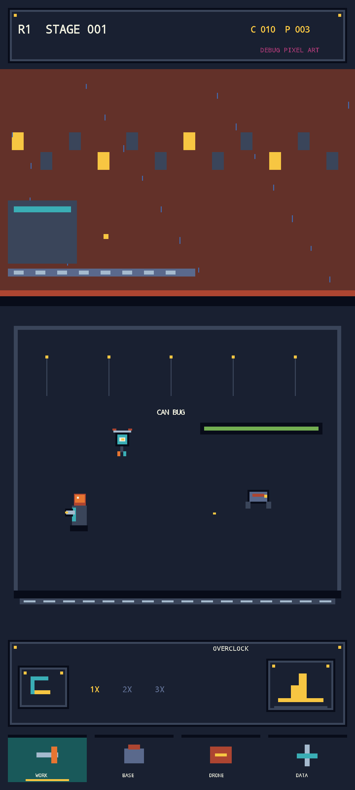

# Android 도트 전투 버티컬 슬라이스

## 경계

- Compose: Activity 생명주기, edge-to-edge, 접근성 의미, `AndroidView` 호스팅
- SurfaceView/Canvas: 전투 세계, HUD, 하단 탭, 오버클럭 입력, 파편·비 연출
- 공통 데이터: 저장소 루트의 `content/r1_vertical_slice.json`
- 공통 판정: `:core:math` PCG32와 50ms 고정 simulation tick

첫 화면의 Compose 트리는 `AndroidView` 하나뿐이다. Card, Button, LazyColumn, Scaffold, Material surface가 없고 360×800 논리 장면 안에서 배경·컨베이어·정비사·드론·폐품 생명체·HUD를 픽셀 블록으로 그린다. 물리 화면에는 정수 scale/translate만 적용하며 `Paint`의 anti-alias, bitmap filtering, subpixel text를 끈다.



현재 블록 스프라이트는 구조·구도 검증용 DEBUG 임시 아트다. 화면에 `DEBUG PIXEL ART`를 표시하고 `packageRelease` 전에 공통 release 검증기를 실행한다. 승인된 Aseprite 1배율 PNG가 들어오기 전에는 배포할 수 없다.

## 빌드 기준

- minSdk 28, target/compile SDK 36
- AGP 8.13.2, Gradle 8.13, Kotlin 2.2.20
- Compose BOM 2025.06.01, Activity Compose 1.10.1
- 모듈: `:app`, `:core:model`, `:core:math`, `:core:content`, `:feature:combat`

Android 16/API 36 설정과 AGP 호환 범위는 [Android 16 SDK 설정](https://developer.android.com/about/versions/16/setup-sdk), [AGP 8.13 릴리스 노트](https://developer.android.com/build/releases/agp-8-13-0-release-notes)를 따른다. 최신 Compose BOM은 API 37/AGP 9를 요구하므로 target 36 버티컬 슬라이스에서는 2025.06.01을 고정한다. Compose Compiler는 Kotlin 2.x와 같은 버전의 Gradle plugin을 쓴다.

## 생성과 검증

```sh
cd android
./gradlew :core:math:test :core:content:test :feature:combat:testDebugUnitTest :app:assembleDebug
cd ..
python3 tools/validate_android_pixel_shell.py
python3 -m unittest discover -s tests -p "test_*.py"
```

에뮬레이터 검증은 Pixel 7 규격 1080×2400, Android 15/API 35에서 실행했다. 360×800 논리 캔버스가 정확히 3배로 확대되며 API 36 타깃 APK의 하위 OS 실행도 함께 확인했다.
