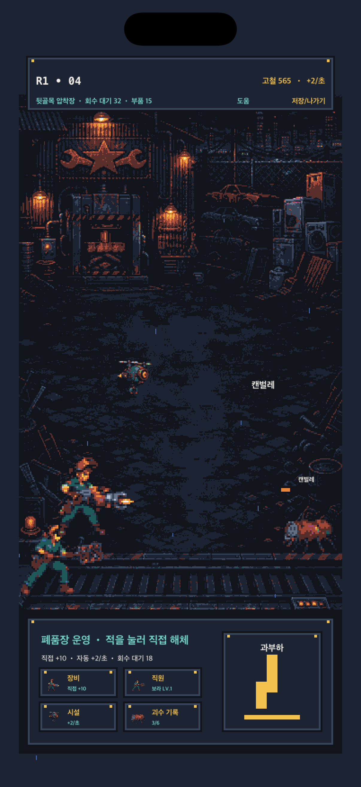
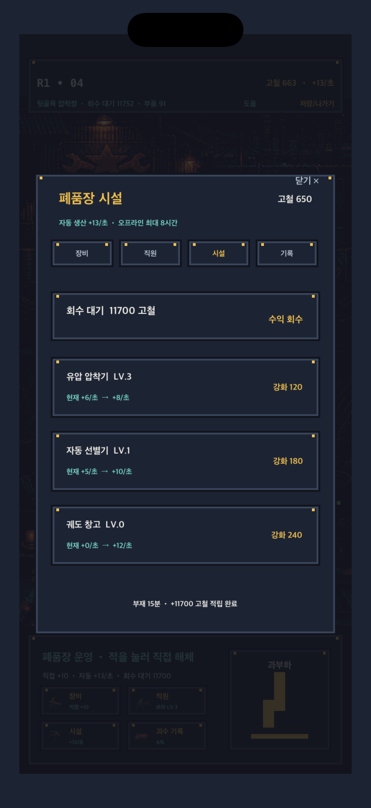
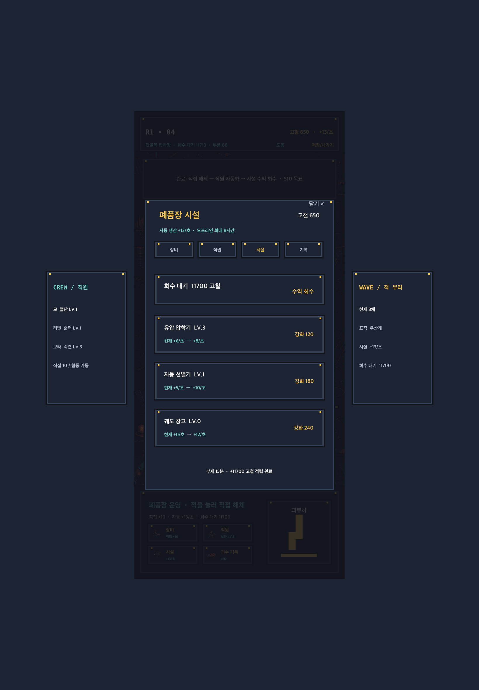

# 방치형 성장 루프의 Star Junkyard 적용

## 적용 원칙

사용자가 제공한 `111.pdf`의 플레이 흐름을 분석하되 원작의 화면 구성, 명칭, 이미지, 수치와 상품은 복제하지 않는다. 아래의 검증된 방치형 성장 원리만 Star Junkyard의 픽셀 SF 폐품장 세계관으로 번역했다.

| PDF에서 확인한 성장 원리 | Star Junkyard 구현 |
|---|---|
| 초반에는 화면을 직접 눌러 재화를 번다 | 괴수를 직접 누르면 절단 피해와 고철을 즉시 얻는다 |
| 중반부터 직원의 초당 수익이 주력이 된다 | 보라가 자동 공격하고 모와 주기적으로 전체 협동 해체를 한다 |
| 자산·기업이 더 큰 자동 수익을 만든다 | 유압 압착기·자동 선별기·궤도 창고가 초당 고철을 생산한다 |
| 여러 성장 메뉴를 메인 화면에서 바로 연다 | 장비·직원·시설·괴수 기록을 픽셀 초상과 명시적 이름으로 항상 노출한다 |
| 수집 카드와 최종 국가가 장기 목표를 만든다 | 실제 괴수 스프라이트 도감과 S10 단위 보스·S60 지역 보스·출항 목표를 둔다 |

원작은 후반 진행을 위해 게임을 켜 두는 방식을 권장하지만, Star Junkyard는 기기를 계속 켜 두도록 강요하지 않는다. 시설 수익은 저장 시각을 기준으로 최대 8시간까지 오프라인 적립된다.

## 현재 플레이 루프

1. 전투 화면의 괴수를 직접 눌러 `직접 해체` 피해와 고철을 받는다.
2. 모·리벳·보라의 스텝 애니메이션 자동 공격으로 여러 괴수를 계속 해체한다.
3. 고철로 장비와 보라의 숙련을 올려 직접·자동·협동 피해를 키운다.
4. 시설에 투자해 초당 생산량을 키우고 `수익 회수`로 회수 대기금을 보유 고철로 옮긴다.
5. 기록 메뉴에서 발견한 괴수의 이름과 모습을 채우고 S10 단위 보스와 S60 출항 목표를 추적한다.

## 경제 계약

- 직접 해체 피해: `6 + 절단날 레벨 × 4`
- 직접 해체 보상: `max(1, 절단날 레벨 ÷ 2)` 고철
- 유압 압착기: 레벨당 `+2/초`, 강화비 `30 × 다음 레벨`
- 자동 선별기: 레벨당 `+5/초`, 강화비 `90 × 다음 레벨`
- 궤도 창고: 레벨당 `+12/초`, 강화비 `240 × 다음 레벨`
- 직원 자동 생산 보정: 보라 2레벨부터 레벨당 `+1/초`
- 오프라인 적립: 현재 초당 수익 × 부재 초, 최대 8시간

초반에는 직접 해체가 다음 강화를 당기고, 중반에는 직원과 시설의 자동 생산이 누적 성장의 중심이 된다. 시설 수익은 바로 보유 재화에 합쳐지지 않고 회수 대기금으로 쌓이므로 복귀 시 할 행동이 분명하다.

## 화면 정보 우선순위

- 상단 HUD: 현재 고철, 초당 수익, 회수 대기금, 부품
- 전투 영역: 괴수 이름·내구도·직접 터치 영역, 직원과 드론의 움직임
- 하단 콘솔: `장비`, `직원`, `시설`, `괴수 기록`, `과부하`
- 관리 화면: 현재 효과, 다음 단계 효과, 비용, 실제 구매/회수 버튼
- iPad: 중앙 360×800 픽셀 전투 레인을 유지하고 좌우에 직원과 진행 정보를 추가

## 과금 경계

시설의 기본 8시간 오프라인 적립과 모든 전투·직원·괴수·지역은 무료로 진행할 수 있다. 유료 모델은 16시간 오프라인 상한, 추가 작업 슬롯, 직원 외형처럼 예측 가능한 편의와 꾸미기를 제공하며 무료 이용자의 진행을 막는 필수 성능은 판매하지 않는다. 상세 상품·가격·노출 규칙은 `docs/MONETIZATION_MODEL.md`를 따른다.
