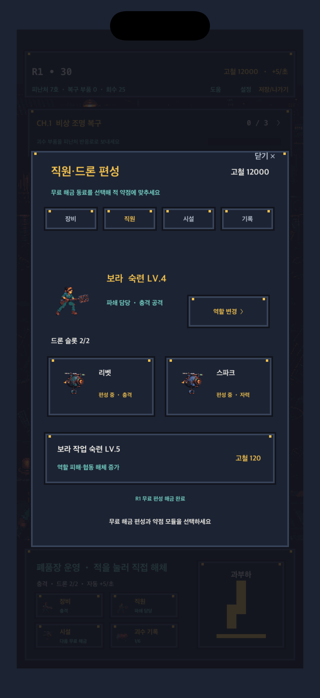

# 드론·직원·모듈 편성 계약

편성 성장은 결제 상품이 아니라 스테이지 진행으로 전부 해금된다. 잠긴 항목은 직원·시설 화면에서 다음 조건과 `무료` 문구를 함께 표시한다.

| 조건 | 무료 해금 | 전투 역할 |
|---|---|---|
| S3 도달 | 리벳 | 충격 약점 담당 |
| S5 도달 | 충격 해머 모듈 | 플레이어 공격을 충격으로 전환 |
| S10 보스 최종 해체 | 절단 코일 모듈 | 플레이어 공격을 절단으로 전환 |
| S15 도달 | 자력 포획 모듈 | 전기 계열 적을 자력 약점으로 공략 |
| S18 도달 | 스파크 | 자력 약점 담당, 한 슬롯에서 리벳과 선택 |
| S30 도달 | 두 번째 드론 슬롯 | 리벳과 스파크 동시 편성 |

보라는 숙련 레벨과 별개로 `파쇄 담당`, `절단 지원`, `자력 회수` 역할을 선택한다. 역할은 각각 충격·절단·자력 친화도를 결정하며 숙련은 개인 공격과 협동 해체의 기본 피해를 올린다.

## 피해 계약

- 모듈의 기본 출력은 정수 PPM으로 계산한다.
- 공격 친화도와 적 약점이 맞으면 최종 피해가 150%가 된다.
- 자력 친화도는 콘텐츠의 `electric` 약점을 공략한다.
- 직접 해체, 플레이어 자동 공격, 드론 공격, 보라 개인 공격, 협동 해체가 같은 약점 판정을 사용한다.
- 피해 계산은 `FormationProgression.resolveDamage` 한 곳에 있으며 부동소수점 반올림에 의존하지 않는다.

## 저장·중복 안전

저장 v7은 해금 드론, 편성 드론, 장착 모듈, 직원 역할, 직원별 숙련을 보존한다. 이전 저장은 기존 `crewLevel`을 보라 숙련으로 이관하고 기본 역할을 파쇄 담당으로 지정한다. 보스·도감 보상과 편성 배열은 불러올 때 중복 ID를 제거하며, 해금 조정은 여러 번 호출해도 보상을 다시 만들지 않는다.

## 실제 화면 검증

`-capture-formation`으로 편성 화면을 바로 열어 iPhone Safe Area 안에서 직원, 드론 두 기, 장착 모듈, 무료 해금 조건을 한 화면에서 식별할 수 있는지 확인한다.
