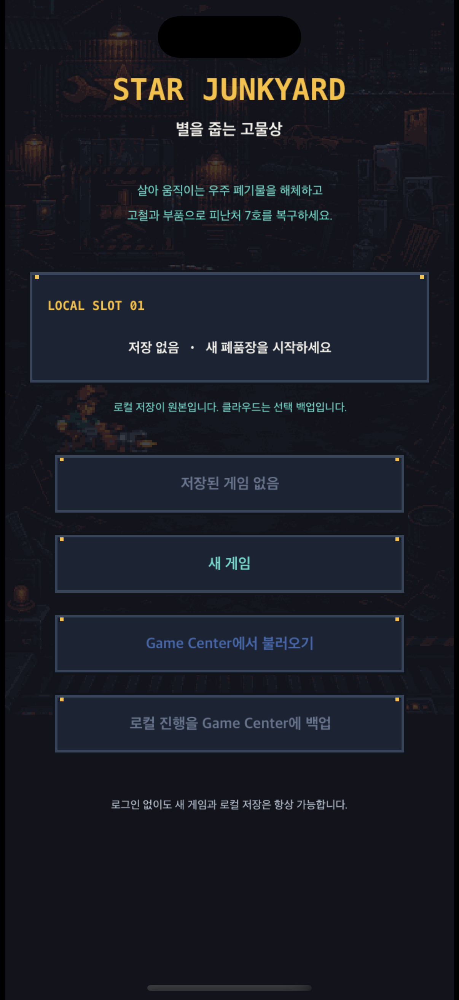

# iOS 도트 전투 버티컬 슬라이스

## 경계

- UIKit: 앱 생명주기, 화면 방향, SKView 호스팅, VoiceOver 요약, Game Center 인증 표시
- SpriteKit: 저장 선택, 전투 세계, 직접 해체, 튜토리얼, 장비·직원·시설·기록, 과부하 입력, 파편·자석 회수 연출
- 공통 데이터: 저장소 루트의 `content/r1_vertical_slice.json`

첫 화면은 전투가 아니라 픽셀 아트 저장 선택 장면이다. 게임 목표를 두 문장으로 설명하고 로컬 슬롯의 스테이지·고철·절단날 레벨을 보여준 뒤 계속하기, 새 게임, Game Center 복구/백업을 선택하게 한다. 로컬 main/backup JSON이 원본이며 Game Center는 사용자가 요청할 때만 동작하므로 인증 실패가 새 게임이나 로컬 이어하기를 막지 않는다.



전투에 들어가면 `괴수 직접 해체 → 직원 자동 공격 → 고철 성장 → 시설 초당 수익 회수`를 화면 안에서 안내한다. 장비 작업대의 절단날·리벳 코일·자석 바구니와 직원 숙련, 폐품장 시설은 고철을 실제로 소비하고 피해량·부품·초당 수익을 바꾸며 즉시 저장된다. 탄환은 총구에서 현재 적까지 5–6개의 정수 위치를 지나간 뒤에만 피해 판정을 발생시킨다.

첫 화면과 전투에는 UIKit 카드, UIButton, SF Symbol, 블러, 그라데이션이 없다. 360×800 논리 장면에서 공통 16색 PNG 배경·정비사·리벳·폐품 생명체를 nearest-neighbor로 렌더링한다. 정비사 대기/공격 4단계, 드론 부유/반동 4단계, 적 이동/피격 3–4단계와 해체 파편 자석 회수를 정수 좌표 스텝 애니메이션으로 표시한다.


캐릭터와 적은 도형 플레이스홀더가 아니라 얼굴·도구·재료·팔다리 실루엣을 갖는 공통 PNG다. 하단에는 앱형 탭 대신 실제 캐릭터·드론·괴수 스프라이트와 `장비`, `직원`, `시설`, `괴수 기록`이라는 기능명을 함께 표시한 폐품장 운영 콘솔이 있다.

## 생성과 검증

```sh
tuist generate --no-open
xcodebuild -project StarJunkyard.xcodeproj -scheme StarJunkyard -sdk iphonesimulator -configuration Debug CODE_SIGNING_ALLOWED=NO build
xcodebuild -project StarJunkyard.xcodeproj -scheme StarJunkyard -sdk iphonesimulator -configuration Debug CODE_SIGNING_ALLOWED=NO test
```

검증 항목은 PCG32 기준 출력, 공통 콘텐츠 디코딩, 로컬 저장/백업 복구, 저장 v1·v2→v3 이관, 8시간 오프라인 상한, 저장 선택 설명, SKView 단일 루트, UIButton 부재, 360×800 논리 크기, SKShapeNode 부재, 직접 해체·장비·직원·시설·기록 노드다.

Release 구성은 빌드 전 `tools/validate_project.py --release`를 실행한다. 9개 프로덕션 PNG의 크기, 완전 알파, 공통 16색, SHA-256이 모두 일치할 때만 성공한다.
