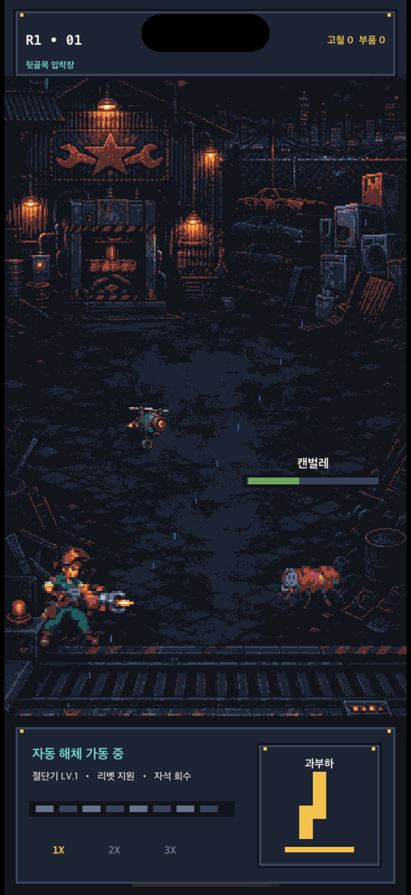

# iOS 도트 전투 버티컬 슬라이스

## 경계

- UIKit: 앱 생명주기, 화면 방향, SKView 호스팅, VoiceOver 요약
- SpriteKit: 전투 세계, HUD, 작업 콘솔, 과부하 입력, 파편·자석 회수 연출
- 공통 데이터: 저장소 루트의 `content/r1_vertical_slice.json`

첫 화면에는 UIKit 카드, UIButton, SF Symbol, 블러, 그라데이션이 없다. 360×800 논리 장면에서 공통 16색 PNG 배경·정비사·리벳·폐품 생명체를 nearest-neighbor로 렌더링한다. 정비사 대기/공격 4단계, 드론 부유/반동 4단계, 적 이동/피격 3–4단계와 해체 파편 자석 회수를 정수 좌표 스텝 애니메이션으로 표시한다.



캐릭터와 적은 도형 플레이스홀더가 아니라 얼굴·도구·재료·팔다리 실루엣을 갖는 공통 PNG다. 하단 앱형 탭은 제거하고 현재 전투의 절단기·드론·자석 상태와 과부하 조작만 담은 작업 콘솔로 교체했다.

## 생성과 검증

```sh
cd ios
tuist generate --no-open
xcodebuild -project StarJunkyard.xcodeproj -scheme StarJunkyard -sdk iphonesimulator -configuration Debug CODE_SIGNING_ALLOWED=NO build
xcodebuild -project StarJunkyard.xcodeproj -scheme StarJunkyard -sdk iphonesimulator -configuration Debug CODE_SIGNING_ALLOWED=NO test
```

검증 항목은 PCG32 기준 출력, 공통 콘텐츠 디코딩, SKView 단일 루트, UIButton 부재, 360×800 논리 크기, SKShapeNode 부재, 정수 좌표다.

Release 구성은 빌드 전 `tools/validate_project.py --release`를 실행한다. 9개 프로덕션 PNG의 크기, 완전 알파, 공통 16색, SHA-256이 모두 일치할 때만 성공한다.
