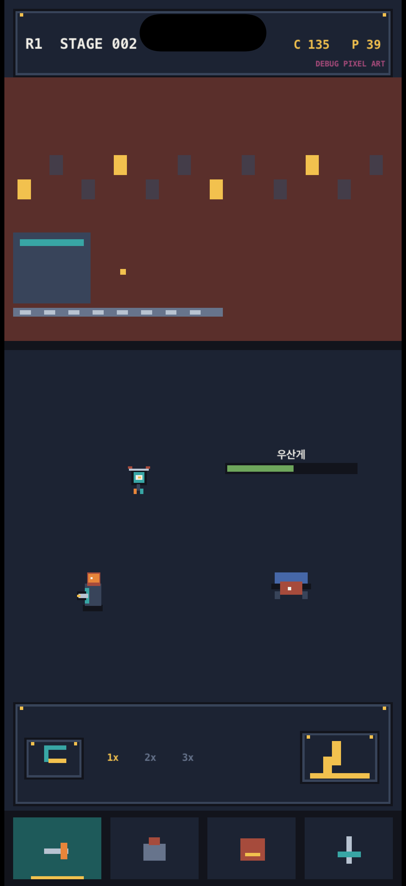

# iOS 도트 전투 버티컬 슬라이스

## 경계

- UIKit: 앱 생명주기, 화면 방향, SKView 호스팅, VoiceOver 요약
- SpriteKit: 전투 세계, HUD, 하단 탭, 오버클럭 입력, 파편 연출
- 공통 데이터: 저장소 루트의 `content/r1_vertical_slice.json`

첫 화면에는 UIKit 카드, UIButton, SF Symbol, 블러, 그라데이션이 없다. 360×800 논리 장면 안에서 배경·컨베이어·정비사·리벳·폐품 생명체·HUD를 모두 픽셀 블록으로 그린다.



현재 블록 스프라이트는 코드 구조와 구도를 검증하는 DEBUG 전용 임시 아트다. 화면에 `DEBUG PIXEL ART`를 표시하고 공통 release 검증기가 `planned` asset을 거부한다. 승인된 Aseprite 1배율 PNG가 들어오기 전에는 배포하지 않는다.

## 생성과 검증

```sh
cd ios
tuist generate --no-open
xcodebuild -project StarJunkyard.xcodeproj -scheme StarJunkyard -sdk iphonesimulator -configuration Debug CODE_SIGNING_ALLOWED=NO build
xcodebuild -project StarJunkyard.xcodeproj -scheme StarJunkyard -sdk iphonesimulator -configuration Debug CODE_SIGNING_ALLOWED=NO test
```

검증 항목은 PCG32 기준 출력, 공통 콘텐츠 디코딩, SKView 단일 루트, UIButton 부재, 360×800 논리 크기, SKShapeNode 부재, 정수 좌표다.

Release 구성은 빌드 전 `tools/validate_project.py --release`를 실행한다. 에셋 매니페스트에 `planned` 항목이 남아 있는 동안 의도적으로 실패한다.
